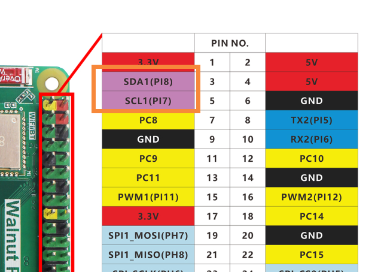
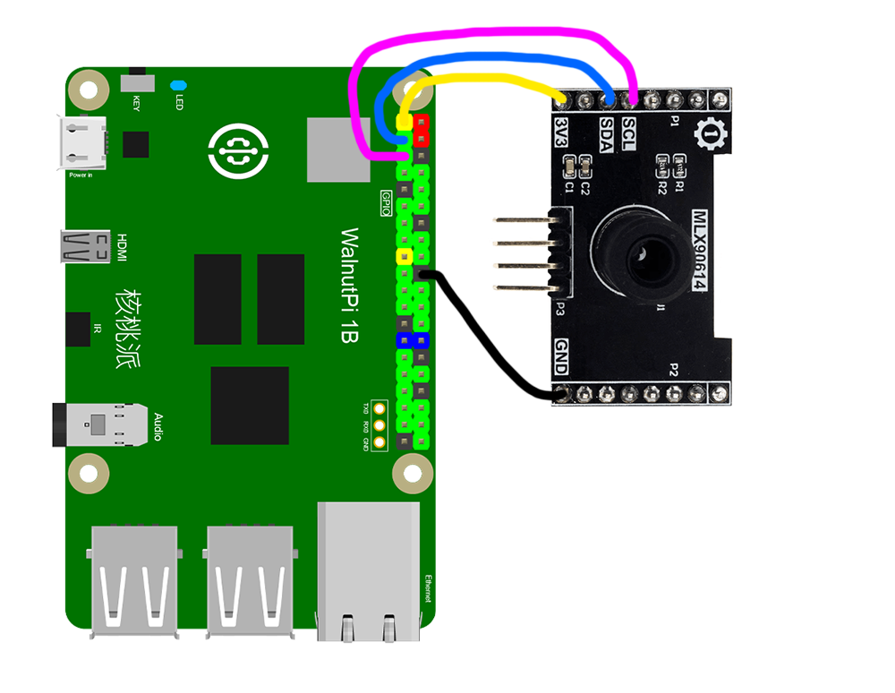
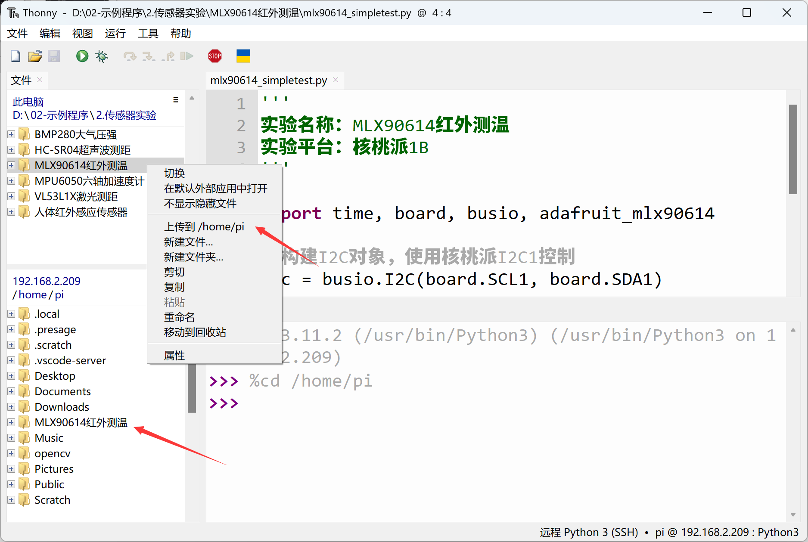
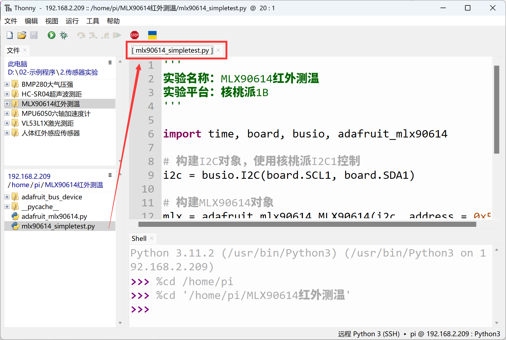
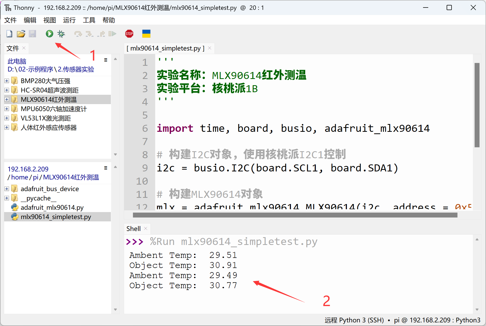

# MLX90614 Infrared Thermometer

## Introduction
The MLX90614 is an infrared thermometer for non-contact temperature measurement, capable of measuring objects between -70°C and 380°C. This sensor uses an infrared-sensitive thermopile detector chip and can measure temperature with 0.02°C resolution within its range.

## Objective
Use Python programming to implement non-contact temperature measurement with the MLX90614.

## Explanation

Most MLX90614 modules on the market are universal and communicate via the I2C bus. The image below shows an MLX90614 sensor module. There are two models: DCC (short range, 10cm) and DCI (long range, 100cm), and the code is universal for both.


|  Module Parameters | |
|  :---:  | ---  |
| Supply Voltage  | 3.3V |
| Measuring Distance  | DCC (10cm) and DCI (100cm) |
| Measuring Range  | -70°C - 382°C |
| Accuracy  | 0.5°C |
| Communication  | I2C bus (default address: 0x5a) |
| Pin Description  | `VCC`: Connect to 3.3V <br></br> `GND`: Ground <br></br>  `SDA`: I2C data pin  <br></br> `SCL`: I2C clock pin |

<br></br>

From the description above, we can see that the MLX90614 is a sensor driven via the I2C interface. We can communicate with this module by programming the WalnutPi's I2C interface.

This routine uses the WalnutPi's I2C1 to connect the MLX90614 sensor:






## The MLX90614 Object

In CircuitPython, you can directly use a pre-written Python library to obtain MLX90614 sensor data. Details are as follows:

### Constructor
```python
mlx = adafruit_mlx90614.MLX90614(i2c, address=0x5a)
```
Constructs an MLX90614 object.

Parameter description:
- `i2c` Requires constructing an i2c object, refer to: [I2C Object Description](../gpio/i2c_oled#the-i2c-object); not repeated here.
- `address` Module I2C address. Default: 0x5a;

### Methods

```python
mlx.ambient_temperature
```
Reads ambient temperature, in °C, data type: `float`.
<br></br>

```python
mlx.object_temperature
```
Reads object temperature, in °C, data type: `float`.

<br></br>

After understanding the MLX90614 sensor principles and object usage, we can organize the programming approach. The flowchart is as follows:

```mermaid
graph TD
    Import related modules --> Construct MLX90614 object --> Get ambient/object temperature and print --> Get ambient/object temperature and print;
```

## Reference Code
```python
'''
Experiment Name: MLX90614 Infrared Thermometer
Experiment Platform: WalnutPi 1B
'''

import time, board, busio, adafruit_mlx90614

# Construct I2C object, controlled by WalnutPi I2C1
i2c = busio.I2C(board.SCL1, board.SDA1)

# Construct MLX90614 object
mlx = adafruit_mlx90614.MLX90614(i2c, address=0x5a)

while True:

    print("Ambent Temp: ", '%.2f'% mlx.ambient_temperature) # Measure ambient temperature
    print("Object Temp: ", '%.2f'% mlx.object_temperature) # Measure object temperature

    time.sleep(1)
```

## Result

Connect the MLX90614 sensor to the WalnutPi as shown — SDA1 to module SDA pin, SCL1 to module SCL pin:


Since this code depends on other `.py` library files, you need to upload the entire example folder to the WalnutPi:



After successful transfer, you need to open and run the `.py` file from the remote directory (WalnutPi), because running it will import other library files in the folder. Therefore, running this type of code locally on a PC is ineffective.



Use Thonny to remotely run the above Python code on the WalnutPi. For instructions on running Python code on the WalnutPi, please refer to: [Running Python Code](../python_run.md). After successful execution, the terminal will print ambient and object temperature information:


