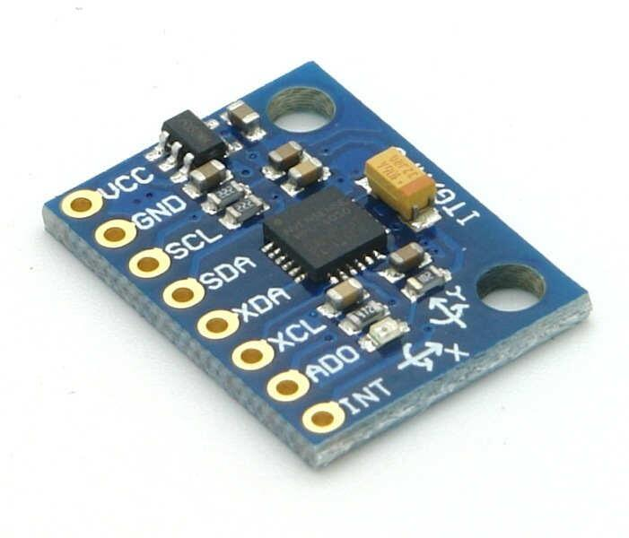
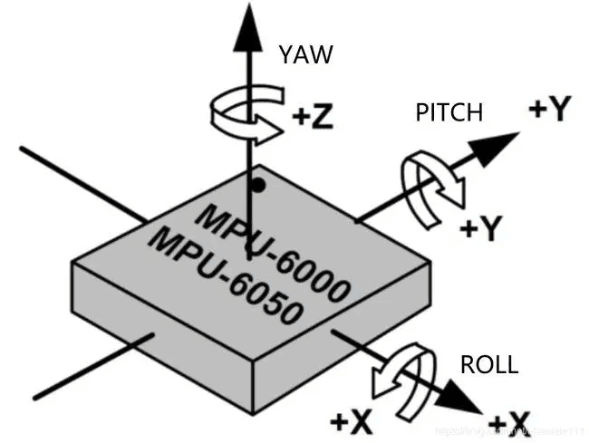
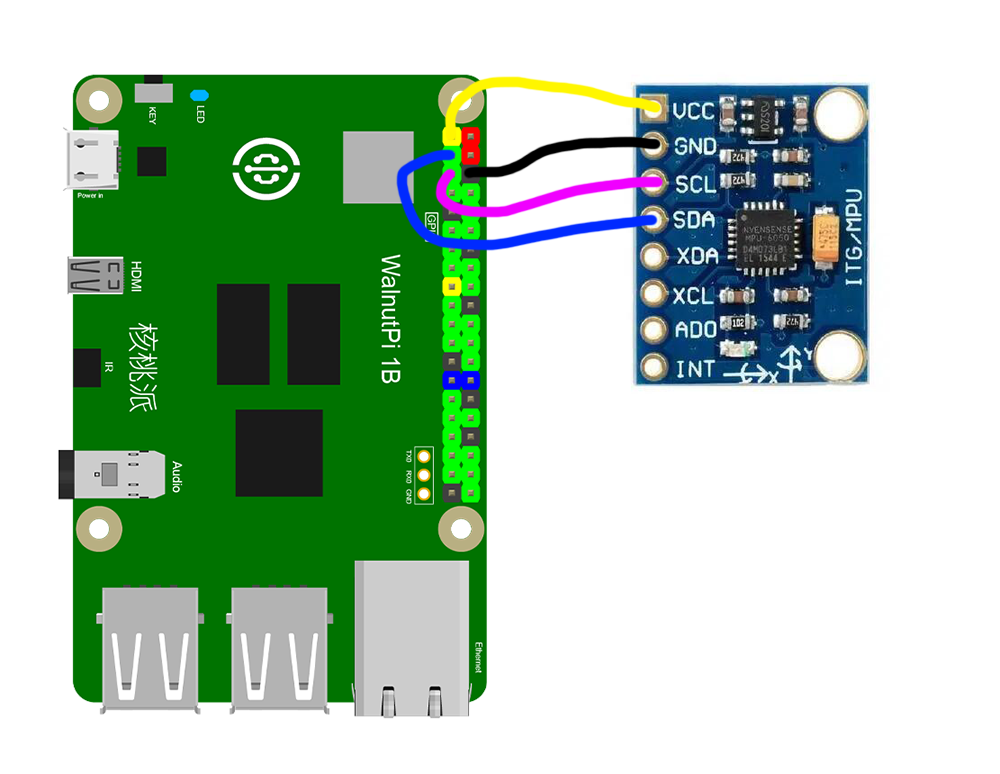
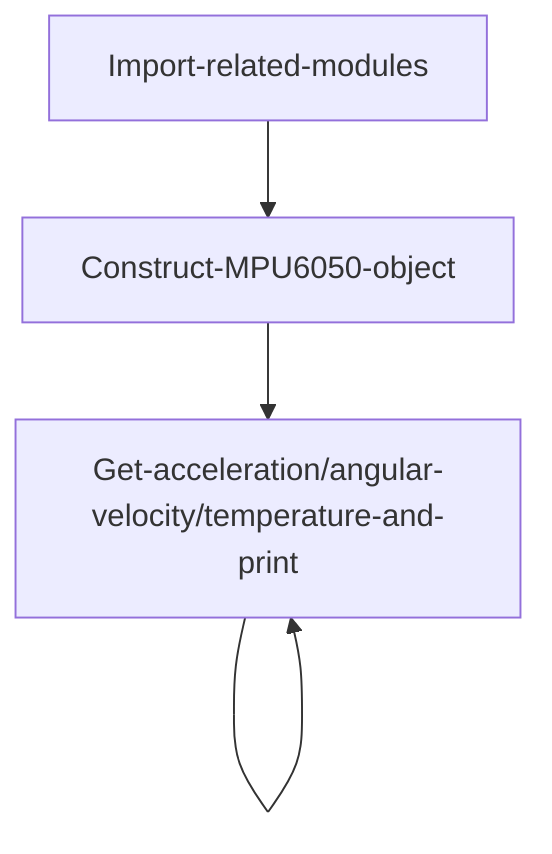
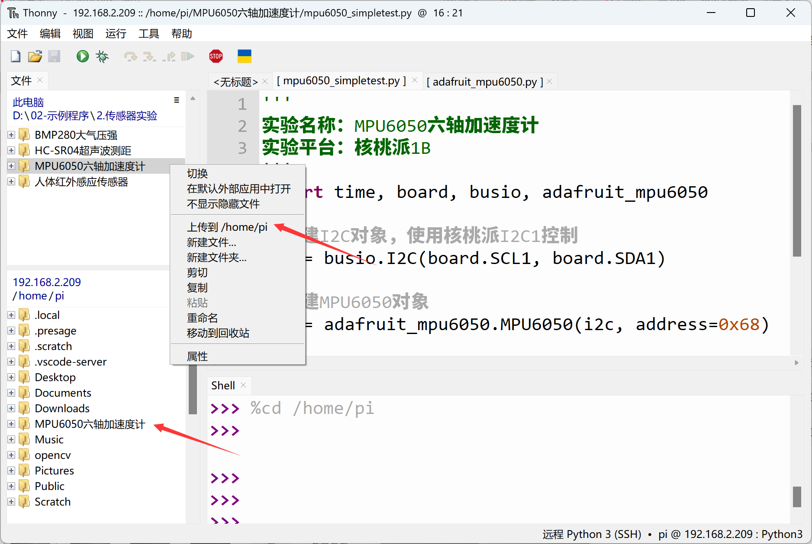
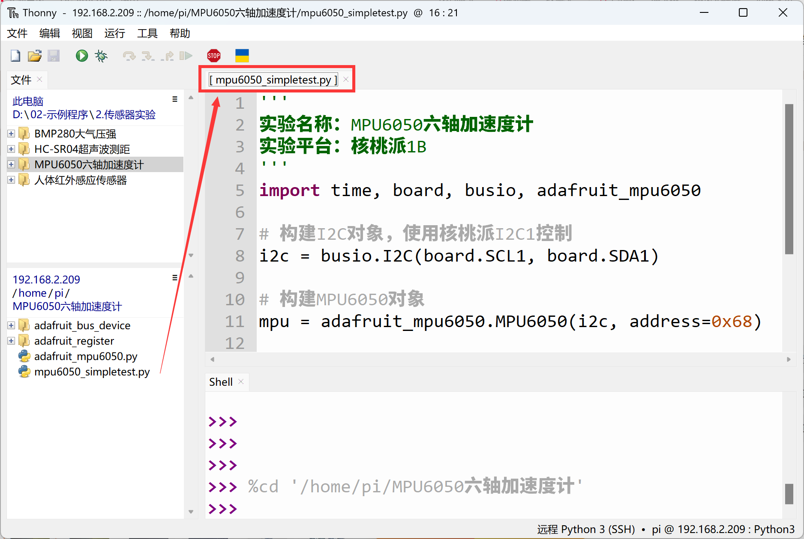
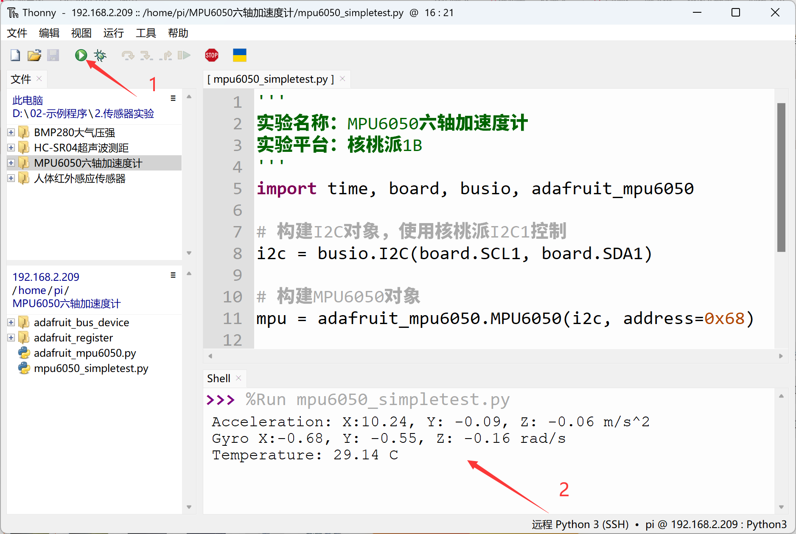

# MPU6050 6-Axis Accelerometer/Gyroscope

## Introduction
The MPU6050 is a high-performance 6-axis (3-axis accelerometer + 3-axis gyroscope) sensor module used for measuring object motion and orientation. It uses an I2C interface and is commonly used in quadcopter flight controllers, self-balancing vehicles, and similar applications.

## Objective
Use Python programming to measure MPU6050 acceleration, angular velocity, and temperature values!

## Explanation

Most MPU6050 modules on the market are universal and communicate via the I2C bus. The image below shows an MPU6050 sensor module:



|  Module Parameters | |
|  :---:  | ---  |
| Supply Voltage  | 3.3V |
| Communication  | I2C bus (default address: 0x68) |
| Measurement Dimensions  | Acceleration: 3 dimensions <br></br> Gyroscope: 3 dimensions |
| Accelerometer Range  | ±2/±4/±8/±16g |
| Gyroscope Range  | ±250/±500/±1000/±2000°/s |
| Temperature Sensor  | Range: -40°C~85°C (accuracy: ±1°C) |
| Pin Description  | `VCC`: Connect to 3.3V <br></br> `GND`: Ground <br></br>  `SDA`: I2C data pin  <br></br> `SCL`: I2C clock pin |

<br></br>

**MPU6050 6-Axis Direction Explanation:**



From the description above, we can see that the MPU6050 is a sensor driven via the I2C interface. We can communicate with this module by programming the WalnutPi's I2C interface.

This routine uses the WalnutPi's I2C1 to connect the MPU6050 sensor:





## The MPU6050 Object

In CircuitPython, you can directly use a pre-written Python library to obtain MPU6050 sensor data. Details are as follows:

### Constructor
```python
mpu = adafruit_mpu6050.MPU6050(i2c, address=0x68)
```
Constructs an MPU6050 object.

Parameter description:
- `i2c` Requires constructing an i2c object, refer to: [I2C Object Description](../gpio/i2c_oled#the-i2c-object); not repeated here.
- `address` Module I2C address. Default: 0x68;

### Methods

```python
mpu.acceleration
```
Returns x, y, z acceleration values, in m/s², data type `float`.

<br></br>

```python
mpu.gyro
```
Returns x, y, z angular velocity values, in rad/s, data type `float`.

<br></br>

```python
mpu.temperature
```
Returns temperature value, in °C, data type `float`.

<br></br>

After understanding the MPU6050 sensor principles and object usage, we can organize the programming approach. The flowchart is as follows:



## Reference Code

```python
'''
Experiment Name: MPU6050 6-Axis Accelerometer/Gyroscope
Experiment Platform: WalnutPi 1B
'''
import time, board, busio, adafruit_mpu6050

# Construct I2C object, controlled by WalnutPi I2C1
i2c = busio.I2C(board.SCL1, board.SDA1)

# Construct MPU6050 object
mpu = adafruit_mpu6050.MPU6050(i2c, address=0x68)

while True:
    print("Acceleration: X:%.2f, Y: %.2f, Z: %.2f m/s^2" % (mpu.acceleration))
    print("Gyro X:%.2f, Y: %.2f, Z: %.2f rad/s" % (mpu.gyro))
    print("Temperature: %.2f C" % mpu.temperature)
    print("")
    time.sleep(1)
```

## Result

Connect the MPU6050 sensor to the WalnutPi as shown — SDA1 to module SDA pin, SCL1 to module SCL pin:


Since this code depends on other `.py` library files, you need to upload the entire example folder to the WalnutPi:



After successful transfer, you need to open and run the `.py` file from the remote directory (WalnutPi), because running it will import other library files in the folder. Therefore, running this type of code locally on a PC is ineffective.



Use Thonny to remotely run the above Python code on the WalnutPi. For instructions on running Python code on the WalnutPi, please refer to: [Running Python Code](../python_run.md). After successful execution, the terminal will print acceleration, angular velocity, and temperature information:


