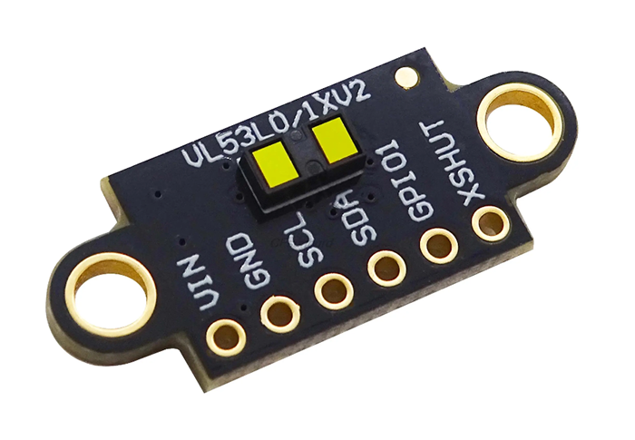
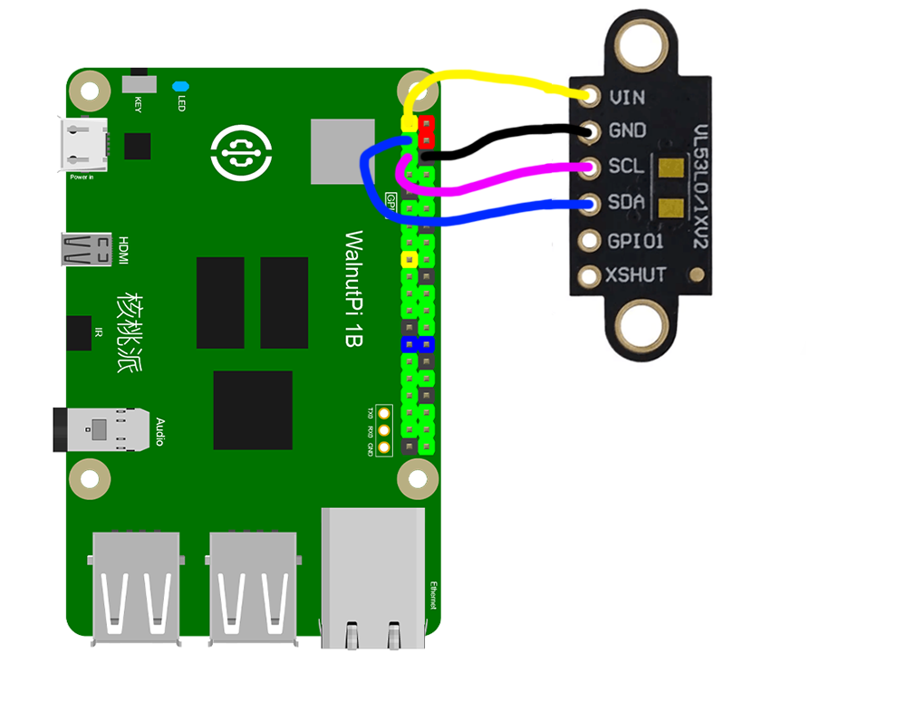
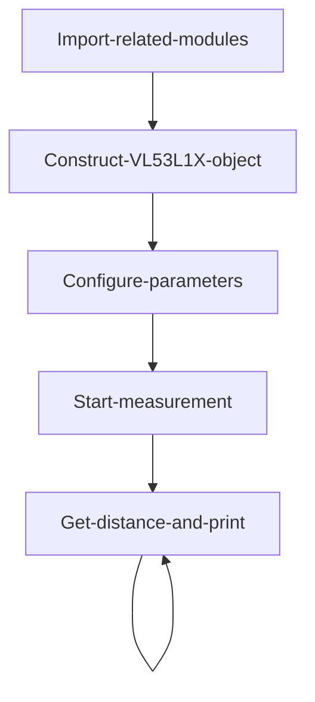
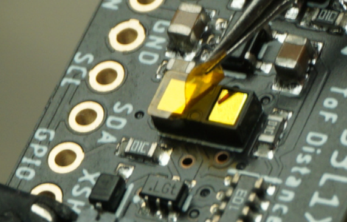
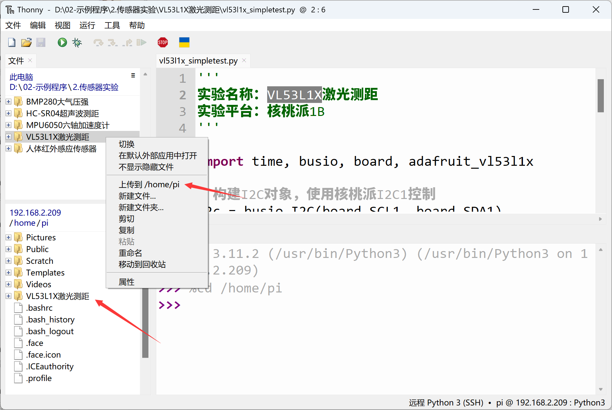
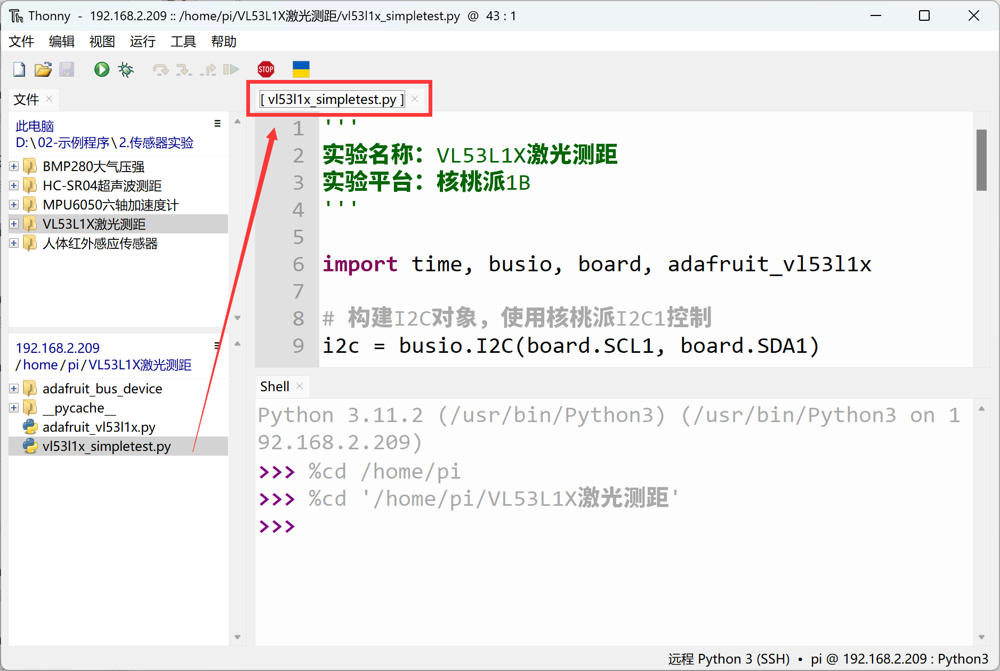
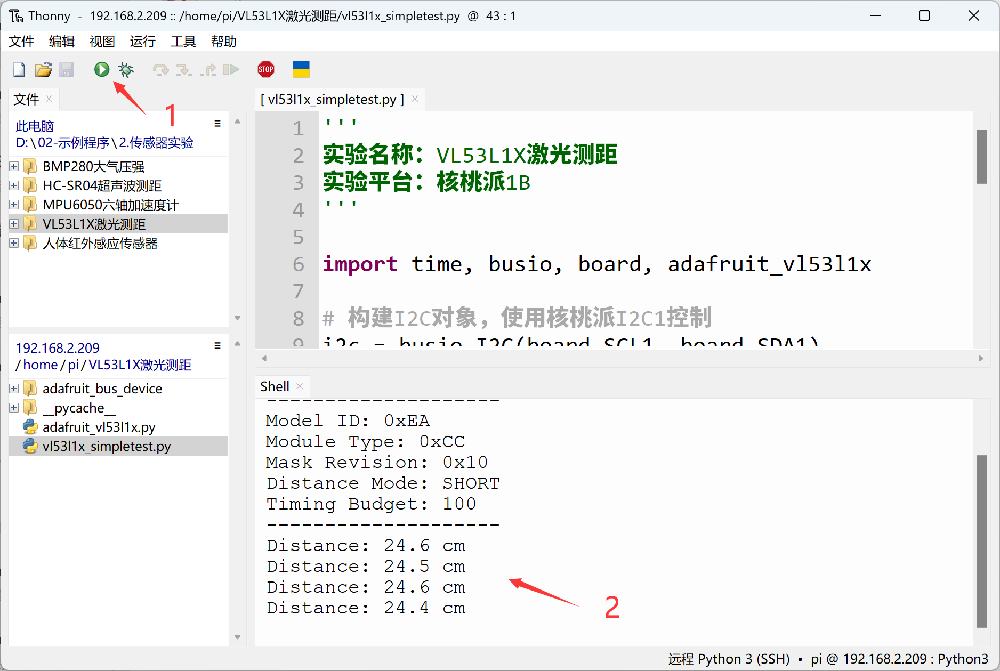

# VL53L1X Laser Distance Sensor

## Introduction
The VL53L1X is a Time-of-Flight (ToF) ranging module with a precise measurement range of up to 4 meters, 1mm accuracy, and fast ranging frequency up to 50Hz. It communicates via I2C and has low power consumption. Compared to the HC-SR04 ultrasonic module discussed earlier, it offers higher precision, faster response, and stronger anti-interference capability. It is commonly used in high-precision and high-real-time ranging applications.

## Objective
Use Python programming to implement distance measurement with the VL53L1X sensor!

## Explanation

Most VL53L1X modules on the market are universal and communicate via the I2C bus. The image below shows a VL53L1X sensor module:



|  Module Parameters | |
|  :---:  | ---  |
| Supply Voltage  | 3.3V |
| Communication  | I2C bus (default address: 0x29) |
| Measuring Range  | 4cm - 4m |
| Accuracy  | 1mm |
| Pin Description  | `VCC`: Connect to 3.3V <br></br> `GND`: Ground <br></br>  `SDA`: I2C data pin  <br></br> `SCL`: I2C clock pin |

<br></br>

From the description above, we can see that the VL53L1X is a sensor driven via the I2C interface. We can communicate with this module by programming the WalnutPi's I2C interface.

This routine uses the WalnutPi's I2C1 to connect the VL53L1X sensor:





## The VL53L1X Object

In CircuitPython, you can directly use a pre-written Python library to obtain VL53L1X sensor data. Details are as follows:

### Constructor
```python
vl53 = adafruit_vl53l1x.VL53L1X(i2c, address=0x29)
```
Constructs a VL53L1X object.

Parameter description:
- `i2c` Requires constructing an i2c object, refer to: [I2C Object Description](../gpio/i2c_oled#the-i2c-object); not repeated here.
- `address` Module I2C address. Default: 0x29;

### Methods

```python
vl53.distance_mode = value
```
- `value`: Mode value
    - `1`: Short distance mode
    - `2`: Long distance mode

<br></br>

```python
vl53.timing_budget = value
```
- `value`: Ranging duration, in ms.

    Increasing the ranging duration increases the device's maximum ranging distance and improves repeatability error. Power consumption increases accordingly. Allowable values: ms = 15 (short distance mode only), 20, 33, 50, 100, 200, 500. Default is 50.

<br></br>

```python
vl53.start_ranging()
```
Start measurement.

<br></br>

```python
vl53.data_ready
```
Sensor measurement status. Returns 1: measurement data available; Returns 0: no measurement data.

<br></br>

```python
vl53.distance
```
Read measurement result. Unit: cm, data type `float`.

<br></br>

After understanding the VL53L1X sensor principles and object usage, we can organize the programming approach. The flowchart is as follows:



## Reference Code
```python
'''
Experiment Name: VL53L1X Laser Distance Sensor
Experiment Platform: WalnutPi 1B
'''

import time, busio, board, adafruit_vl53l1x

# Construct I2C object, controlled by WalnutPi I2C1
i2c = busio.I2C(board.SCL1, board.SDA1)

vl53 = adafruit_vl53l1x.VL53L1X(i2c, address=0x29)

# Parameter settings
vl53.distance_mode = 1  # 1: Short distance mode; 2: Long distance mode.
vl53.timing_budget = 100 # Ranging duration, in ms.

# Sensor information
print("VL53L1X Simple Test.")
print("--------------------")
model_id, module_type, mask_rev = vl53.model_info
print("Model ID: 0x{:0X}".format(model_id))
print("Module Type: 0x{:0X}".format(module_type))
print("Mask Revision: 0x{:0X}".format(mask_rev))
print("Distance Mode: ", end="")
if vl53.distance_mode == 1:
    print("SHORT")
elif vl53.distance_mode == 2:
    print("LONG")
else:
    print("UNKNOWN")
print("Timing Budget: {}".format(vl53.timing_budget))
print("--------------------")

# Start measurement
vl53.start_ranging()

while True:

    if vl53.data_ready:
        print("Distance: {} cm".format(vl53.distance))
        vl53.clear_interrupt()
        time.sleep(0.5)
```

## Result

If needed, you can peel off the protective film on the VL53L1X sensor. Be careful not to scratch the surface — the accuracy may improve slightly.



Connect the VL53L1X sensor to the WalnutPi as shown — SDA1 to module SDA pin, SCL1 to module SCL pin:


Since this code depends on other `.py` library files, you need to upload the entire example folder to the WalnutPi:



After successful transfer, you need to open and run the `.py` file from the remote directory (WalnutPi), because running it will import other library files in the folder. Therefore, running this type of code locally on a PC is ineffective.



Use Thonny to remotely run the above Python code on the WalnutPi. For instructions on running Python code on the WalnutPi, please refer to: [Running Python Code](../python_run.md). After successful execution, the terminal will print distance information:


