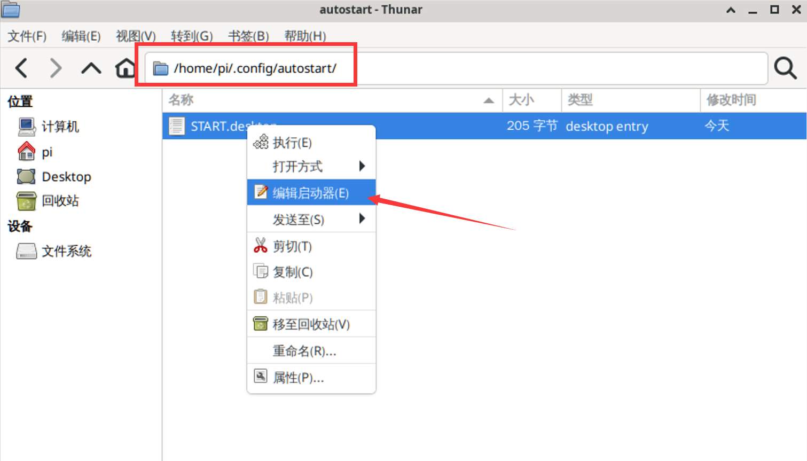
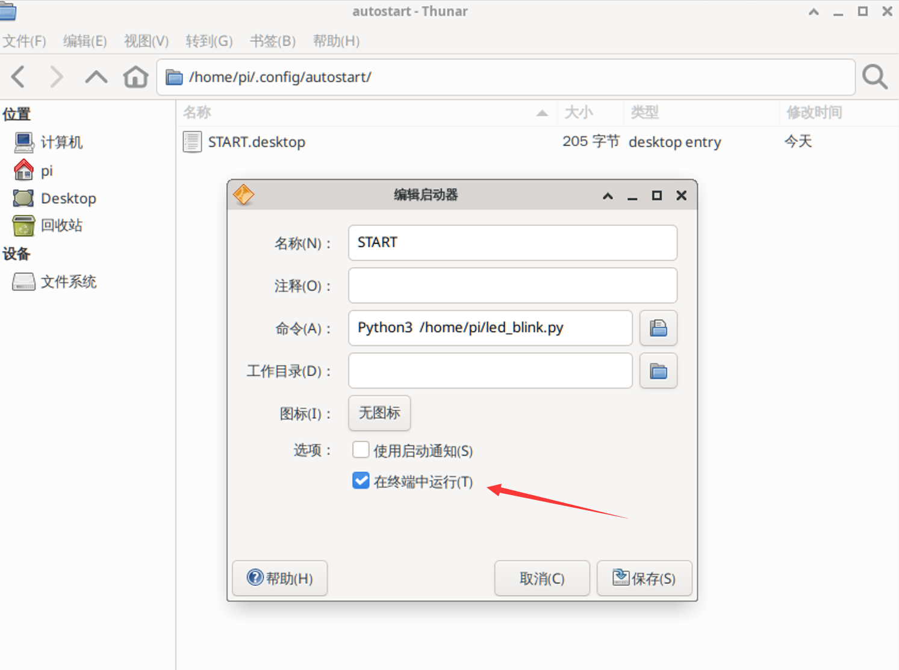
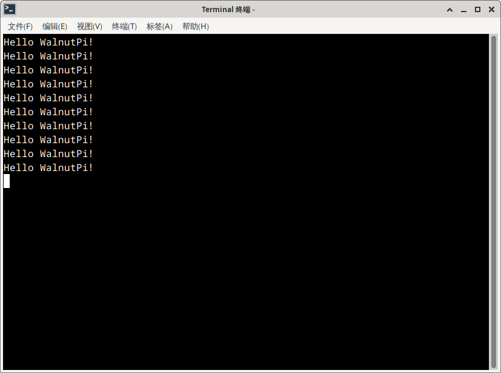

# Auto-Run Python Code on Boot

In the previous sections, we learned many Python embedded programming cases. Some of you may wonder: can we place our already-written Python code on the WalnutPi and have it automatically execute on boot? The answer is yes, and it's a very practical feature. This section will explain it in detail.

## Method for Desktop Systems

First, let's write a piece of test Python code that uses the onboard LED blinking effect as a demonstration, along with a "Hello WalnutPi!" print message. The code is as follows (available in the WalnutPi development board resource package → Example Programs → Other Usage Tips):

```python
'''
Experiment Name: LED Blinking
Experiment Platform: WalnutPi
'''

# Import related modules
import board,time
from digitalio import DigitalInOut, Direction

# Construct and initialize LED object
led = DigitalInOut(board.LED) # Define pin number
led.direction = Direction.OUTPUT  # IO as output

while True:

    led.value = 1 # Output HIGH, turn on onboard blue LED

    time.sleep(0.5)

    led.value = 0 # Output LOW, turn off onboard blue LED

    time.sleep(0.5)

    print("Hello WalnutPi!") # Output print message
```

Save the above code as **led_blink.py** and place it in the WalnutPi's /home/pi directory for testing. You can transfer it using Thonny or copy it directly to the directory using a USB drive.


Then, on the WalnutPi desktop, click **Start Menu → Settings → Session and Startup**.


After it opens, click **Application Autostart**, then click **+ Add** at the bottom left. In the popup dialog, configure the following:
- `Name`: Define the application name. We'll use START here; you can change it as desired.
- `Description`: A description of this application; can be left blank.
- `Command`: Use the following Python terminal command to start the `.py` script. Be sure to use **Python3** (note capitalization), because this program has elevated privileges on the WalnutPi, giving it admin permissions to run Python scripts and avoiding permission issues.
```bash
Python3 /home/pi/led_blink.py
```
- `Trigger`: Select "on login".


After confirming, you can see the START program appear in the list.


After creation, you'll notice a startup file in the /home/pi/.config/autostart directory. Right-click and select "Edit Launcher" for more editing options.



As shown below, you can check the **Run in terminal** option so that opening this application will pop up a new terminal on the desktop for viewing debug information. If unchecked, it runs in the background.




After saving, you can double-click the application to test it. You'll see a new terminal pop up on the desktop, printing the output from **led_blink.py**.



The onboard LED blinks periodically!


Execute the reboot command and you'll see the WalnutPi board pop up a terminal printing "Hello WalnutPi!" and the LED blinking, indicating the Python code auto-runs successfully on boot.
```bash
sudo reboot
```

## Method for Headless (No Desktop) Systems

The previous section covered the method for WalnutPi desktop systems. Here's the method for headless systems, using a boot startup service. **This method also works for desktop systems!**

As before, first write a piece of test Python code using the onboard LED blinking effect as a demonstration, along with a "Hello WalnutPi!" print message. The code is as follows (available in the WalnutPi development board resource package → Example Programs → Other Usage Tips):

```python
'''
Experiment Name: LED Blinking
Experiment Platform: WalnutPi
'''

# Import related modules
import board,time
from digitalio import DigitalInOut, Direction

# Construct and initialize LED object
led = DigitalInOut(board.LED) # Define pin number
led.direction = Direction.OUTPUT  # IO as output

while True:

    led.value = 1 # Output HIGH, turn on onboard blue LED

    time.sleep(0.5)

    led.value = 0 # Output LOW, turn off onboard blue LED

    time.sleep(0.5)

    print("Hello WalnutPi!") # Output print message
```

Save the above code as **led_blink.py** and place it in the WalnutPi's /home/pi directory for testing. You can transfer it using Thonny or copy it directly using a USB drive.


Create a new start.service file in the /lib/systemd/system directory. **(This file is available in the WalnutPi development board resource package → Example Programs → Other Usage Tips → Headless System Method directory.)**

```bash
sudo nano /lib/systemd/system/start.service
```

Modify the content as follows:

```bash
[Unit]
Description=Expand partition size

[Service]
Type=oneshot
ExecStart=Python3 /home/pi/led_blink.py
RemainAfterExit=yes
StandardOutput=null

[Install]
WantedBy=multi-user.target
```


After saving, give the file full permissions:
```bash
sudo chmod 777 /lib/systemd/system/start.service
```


Enable the service:
```bash
 sudo systemctl enable start.service
```


Execute the reboot command. You'll see the LED blinking after the WalnutPi restarts, indicating the Python code auto-runs successfully. Since this method runs in the background, you won't see the "Hello WalnutPi!" print message!
```bash
sudo reboot
```


<br></br>

::::tip Note
Both methods above work by launching the Python script via a command. Users can modify the command to run specific Linux commands or software on boot as needed.
::::
