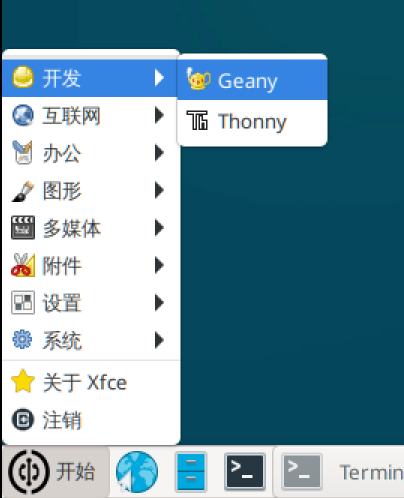
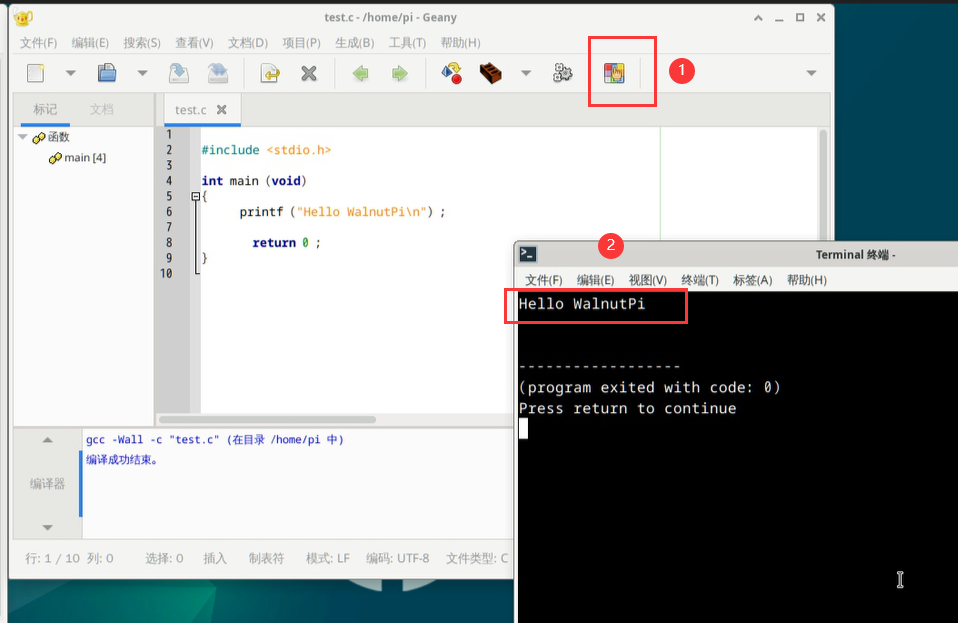

# Compiling C Code on the Development Board

## Command Line Method

First, create a test.c file in the current directory on WalnutPi and enter the following content (this code prints "Hello WalnutPi" to the terminal):

```c
#include <stdio.h>

int main (void)
{
  printf ("Hello WalnutPi\n") ;

  return 0 ;
}
```

To compile the code, use the `gcc` command, which is very simple. For example, to compile test.c into an executable named test, just run:

```bash
gcc test.c -o test
```

Run the compiled program:

```bash
./test
```

You will see "Hello WalnutPi" printed in the terminal:


## Geany IDE (Local on WalnutPi)

The WalnutPi desktop system comes pre-installed with Geany IDE, located in the **Start--Development** menu. You can use Geany for C programming, compiling, and running.

Open Geany:



Create a new file, enter the following test code, and save it as a .c file.

```c
#include <stdio.h>

int main (void)
{
  printf ("Hello WalnutPi\n") ;

  return 0 ;
}
```


Click the **Build** button, and you will see the compilation result below. If the compilation is successful, an executable file will be generated in the current directory.


Click the **Execute** button to run the compiled executable. A new terminal will pop up, displaying "Hello WalnutPi".


