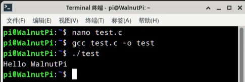
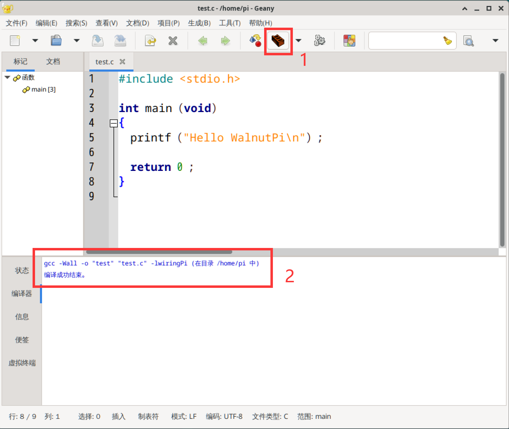
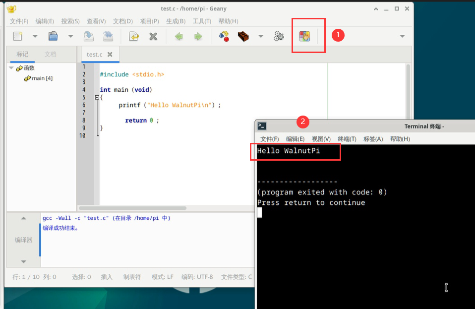

# 在开发板上编译C语言代码

## 命令行方式

先在核桃派当前目录新建一个test.c文件，输入下面内容（该代码实现在终端打印“Hello WalnutPi信息”）：
```c
#include <stdio.h>

int main (void)
{
  printf ("Hello WalnutPi\n") ;

  return 0 ;
}
```
编译代码需要使用`gcc`这条命令，使用很简单。例如将test.c编译成可执行文件test，只要运行以下命令

```bash
gcc test.c -o test
```

运行刚刚编译出来的程序：

```bash
./test
```

可以看到执行后终端打印出：Hello WalnutPi信息：



## Geany IDE (核桃派本地)

核桃派桌面系统出厂预装了Geany IDE ，位于**开始--开发**栏，使用Geany可以实现C编程和编译运行。

打开Geany:


新建一个文件，输入下面的测试代码，保存为.c文件。

```c
#include <stdio.h>

int main (void)
{
  printf ("Hello WalnutPi\n") ;

  return 0 ;
}
```


点击**Build**按钮，下方可以看到编译结果信息。编译成功的话当前目录下会生成一个可执行文件。



点击**执行**按钮，运行刚刚编译出来的可执行文件。可以看到弹出一个新终端，打印了“Hello WalnutPi”信息。


