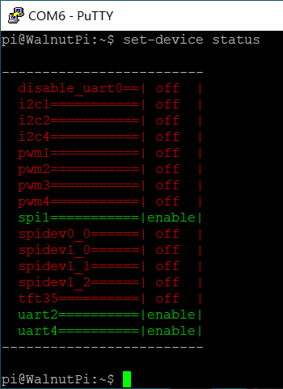
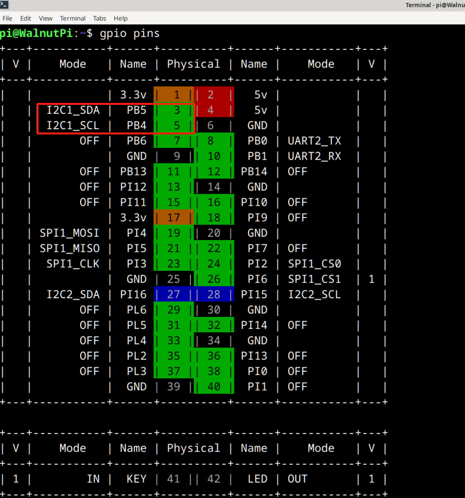
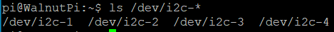
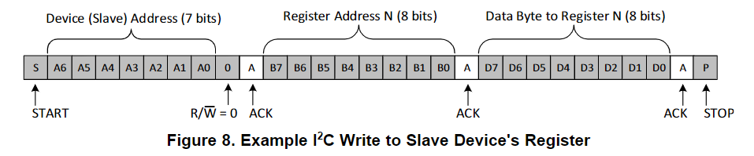
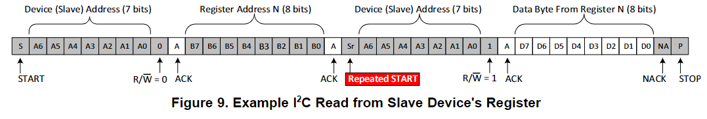
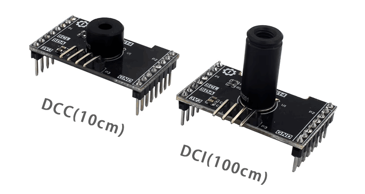
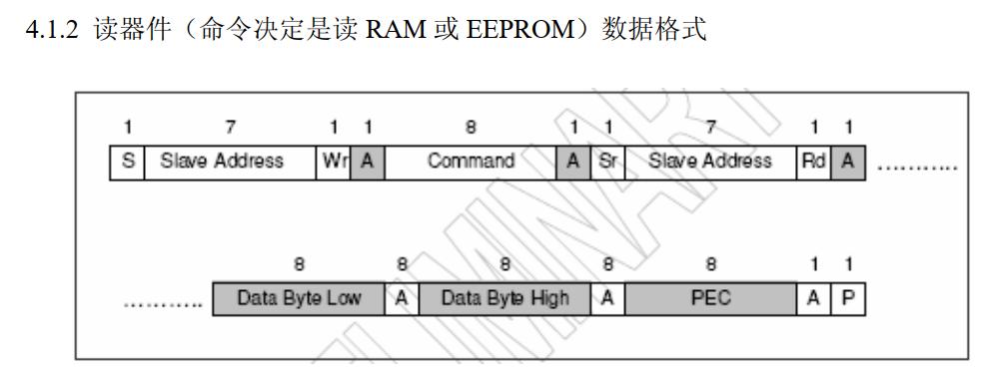
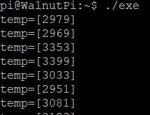

# I2C

## Configure Pins

### Find the I2C Pins on the Board
For easy lookup, we added a feature to display the functional pin positions. Run the following command to see how many available I2C interfaces are on the board's 40-pin header:

```bash
gpio pin i2c
```


### Enable I2C
We use the `set-device` command to enable/disable the underlying driver for a specified device. After enabling, the pins will switch from GPIO mode to the corresponding multiplexed pin function. (A restart is required for the changes to take effect.)


First, check the status of each device:

```bash
set-device status
```



Run the command to enable i2c1. Note that a restart is required for the changes to take effect:

```bash
sudo set-device enable i2c1
```

After rebooting, check the pin status. You will see that pins 3 and 5 are now in I2C multiplexed mode:



And the file `/dev/i2c-1` exists, because we will need to operate on this file later to control I2C communication.



## I2C Read/Write Program
In Linux, everything is a file. I2C1 is abstracted as the file `/dev/i2c-1`. Open it with `open`, trigger read/write with `ioctl`, and close it with `close`.

### 1. Open the File
In Linux, everything is a file. First, use the `open` function to open the device file we want to operate and obtain a file descriptor.

The following header files are needed:

```c
#include <sys/types.h>
#include <sys/stat.h>
#include <fcntl.h>
#include <unistd.h>
```

Open the device node:

```c
    int fd = open("/dev/i2c-1", O_RDWR);
    if (fd < 0)
    {
        perror("Fail to Open\n");
        return -1;
    }
```

### 2. i2c_msg
In Linux, I2C operations use the `i2c_msg` structure instead of the `write` and `read` functions. It configures what to do from the I2C start to stop conditions.
- `addr`: Target address
- `flags`: Read or write
- `buf` : Address of the buffer. Depending on whether `flags` indicates read or write, after the address frame is sent, the buffer content will either be transmitted or data from the bus will be stored into it.
- `len` : Size of the buffer


### 3. Writing to the I2C Bus
I2C write timing diagram (from TI) ↓



Suppose I want to write the value 0x55 to register 0x01 on a device with address 0x3c. The msg structure should be set as follows. `addr` and `flags` together determine the content of the first address frame. Since `flags` indicates a write, after the address frame is sent, the buf content will be transmitted sequentially.

First, the following header files are needed:

```c
#include <sys/ioctl.h>
#include <linux/i2c.h>
#include <linux/i2c-dev.h>
```

```c

    uint8_t addr = 0x3c;
    uint8_t reg = 0x01;
    uint8_t value = 0x55;

    uint8_t buf[2];
    buf[0] = reg; // Register
    buf[1] = value; // Data

    struct i2c_msg msg;
    msg.addr = addr; // Target address
    msg.flags = 0;  // Read/Write flag
    msg.len = 2;  // buf length
    msg.buf = buf; 
```

After writing the msg, you also need to create the `i2c_rdwr_ioctl_data` structure, specify how many msgs this I2C communication needs to handle, and then use the `ioctl` function to trigger an I2C communication.

```c
    struct i2c_rdwr_ioctl_data data;
    data.msgs = &msg;
    data.nmsgs = 1;

    int ret = ioctl(fd, I2C_RDWR, &data);
    if (ret < 0)
        printf("i2c write failed");
    return ret;
```

### 4. Reading from the I2C Bus
I2C read timing diagram (from TI) ↓



Now I want to read the value of register 0x01 from the device with address 0x3c.

According to the timing diagram, two msgs are needed. The first msg is a write, followed only by the register number after the address frame. The second msg is a read; after the address frame is sent, the slave returns the content of that register.

```c
    uint8_t addr = 0x3c;
    uint8_t reg = 0x01;
    uint8_t value;

    struct i2c_msg msgs[2];
    msgs[0].addr = addr;
    msgs[0].flags = 0;
    msgs[0].len = 1;
    msgs[0].buf = &reg;

    msgs[1].addr = addr;
    msgs[1].flags = I2C_M_RD;
    msgs[1].len = 1;
    msgs[1].buf = &value;

```

After writing the msgs, you also need to create the `i2c_rdwr_ioctl_data` structure, specify how many msgs this I2C communication needs to handle, and then use the `ioctl` function to trigger an I2C communication.

```c
    struct i2c_rdwr_ioctl_data data;
    data.msgs = msgs;
    data.nmsgs = 2;

    int res = ioctl(fd, I2C_RDWR, &data);
    if (res < 0)
        printf("Read failed\n");

    return res;
```

### 5. Close the File
Remember to call `close` after each `open` to manually close it, otherwise the file descriptor will remain until the program exits. The system limits a single program to a maximum of 1024 simultaneously open files. If the program keeps opening files without closing them, it will soon error out.

```
close(fd);
```

## Example - Reading Temperature Data from MLX90614



First, read the MLX90614 datasheet to check its read/write timing ↓




According to the timing diagram from the datasheet, two msgs need to be created here. The first is a write, with the buf containing the temperature read command 0x07. The second is a read, reading 3 consecutive bytes, where the first two contain the temperature data. Since the MLX90614 address is 0, the final code is as follows:

```c
#include <stdio.h>
#include <stdint.h>
#include <string.h>

#include <sys/types.h>
#include <sys/stat.h>
#include <fcntl.h>
#include <unistd.h>

#include <sys/ioctl.h>
#include <linux/i2c.h>
#include <linux/i2c-dev.h>


#define DEV_I2C "/dev/i2c-1"

// Calculate the actual temperature value of MLX90614
uint16_t mlx_data_transform(uint8_t Data[3])
{
    uint16_t temp;
    temp = (Data[1] << 8) + Data[0]; // Combine high and low bytes
    temp = temp * 2 - 27315;         // Scale the data by 100
    return temp;
}

int main()
{

    int fd = open(DEV_I2C, O_RDWR);
    if (fd < 0)
    {
        perror("Fail to Open\n");
        return -1;
    }

    uint8_t addr = 0;
    uint8_t reg = 0x07;
    uint8_t value[3];

    struct i2c_msg msgs[2];
    msgs[0].addr = addr;
    msgs[0].flags = 0;
    msgs[0].len = 1;
    msgs[0].buf = &reg;

    msgs[1].addr = addr;
    msgs[1].flags = I2C_M_RD;
    msgs[1].len = 3;
    msgs[1].buf = value;

    struct i2c_rdwr_ioctl_data data;
    data.msgs = msgs;
    data.nmsgs = 2;

    while (1)
    {

        int res = ioctl(fd, I2C_RDWR, &data);
        if (res < 0)
            printf("Read failed\n");
        printf("temp=[%d]\r\n", mlx_data_transform(value));
        sleep(1);
    }
}
```

I saved the code in the file `i2c.c`. To compile it into an executable named `exe`, just run:

```bash
gcc i2c.c -o exe
```

The execution result is as follows, showing the ambient temperature around 30, and it rises to 34 when a hand approaches:


