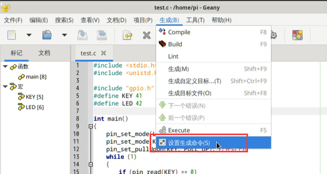
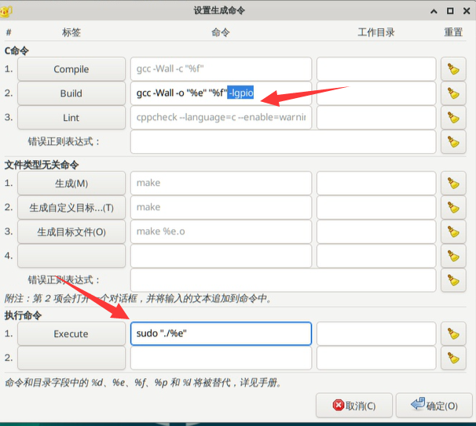

# IO Control

:::tip Note
Please use WalnutPi OS v2.3 or above.
:::

## About Pin Numbering

Run the following command to view the status of each pin. In subsequent programming, use the **Physical** numbers from this table to refer to the pins.

```
gpio pins
```


For detailed operation instructions, please refer to: [**GPIO Command Operations**](../gpio/gpio_command.md) section. This will not be repeated here.


## Example Code

Here is an example: pressing the button on the WalnutPi development board turns on the LED, and releasing it turns off the LED.

```
#include <stdio.h>
#include <unistd.h>
#include "gpio.h" // Library for controlling GPIO

#define KEY 41
#define LED 42
// These two pin numbers can be obtained using the gpio pins command

int main()
{
    pin_set_mode(LED, OUTPUT); 
    pin_set_mode(KEY, INPUT); 
    pin_set_pullUpDn(KEY, PULL_UP); // Enable internal pull-up
    while (1)
    {
        if (pin_read(KEY) == 0)
            pin_write(LED, 1);
        else
            pin_write(LED, 0);
    }
    return 0;
}
```

## Command Line Compilation and Execution

To compile the code, since the GPIO library exists as a dynamic library, you need to add `-lgpio` during compilation. The following command compiles the test.c file in the current directory into the executable test.

```bash
gcc -Wall -o test test.c -lgpio
```

Run the compiled program. Note that administrator privileges are required to control GPIO:

```bash
sudo ./test
```


## Geany IDE Compilation

For how to use Geany IDE, refer to this tutorial: [**Compiling C Code on the Development Board**](./c_run.md)

If you are using the Geany IDE that comes with the WalnutPi desktop system, you need to make some settings.

Open **Build--Set Build Commands**:






Add `-lgpio` at the end of the **Build** command, so that when you click the build button in the software, the GPIO library will also participate in the compilation process:

```bash
gcc -Wall -o "%e" "%f" -lgpio
```

Add `sudo ` before the **Execute** command, so that when you click the run button in the software, it will run with administrator privileges:

```bash
sudo "./%e"
```

Click **OK** to save.
