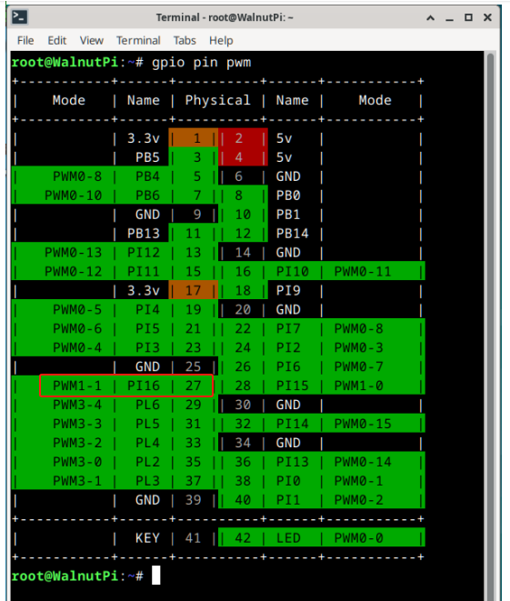

# PWM

In the [**GPIO Application - PWM**](../gpio/pwm.md) section, hardware PWM is controlled by writing values to specified files. If you want to control PWM using C language, simply call the C language file read/write functions to operate those files.

## Example - Operating PWM1-1 Output

```c
#include <stdio.h>
#include <stdlib.h>
#include <fcntl.h>
#include <unistd.h>
#include <string.h>

char *control_path[4] = {
    "/sys/class/pwm/pwmchip0",
    "/sys/class/pwm/pwmchip16",
    "/sys/class/pwm/pwmchip20",
    "/sys/class/pwm/pwmchip22",
};

/**
 * Write a string to a specified file
 * @param path File path
 * @param str String to write
 */
void write_to_file(char *path, char *str)
{
    int fd;
    fd = open(path, O_WRONLY);
    if (fd < 0)
    {
        printf("open file error: %s\n", path);
        exit(-1);
    }
    write(fd, str, strlen(str));
    close(fd);
}

/**
 * Export a PWM channel
 * @param control Controller number 0 1 2 3
 * @param channel PWM channel number
 */
void pwm_export(int control, int channel)
{
    char path[100];
    char str[10];

    sprintf(path, "%s/export", control_path[control]); // Generate the path to the export file
    sprintf(str, "%d", channel);
    write_to_file(path, str);
}

/**
 * Configure PWM channel parameters.
 * @param control Controller number 0 1 2 3
 * @param channel PWM channel number
 * @param period PWM signal period in nanoseconds.
 * @param duty_cycle PWM signal high-level duration.
 */
void pwm_config(int control, int channel, int period, int duty_cycle)
{
    char str[10];
    char path[100];

    sprintf(path, "%s/pwm%d/period", control_path[control], channel);
    sprintf(str, "%d", period);
    write_to_file(path, str);

    sprintf(path, "%s/pwm%d/duty_cycle", control_path[control], channel);
    sprintf(str, "%d", duty_cycle);
    write_to_file(path, str);

    sprintf(path, "%s/pwm%d/polarity", control_path[control], channel);
    write_to_file(path, "normal");
}

/**
 * Enable PWM channel output.
 * @param control Controller number 0 1 2 3
 * @param channel PWM channel number
 */
void pwm_enable(int control, int channel)
{
    char str[10];
    char path[100];

    sprintf(path, "%s/pwm%d/enable", control_path[control], channel);
    write_to_file(path, "1");
}

/**
 * Disable PWM channel output.
 * @param control Controller number 0 1 2 3
 * @param channel PWM channel number
 */
void pwm_disable(int control, int channel)
{
    char str[10];
    char path[100];

    sprintf(path, "%s/pwm%d/enable", control_path[control], channel);
    write_to_file(path, "0");
}

int main()
{
    pwm_export(1, 1); // Export PWM channel
    pwm_config(1, 1, 10000000, 5000000); // Configure PWM period and duty cycle
    pwm_enable(1, 1); // Enable PWM output

    return 0;
}

```


The above code configures the PWM output through the following 3 statements. Regarding **pwm_config(1, 1, 10000000, 5000000);** 

- (1,1) indicates timer 1, channel 1
- Period time 10000000ns, i.e., 10ms, frequency: 1s/10ms = 100Hz; 
- High-level time 5000000ns, i.e., 5ms, duty cycle: 5ms/10ms = 50%

## Experimental Results

Below are the output pin and results:




