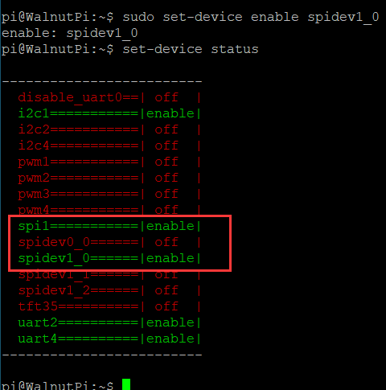
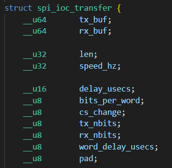
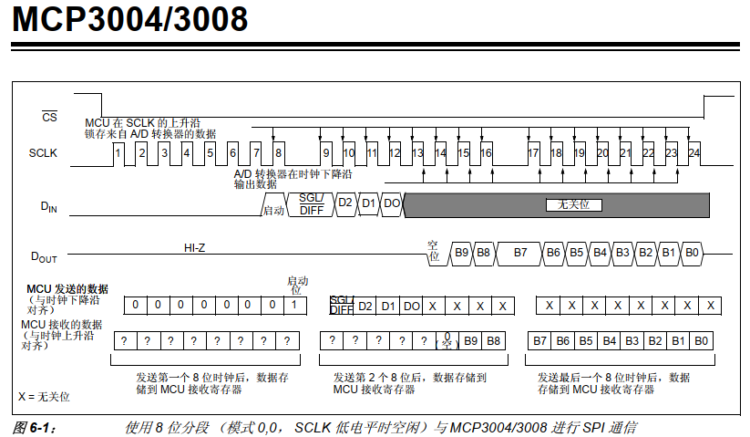
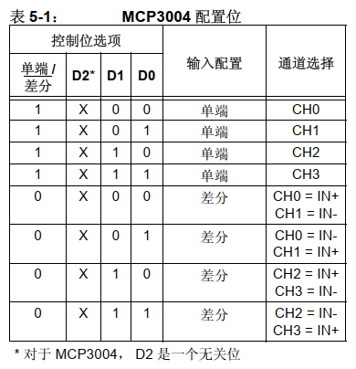
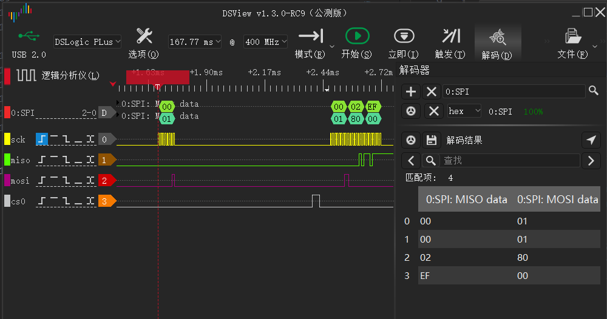

# SPI

## Configure Pins

### Find the SPI Pins on the Board
For easy lookup, we added a feature to display the functional pin positions. Run the following command to see how many available SPI interfaces are on the board's 40-pin header:

```
gpio pin spi
```


You can see that this 40-pin header only has spi1, along with two CS pins belonging to spi1. A single SPI interface can connect to multiple modules simultaneously, each connected to a different CS pin. The CS pin is used to control which module to communicate with.

### Enable spi-dev
We use the `set-device` command to enable/disable the underlying driver for a specified device. After enabling, the pins will switch from GPIO mode to the corresponding multiplexed pin function. (A restart is required for the changes to take effect.)


If we want to operate spi1, we first need to enable spi1, then enable a spidev1_x. For example, enabling `spidev1_0` corresponds to spi1-cs0. After a reboot, a `/dev/spidev1.0` file will appear. When operating this file for SPI communication, it will automatically enable (pull low) the spi1 cs0 pin while disabling (pulling high) all other CS pins.

Note: Enabling spidev1_0 will cause all other device drivers using spi1-cs0 to become invalid, such as the 3.5-inch LCD screen.


Here I enable spidev1_0. Note that a restart is required for the changes to take effect:

```
sudo set-device enable spidev1_0
```



After rebooting, you will see that the file `/dev/spidev1.0` has appeared, because we will need to operate on this file later to control spi1_cs0 communication.


## SPI Read/Write Program
We need to operate on the `/dev/spidev1.0` file. Open it with `open`, configure and trigger SPI read/write with `ioctl`, and close it with `close`.

### 1. Open the File
In Linux, everything is a file. First, use the `open` function to open the device file we want to operate and obtain a file descriptor.

The open function requires the following header files:

```c
#include <sys/types.h>
#include <sys/stat.h>
#include <fcntl.h>
#include <unistd.h>
```

Open the device node:

```c
    int fd = open("/dev/spidev1.0", O_RDWR);
    if (fd < 0)
    {
        perror("Fail to Open\n");
        return -1;
    }

```
### 2. Configure SPI Mode
SPI has 4 modes depending on CPOL and CPHA. Different chips may require you to operate in a specific mode.

The ioctl function requires the following header file:

```
#include <sys/ioctl.h>
```

Configure for mode0, i.e., CPOL=0, CPHA=0:

```c
static uint32_t SPI_MODE = SPI_MODE_0;
    if (ioctl(fd, SPI_IOC_WR_MODE32, &SPI_MODE) == -1)
        printf("err: can't set spi mode");
```

### 3. SPI Transfer
SPI's two data lines work simultaneously - MISO and MOSI operate synchronously. Use the `spi_ioc_transfer` structure to describe a single SPI transfer. SPI can be used to emulate many protocols, or rather, many chips claiming to have SPI interfaces have unusual timing requirements.

- `tx_buf`: Buffer to send via MOSI
- `rx_buf`: Buffer to store MISO content
- `len`: Size of the buffer
- `speed_hz`: SPI transfer speed
- `cs_change`: Whether to keep the CS line asserted after the transfer completes
- `bits_per_word`: Size of a single word during transfer
- `delay_usecs`: Delay after transmission
- `tx_nbits`: Number of lines for SPI transmission. 4-line QSPI also uses this interface for transmission, so this option is provided for selection.



First, the following header file is needed:

```c
#include <linux/spi/spidev.h>
```

Example:

```c
static uint8_t BITS_PER_WORD = 8;
static uint32_t SPEED = 80 * 1000;
    transfer.tx_buf = (unsigned long)tx_buf;
    transfer.rx_buf = (unsigned long)rx_buf;
    transfer.len = len;
    transfer.delay_usecs = 500;     // Delay after transmission completes
    transfer.speed_hz = SPEED;
    transfer.bits_per_word = BITS_PER_WORD;
    transfer.tx_nbits = 1;  // Single-line mode
    transfer.rx_nbits = 1;  // Single-line mode
    transfer.cs_change = 0; // Release CS line after transfer
```

Then, use the ioctl function with `SPI_IOC_MESSAGE(x)` (x = number of transfers passed in) to trigger an SPI transfer. With each clock pulse, the content of tx_buf is output via MOSI while simultaneously reading the MISO content into rx_buf:

```
    int res = ioctl(fd, SPI_IOC_MESSAGE(1), &transfer);
    if (res < 0)
        printf("err: spi_transfer failed");
```
### 4. Close the File
Remember to call `close` after each `open` to manually close it, otherwise the file descriptor will remain until the program exits. The system limits a single program to a maximum of 1024 simultaneously open files. If the program keeps opening files without closing them, it will soon error out.

```
close(fd);
```

## Example Program
Here we use the MCP3004 ADC chip, which converts 4-channel input to SPI output. First, read the chip datasheet to understand the reading steps, as shown below ↓





Now I want to read the value of ch0. I need to send 3 bytes of data: the first byte is 0x01 as the start signal, the second byte is the configuration word 0x80, and the third byte has no function other than to trigger reception. The code is as follows:

```c
#include <stdio.h>
#include <stdint.h>

#include <sys/types.h>
#include <sys/stat.h>
#include <fcntl.h>
#include <unistd.h>

#include <sys/ioctl.h>

#include <linux/spi/spidev.h>

#define DEV_SPI "/dev/spidev1.0"

static uint32_t SPI_MODE = SPI_MODE_0;
static uint8_t BITS_PER_WORD = 8;
static uint32_t SPEED = 100 * 1000;

// MOSI and MISO work simultaneously. While sending data from tx_buf, data is also read into rx_buf.
int spi_transfer(int fd, uint8_t *tx_buf, uint8_t *rx_buf, int len)
{
    struct spi_ioc_transfer transfer;

    transfer.tx_buf = (unsigned long)tx_buf;
    transfer.rx_buf = (unsigned long)rx_buf;
    transfer.len = len;
    transfer.delay_usecs = 500; // Delay after transmission completes
    transfer.speed_hz = SPEED;
    transfer.bits_per_word = BITS_PER_WORD;
    transfer.tx_nbits = 1;  // Single-line mode
    transfer.rx_nbits = 1;  // Single-line mode
    transfer.cs_change = 0; // Release CS line after transfer

    int res = ioctl(fd, SPI_IOC_MESSAGE(1), &transfer); // Trigger transfer
    if (res < 0)
        printf("err: spi_transfer failed");
    return res;
}
int main()
{
    int fd0 = open(DEV_SPI, O_RDWR);
    if (fd0 < 0)
    {
        perror("Fail to Open\n");
        return -1;
    }

    // Configure SPI mode
    if (ioctl(fd0, SPI_IOC_WR_MODE32, &SPI_MODE) == -1)
        printf("err: can't set spi mode");

    uint8_t tx_buf[3] = {0x01, 0x80, 0x00};
    uint8_t rx_buf[3];

    // MCP3004 requires the falling edge of CS0 as the start of SPI communication
    // Since there is only one CS0 device under the current SPI1, CS0 is always low initially
    // Send one piece of data first to trigger CS0 going high
    spi_transfer(fd0, tx_buf, rx_buf, 1); 

    uint16_t value;
    while (1)
    {
        spi_transfer(fd0, tx_buf, rx_buf, 3);
        value = (rx_buf[1] << 8) + rx_buf[2];
        printf("value=%d\r\n ", value);
        sleep(1);
    }

    return 0;
}

```

Compilation on the development board is very simple. I saved the code in the file `spi.c`. To compile it into an executable named `exe`, just run:

```
gcc spi.c -o exe
```

The test result is as follows. Turning the potentiometer connected to channel 0 of the MCP3004 causes the value to change accordingly:


The initial timing when the code starts running is as follows:


