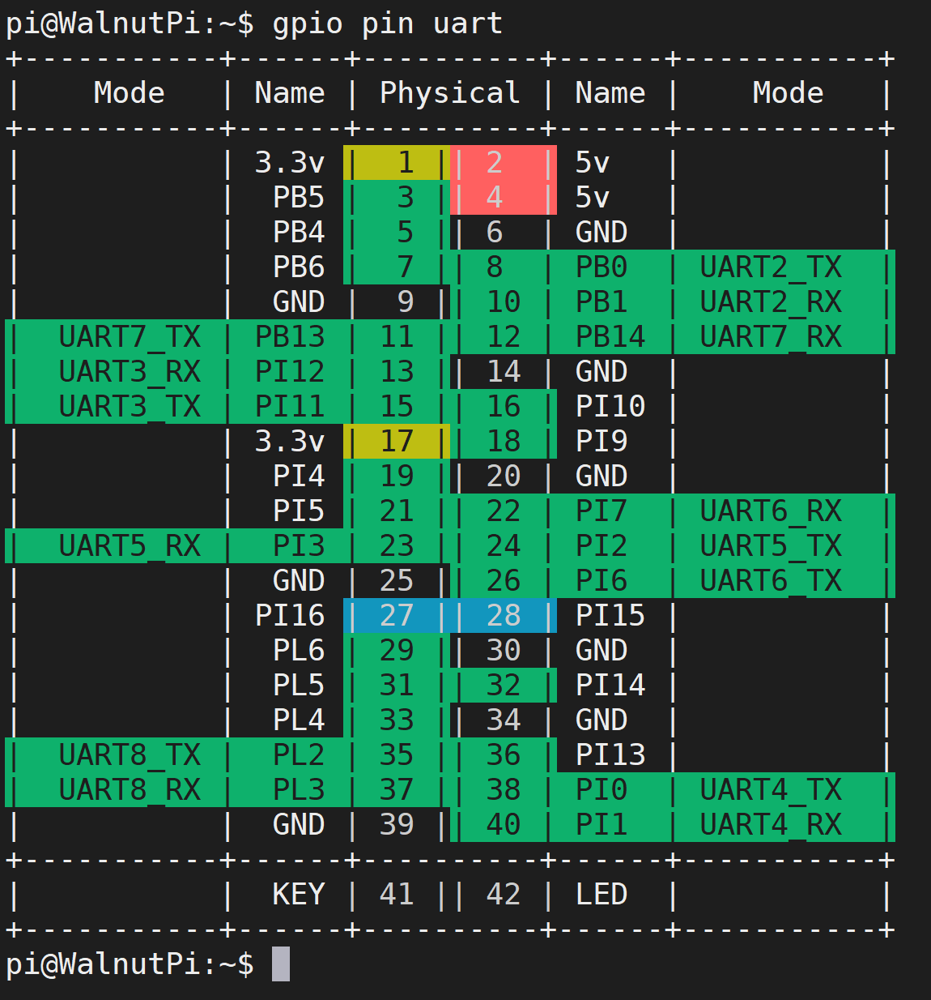
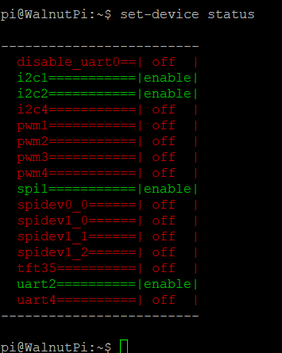
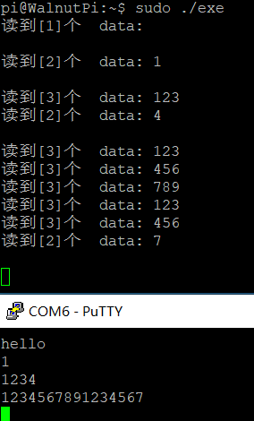

# UART (Serial Port)

## Configure Pins

### Find the UART Pins on the Board
For easy lookup, we added a feature to display the functional pin positions. Run the following command to see how many available UART interfaces are on the board's 40-pin header:

```
gpio pin uart
```




### Enable UART
We use the `set-device` command to enable/disable the underlying driver for a specified device. After enabling, the pins will switch from GPIO mode to the corresponding multiplexed pin function. (A restart is required for the changes to take effect.)

First, check the status of each device:

```
set-device status
```



Run the command to enable UART4. Note that a restart is required for the changes to take effect:

```
sudo set-device enable uart4
```


After rebooting, check the pin status. You will see that pins 38 and 40 are now operating in UART multiplexed mode:


## UART Read/Write Program
In Linux, everything is a file. The serial port is also abstracted as a special file - UART4 is the file `/dev/ttyS4`. Open it with `open`, configure it with `ioctl`, read/write with `write` & `read`, and close it with `close`.

### 1. Open the File
In Linux, everything is a file. First, use the `open` function to open the device file we want to operate and obtain a file descriptor.

The open function requires the following header files:

```
#include <sys/types.h>
#include <sys/stat.h>
#include <fcntl.h>
#include <unistd.h>
```

Open the device node:

```c
    int fd = open("/dev/ttyS4", O_RDWR);
    if (fd < 0)
    {
        perror("Fail to Open\n");
        return -1;
    }

```

### 2. Configure UART Parameters
In Linux, `ioctl` is generally used to configure device-specific parameters. Different devices have different configurable parameters. The following code is the most common 8N1 configuration with a 115200 baud rate.


The following header files are needed:

```c
#include <sys/ioctl.h>
#include <termios.h>
```

- Data bits: Options include `CS8`, `CS7`, `CS6`, etc.
- Parity: If the bit corresponding to `PARENB` is set to 1, parity is enabled. Additionally, if the bit corresponding to `PARODD` is set to 1, it is odd parity; otherwise, it is even parity.
- Stop bits: If the bit corresponding to `CSTOPB` is set to 1, there are 2 stop bits; otherwise, there is 1 stop bit.

```c
    struct termios opt;
    ioctl(fd,TCGETS, &opt); // Get UART parameters opt

    cfsetospeed(&opt, B115200); // Output baud rate 115200
    cfsetispeed(&opt, B115200); // Input baud rate 115200
    
    opt.c_cflag &= ~CSIZE; // Clear data bits setting
    opt.c_cflag |= CS8; // Data bits = 8

    opt.c_cflag &= ~PARENB; // No parity

    opt.c_cflag &= ~CSTOPB; // 1 stop bit

    ioctl(fd,TCSETS, &opt); // Apply the configuration

```

### 3. Transmitting
As long as you write data to this file, the underlying layer will send it out via the serial port.

The write function requires this header file:

```c
#include <unistd.h>
```

Send data:

```c
    char buf[1024] = "hello\n";
    write(fd, buf, strlen(buf));
```

### 4. Receiving
The underlying driver automatically stores the data received through the serial port into a buffer. We only need to use the `read` function to read this file, which reads the content of the serial port buffer.

The `read` function attempts to read a specified number of characters, and the return value is the actual number of characters read.

If the buffer is empty, the `read` function will block here. Only when the serial port receives data ending with a `\n` carriage return will the buffer be flushed and the data delivered to `read`.


The `read` function depends on the same header file as the `write` function:

```
#include <unistd.h>
```

Below is an example code for reading:

```c
    tcflush(fd, TCIOFLUSH); // Clear the serial port receive buffer
    while (1)
    {
        int res = read(fd, buf, 3); // Read 3 characters
        if (res > 0)
        {
            buf[res] = '\0';
            printf("Read [%d] bytes  data: %s\n", res, buf);
        }
    }

```

### 5. Close the File
Remember to call `close` after each `open` to manually close it, otherwise the file descriptor will remain until the program exits. The system limits a single program to a maximum of 1024 simultaneously open files. If the program keeps opening files without closing them, it will soon error out.

```c
close(fd);
```
## Testing
The complete example code is as follows. When running, it sends the string "hello" via the serial port, and then the serial port loops to print out the received data:

```c
#include <stdio.h>
#include <stdint.h>
#include <string.h>

#include <sys/types.h>
#include <sys/stat.h>
#include <fcntl.h>
#include <unistd.h>

#include <sys/ioctl.h>
#include <termios.h>


#define DEV_UART "/dev/ttyS4"

int main()
{
    int fd = open(DEV_UART, O_RDWR);
    if (fd < 0)
    {
        perror("Fail to Open\n");
        return -1;
    }

    struct termios opt;
    ioctl(fd, TCGETS, &opt); // Get UART parameters opt

    cfsetospeed(&opt, B115200); // Output baud rate 115200
    cfsetispeed(&opt, B115200); // Input baud rate 115200

    opt.c_cflag &= ~CSIZE; // Clear data bits setting
    opt.c_cflag |= CS8;    // Data bits = 8

    opt.c_cflag &= ~PARENB; // No parity

    opt.c_cflag &= ~CSTOPB; // 1 stop bit

    ioctl(fd, TCSETS, &opt); // Apply the configuration

    fcntl(fd, F_SETFL, O_NONBLOCK);

    char buf[1024] = "hello\n";
    write(fd, buf, strlen(buf));

    tcflush(fd, TCIOFLUSH); // Clear the serial port receive buffer
    while (1)
    {
        int res = read(fd, buf, 3); // Read 3 characters
        if (res > 0)
        {
            buf[res] = '\0';
            printf("Read [%d] bytes  data: %s\n", res, buf);
        }
    }

    close(fd);

    return 0;
}
```

Compilation on the development board is very simple. I saved the code in the file `uart.c`. To compile it into an executable named `exe`, just run:

```
gcc uart.c -o exe
```

The execution result is as follows:


