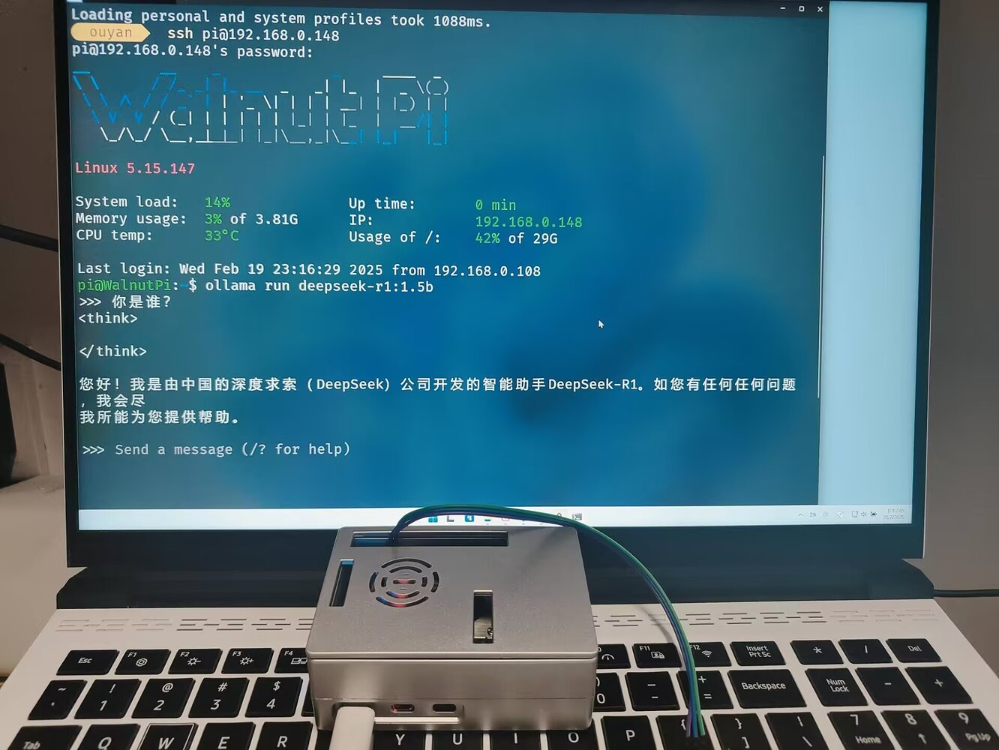
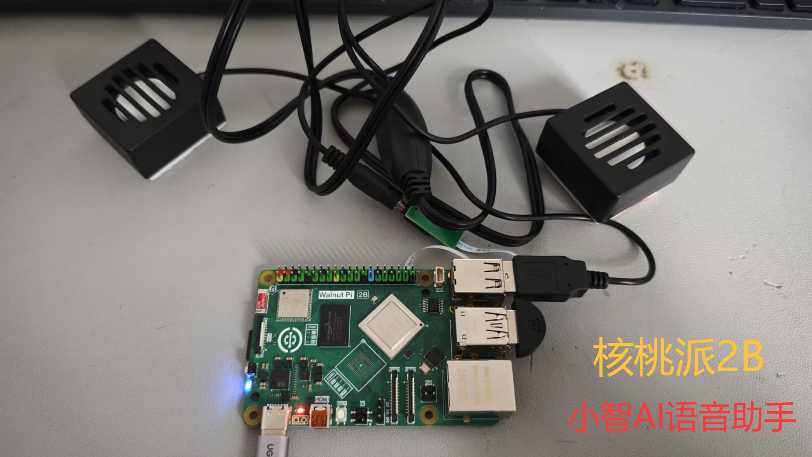

# Community Open-Source Project Sharing

Thanks to the following users for contributing projects to the Walnut Pi open-source ecosystem. If you also have open-source projects based on Walnut Pi, feel free to contact us via QQ group or email (walnutpi@qq.com). We will periodically reward contributing users with Walnut Pi related products.

## Walnut Pi 2B: Deploying DeepSeek-R1 1.5B LLM

- `User`: ouyanglingle

[Running DeepSeek-R1 LLM on Walnut Pi 2B and converting user text to AT commands for output to a microcontroller](https://forum.walnutpi.com/t/topic/298)

## Walnut Pi 2B: XiaoZhi AI Voice Assistant

- `User`: jd3096

[Running Maker Succubus — XiaoZhi on Walnut Pi 2B: A Beginner's Guide](https://forum.walnutpi.com/t/topic/315)

## Walnut Pi 1.54-inch LCD Expansion Board

- `User`: windskys

[Walnut Pi 2B Functional Board (LCD) — Open-source PCB](https://oshwhub.com/windskys/walnut-pi-2b)

