# System Image Burning

- **Video Tutorial**

<iframe src="//player.bilibili.com/player.html?isOutside=true&aid=1203172875&bvid=BV12F4m1N7Jz&cid=1508551068&p=1" scrolling="no" border="0" frameborder="no" framespacing="0" allowfullscreen="true" width="100%" height="500"></iframe>

<br></br>
<br></br>

Walnut Pi OS is a free Debian-based operating system optimized for Walnut Pi hardware. It is the recommended operating system for normal use on the Walnut Pi.

The Walnut Pi operating system is installed onto an SD card. Currently, two images are available: a customized Debian Desktop edition and a Server (headless) edition.

- **Desktop Edition**: The Walnut Pi customized Debian has been heavily modified to provide an experience closer to Windows. The system comes pre-installed with a rich set of applications, ready to use right after booting. It includes C and Python programming tools, Google Chrome browser, LibreOffice (compatible with Microsoft Office), an image viewer, VLC media player, screenshot tool, and more, all aimed at lowering the barrier to entry.

- **Server Edition (Headless)**: This uses terminal-based interaction. The benefits are faster boot times, lower memory usage, and lower power consumption—especially suitable for users familiar with Linux commands. You can even use it to deploy a small server.

<br></br>

- `Normal User (Default)` Username: pi ; Password: pi
- `Root Account` Username: root ; Password: root

## Image Download Links:

- Baidu Netdisk: https://pan.baidu.com/s/1dxZ9weWiwwEjI5t3j5sP6Q?pwd=WPKJ
- Access code: **WPKJ**

For changelog details, see the **readme.txt** inside the download. If Baidu Netdisk download speeds are too slow, you can download from the QQ group files: 677173708

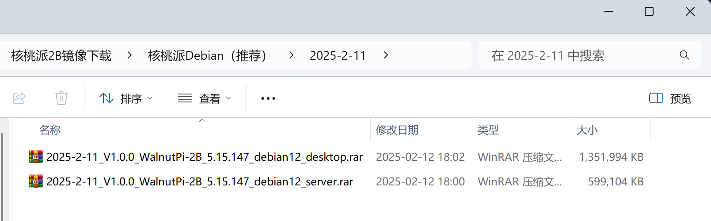


## Burning the SD Boot Card

### Using Rufus (Recommended)

After downloading the image, you will also need an image burning tool. We recommend the lightweight burning software **Rufus**. Download link: https://rufus.ie/


After downloading, simply open the software, select your USB drive and the image file to burn:

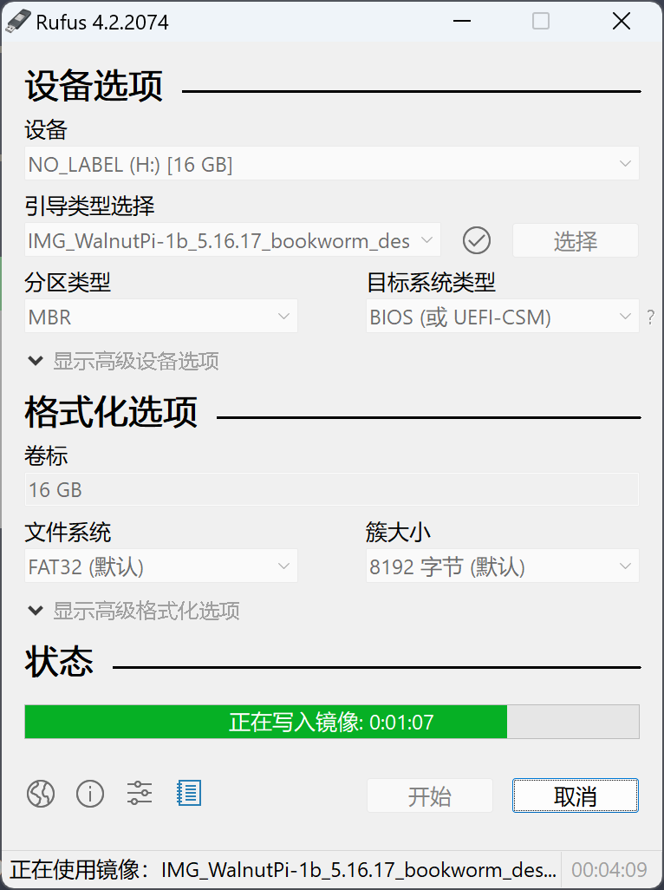


### Using balenaEtcher

If Rufus cannot burn the image, you can try balenaEtcher. **balenaEtcher** download: [https://etcher.balena.io/#download-etcher](https://etcher.balena.io/#download-etcher/)

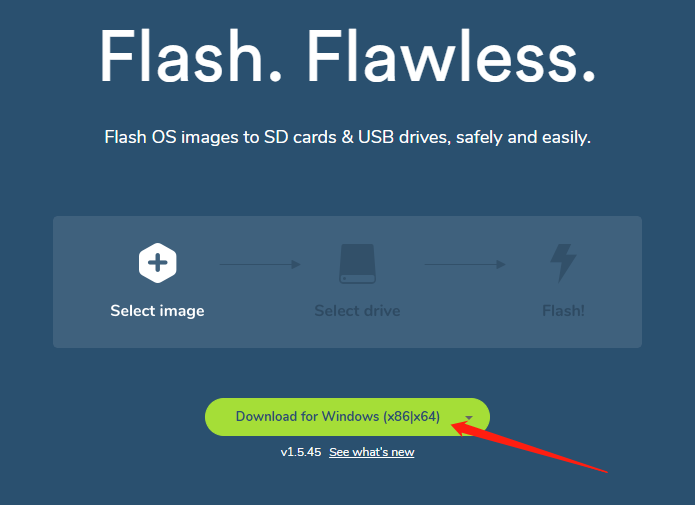

Choose the version that matches your computer's operating system. Windows users should select the first option to download and install.


After installation, open the software and you will see the following interface:

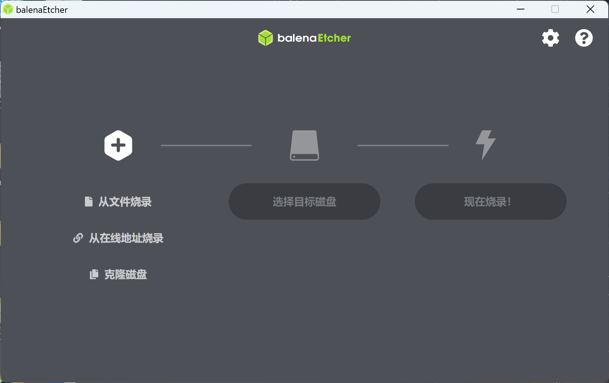

Insert the MicroSD card into your computer via a card reader (recommended: 16GB or larger, SanDisk Class 10 or similar brand).

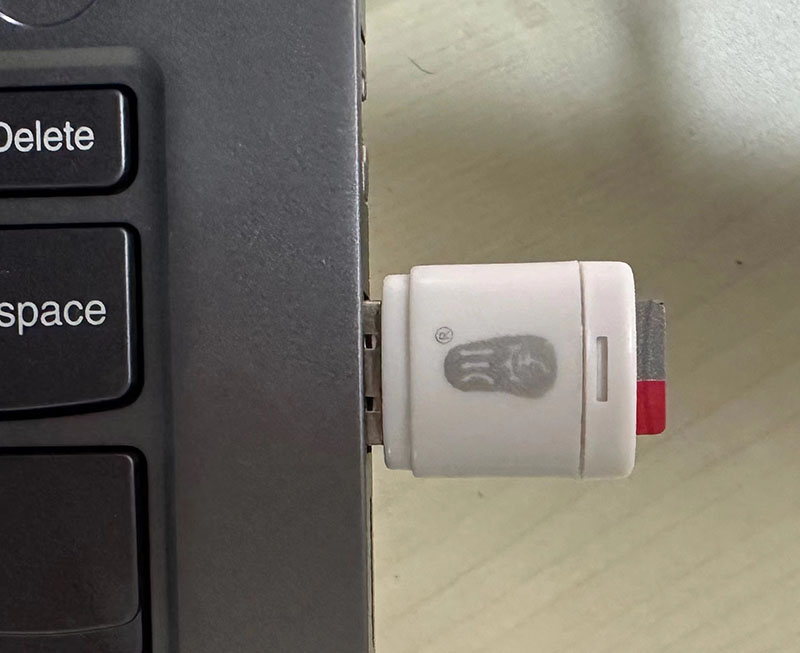

Return to the image burning software. Click **Select image** and choose the system image file you downloaded earlier. Note that files downloaded from Baidu Netdisk are compressed—extract the .img file first before selecting.


Then, under **Select Drive**, choose the drive letter corresponding to your SD card. If a prompt appears asking to format the drive, simply click Cancel—the burning software will format the SD card automatically.


Click **Flash** to begin burning the image. You will see a progress indicator during the process:


Once burning is complete, it will appear as shown below:

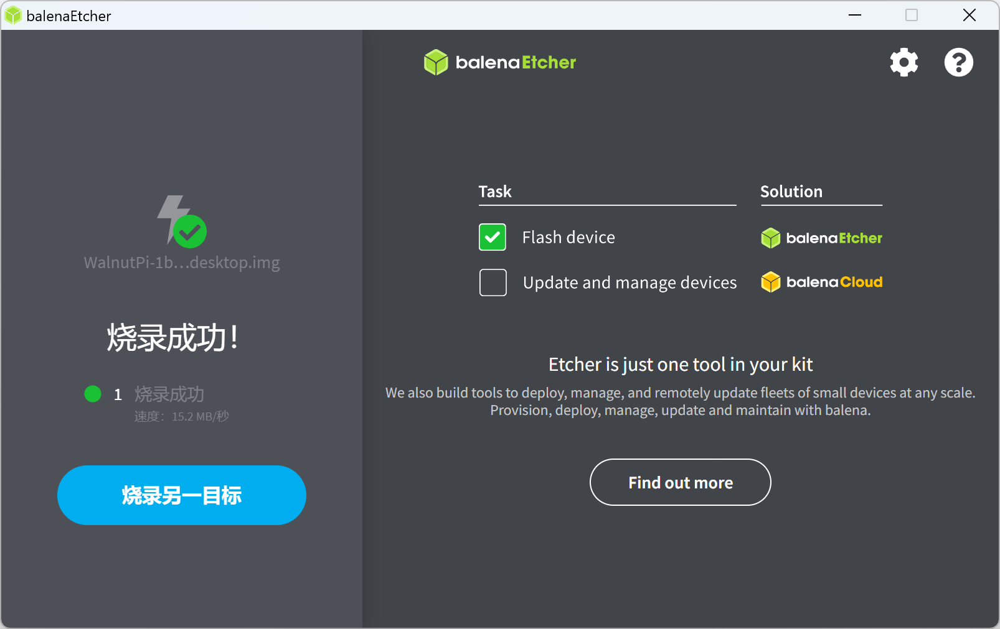

After burning, you may notice that Windows only shows a 100MB partition. This is normal—it contains some Walnut Pi configuration files.


## EMMC Burning

The following tutorial applies to the Walnut Pi 2B with EMMC version.

::::tip Note
When both the SD card and EMMC contain an operating system, the chipset will boot from the SD card.
::::

### Auto-flash Image to EMMC Using SD Card (Recommended)

The Walnut Pi 2B provides a packaged system image that can automatically flash the OS to EMMC. Download links:

- Baidu Netdisk: https://pan.baidu.com/s/1nUUUX1yq7dbeRtqAv8XCMQ?pwd=WPKJ
- Access code: **WPKJ**

This contains the Walnut Pi Debian images, including both Desktop and Server editions.

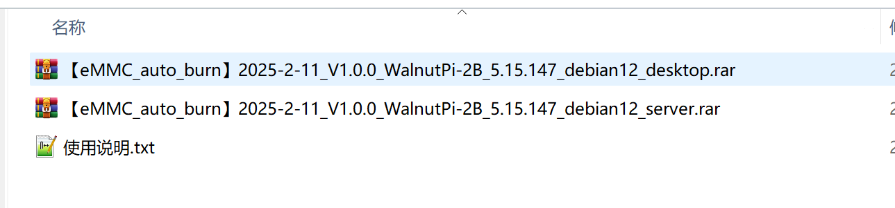

Use the [Burning the SD Boot Card](#burning-the-sd-boot-card) method described earlier to burn this image to the SD card. After burning, insert it into the Walnut Pi.

You can monitor the flashing progress in the following 3 ways:

**1. Connect an HDMI Display (1080P resolution recommended)**

The system will automatically display the flashing progress after booting:

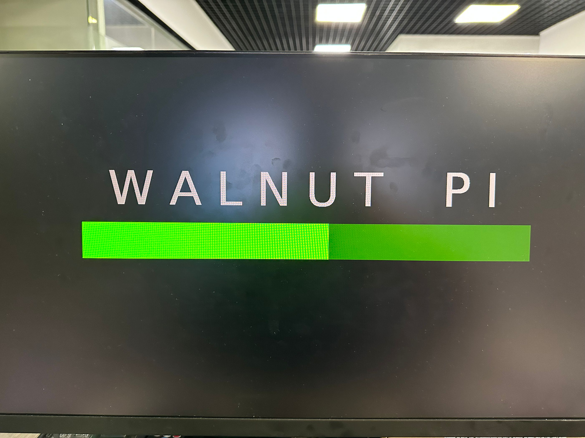

After flashing is complete, it will appear as shown below:

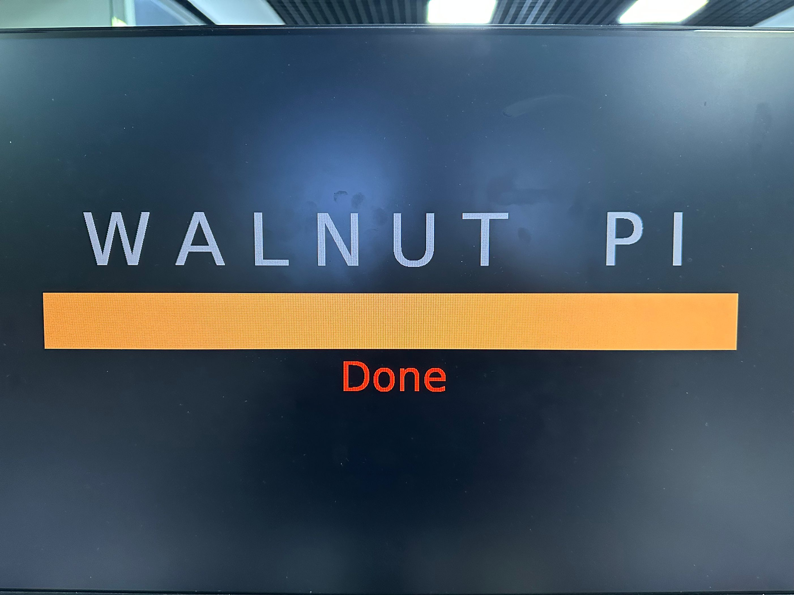

**2. Serial Terminal**

You can also view the flashing progress via the serial terminal:

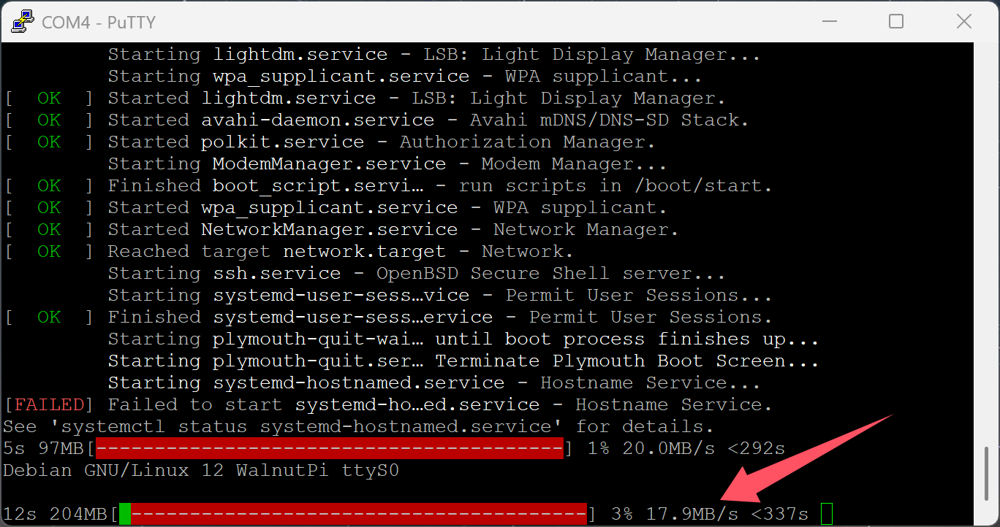

**3. Blue LED**

The blue LED blinks during the flashing process and turns off once flashing is complete.

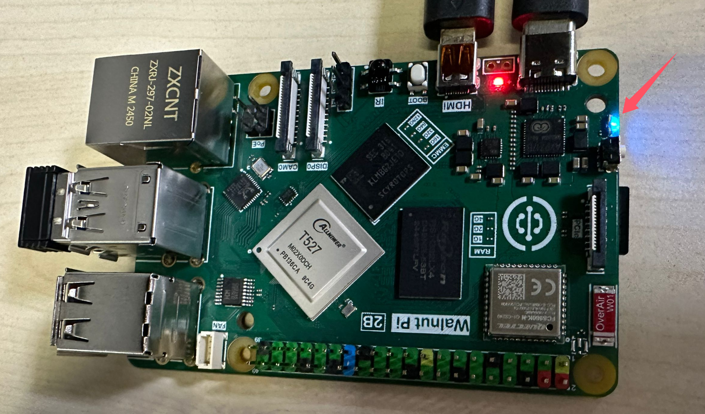


After flashing is complete, power off, remove the SD card, and power on again to boot from EMMC.


### Manual Flashing from the Walnut Pi Debian System

In addition to the methods above, you can also boot a Walnut Pi Debian system from an SD card, then mount the Walnut Pi image via USB drive or network share to perform manual flashing.

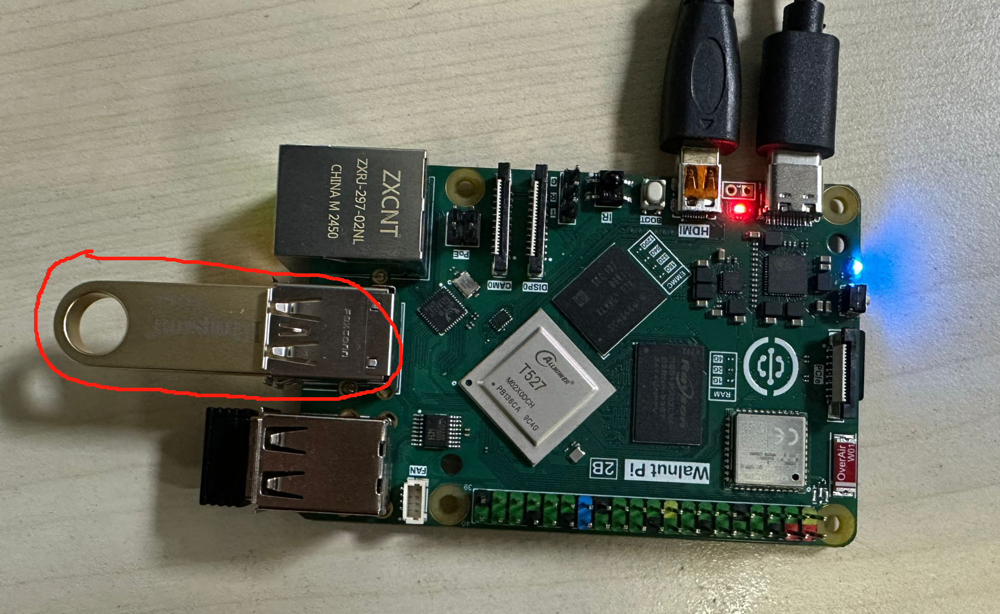


You can also compress the image into a zip file first, connect it to the Walnut Pi via a USB drive, and then decompress the image using the `unzip` command to save copying time.

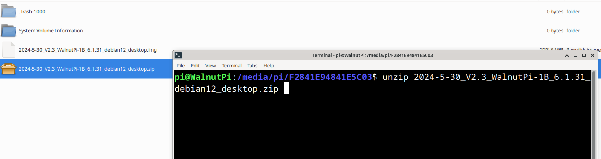

Extract to the current directory:
```bash
unzip xxx.zip
```

::::tip Note

You can also extract to a specific directory. The following command extracts the zip file to the /home/pi directory:
```bash
unzip xxx.zip -d /home/pi
```
::::


Then use the following command to flash the .img image file to the Walnut Pi EMMC:

```bash
sudo set-emmc burn xxx.img
```


After flashing is complete, shut down, remove the SD card, and power on. If the system boots normally, it means the system has been successfully flashed to EMMC and is working properly.
