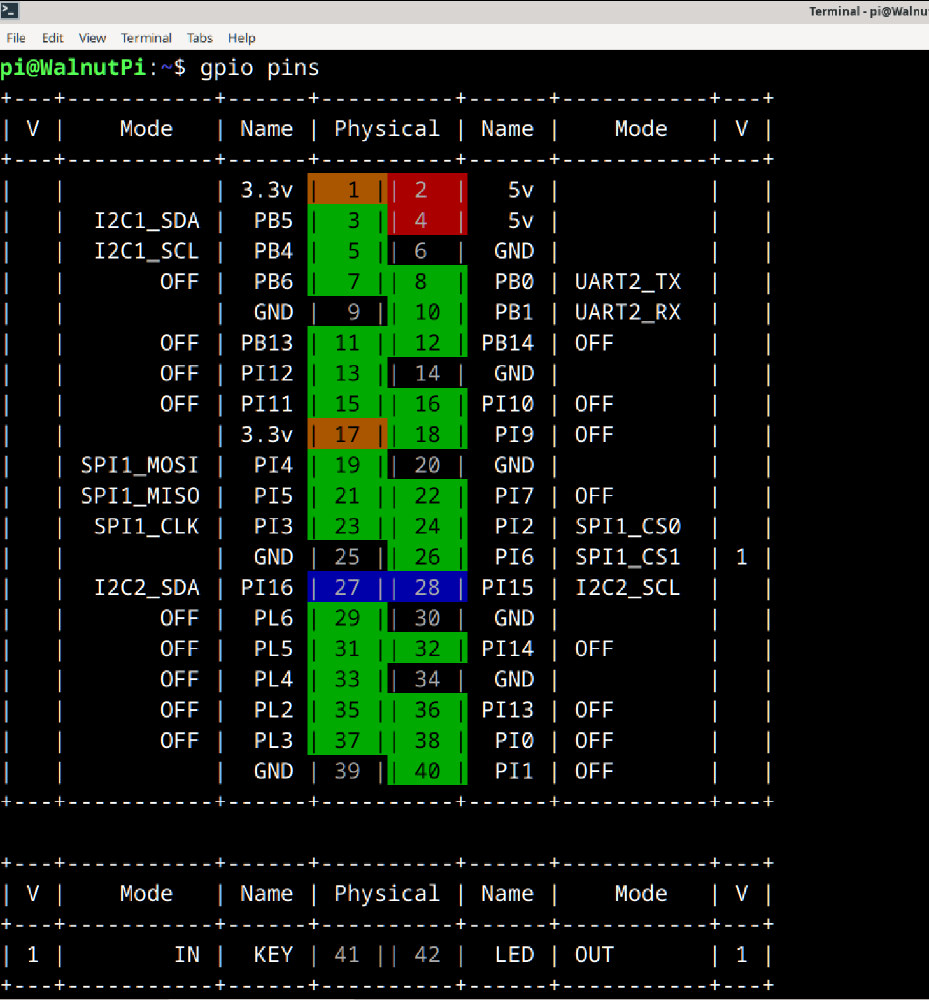
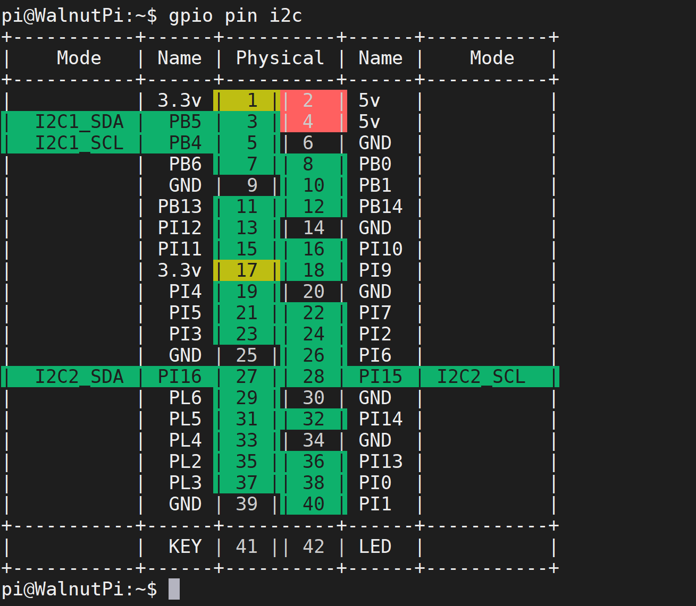
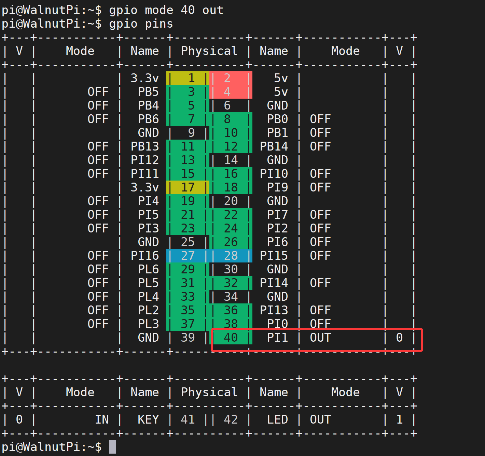
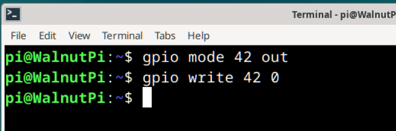
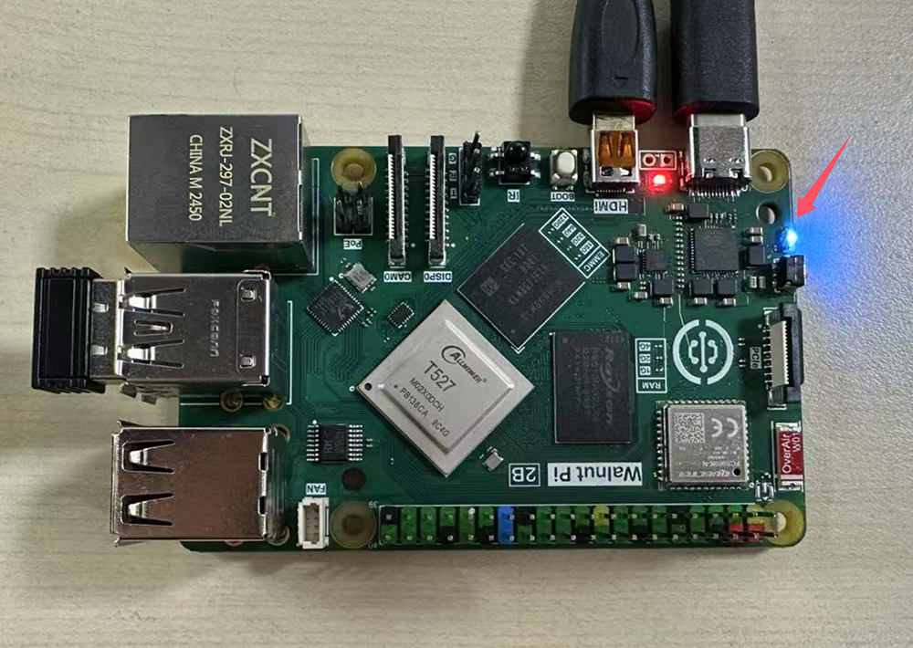
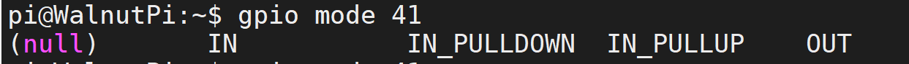
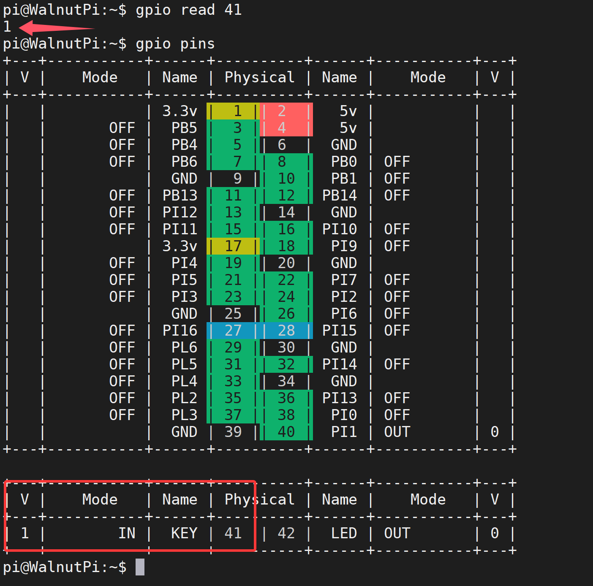
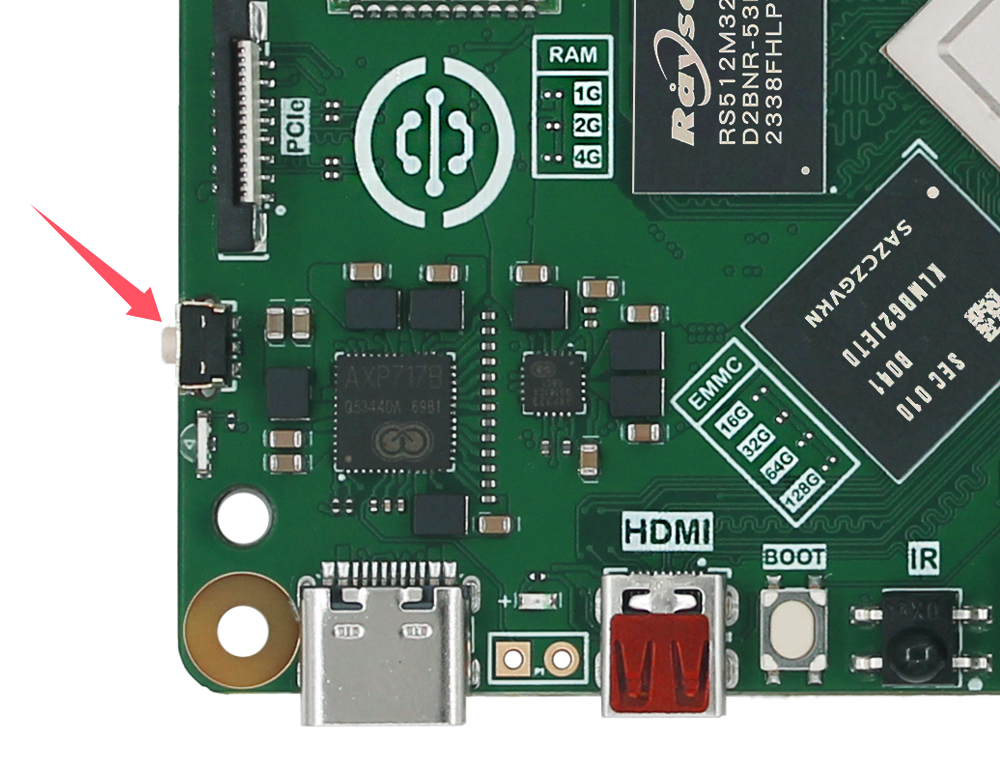

# GPIO Command Operations

We provide a set of commands for quickly operating GPIO from the command line. This guide mainly introduces how to use these commands.

To control GPIO using Python programming, please refer to this chapter: [**Python Embedded Programming - Lighting the First LED**](../python/gpio/led.md)

To control GPIO using C programming, please refer to this chapter: [**C Embedded Programming - Controlling GPIO**](../c/io_gpioc.md)

## View All Pin States

Use the following command to view all pin definitions of the Walnut Pi:
```bash
gpio readall
```
or
```bash
gpio pins
```


The meaning of each column in the output above:
- `Physical` : The physical pin number on the board, used for subsequent command operations
- `Name` : Pin name, which can be used in Python programming
- `mode`: The current operating mode of the pin:
    - `OFF`: Initial state, not configured
    - `IN`: Input mode
    - `OUT`: Output mode
    - `Other`: Pin alternate function
- `V` : When the pin is in IN/OUT mode, the voltage level state, 1 for high, 0 for low

## View I2C/UART etc. Pin Locations

This is a Walnut Pi specific feature for convenient user query.

```bash
gpio pin [function]
```
Outputs a table showing the locations of pins with the specified function.
- `[function]`: Function type, choose from the following options:
    - `pwm`
    - `uart`
    - `spi`
    - `i2c`

For example, to find out which pins are I2C, enter the following command:

```bash
gpio pin i2c
```


## Set Pin Function
```bash
gpio mode [PIN] [mode]
```
- `[PIN]`: Physical pin number of the target pin.
- `[mode]`: Choose from the following:
    - `IN` : Input mode, floating
    - `IN_PULLUP` : Input mode, internal pull-up enabled
    - `IN_PULLDOWN` : Input mode, internal pull-down enabled
    - `OUT` : Output mode
    - `OFF` : Return to initial unused state

For example, to set pin 40 to output mode, use the following command:
```bash
gpio mode 40 out
```
After configuration, use the **gpio pins** command to check the pin status; you can see that PC8's pin mode has changed to OUT.



## Control Pin Output Level

```bash
gpio write [PIN] [status]
```

- `[PIN]` : The wPi number of the pin you want to control.
- `[status]` : Pin output state.
    - `0` : Low level (0V)
    - `1` : High level (3.3V)

We can test this using the onboard blue LED. Since the LED is on by default after system startup, let's use the command to turn it off.

From the table above, the LED's pin number is **42**. First, set the LED pin mode to output:
```bash
gpio mode 42 out
```

Then set the output state to 0 (low level, 0V):

```bash
gpio write 42 0
```



You can see the blue LED on the Walnut Pi has turned off.




## Read Pin Input Level

```bash
gpio read [PIN]
```

- `[PIN]` : The pin number to read.

We can test this using the onboard button. Read the button's input level. When the Walnut Pi's onboard button is not pressed, it inputs 1 (high level, 3.3V); when pressed, it outputs 0 (low level, 0V).

From the table above, the button KEY's wPi number is **41**. Since a pull-up resistor is already on the board, simply set the KEY pin mode to input:
```bash
gpio mode 41 IN_PULLUP
```

:::tip
Adding `IN` after `gpio mode 41` means input mode, and `IN_PULLUP` means enable pull-up resistor. You can use `Tab` key completion to view all function settings.


:::

After setting, read the current voltage state of the button:

```bash
gpio read 41
```

Due to the pull-up resistor, when the button is not pressed, the pin input level is 1 (high level, 3.3V).



Next, **press and hold the button**:



Execute the read level command again. Since the switch is connected to ground, it pulls the pin level low, so you can see the input level changes to 0 (low level, 0V).
```bash
gpio read 41
```


## Toggle Pin Output Level

This function toggles the level of an output-mode pin. For example, if the current output is high, executing this command will output low; executing it again will toggle back to high.

```bash
gpio toggle [PIN]
```
- `[PIN]` : The wPi number of the output pin.

For example, toggle the onboard LED output state:
```bash
gpio toggle 42
```
