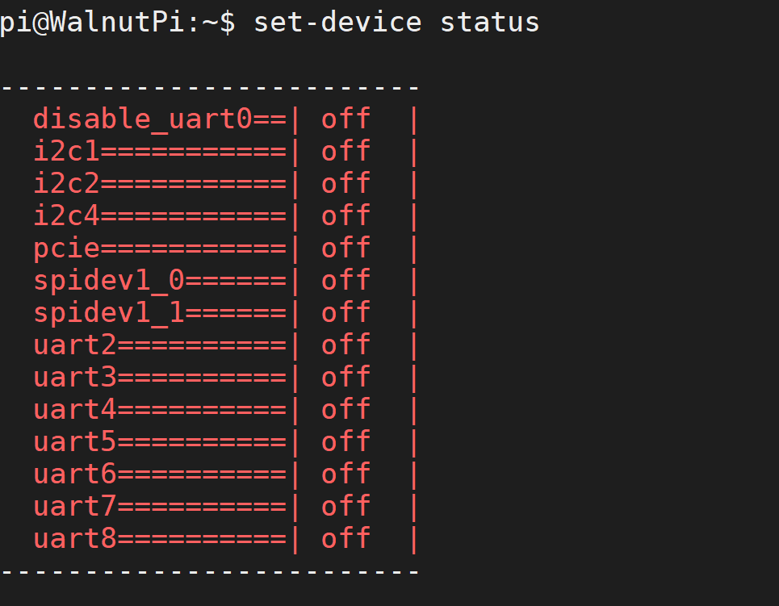
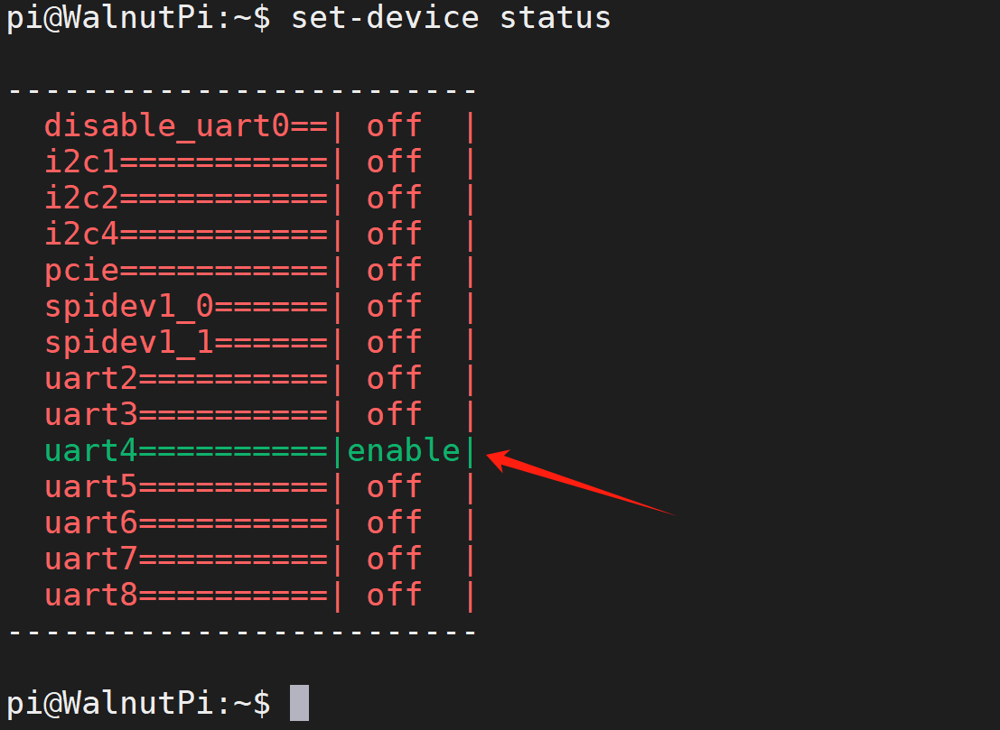
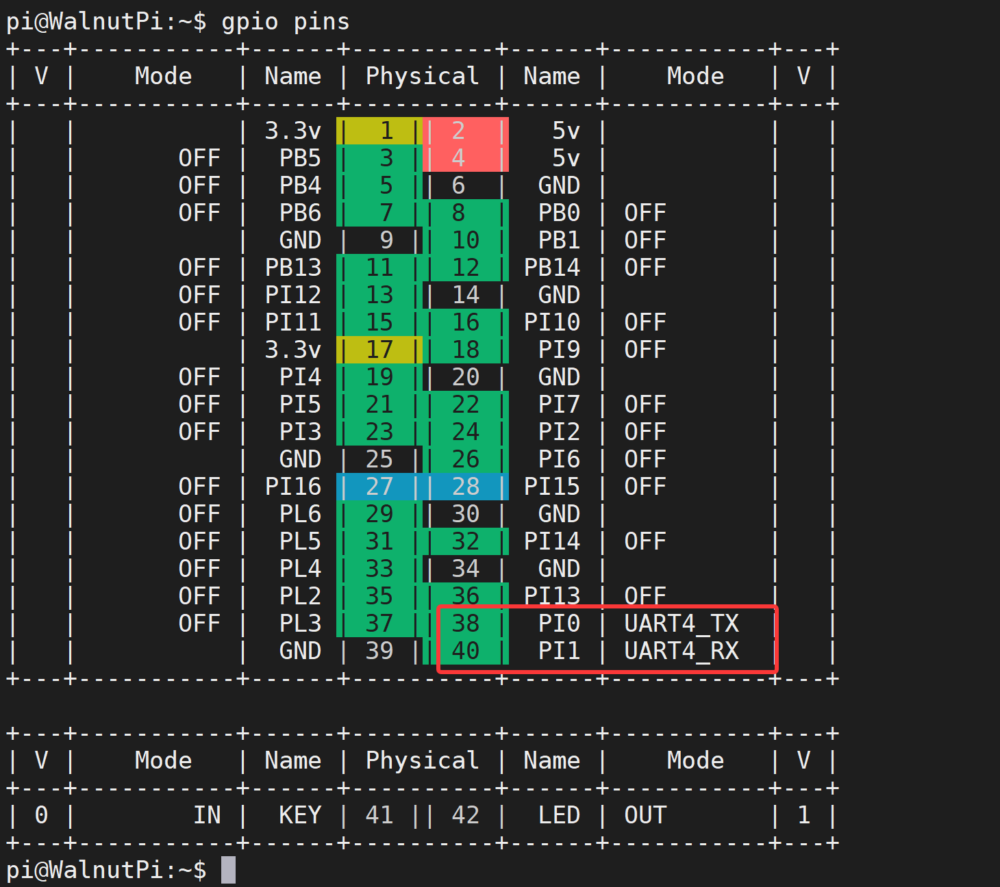

# Switch GPIO Function

Some pins carry functions such as **I2C, UART, SPI**, etc. You need to use the `set-device` command to enable the configuration before you can use Python or C for embedded programming applications.

The working principle of `set-device` is based on Linux's **device tree overlay** feature. We have written information such as "configure pin xx as SPI and enable the corresponding driver" into configuration files (.dtb). This command controls which configuration files (.dtb) the system loads at boot.

Note that some drivers are mutually exclusive. For example, enabling the 3.5-inch display occupies SPI1, so you cannot simultaneously use the spidev1.0 driver. If you configure pins 38/40 of the Walnut Pi 2B as UART4, then these two pins cannot be used for hardware PWM.

For example, pin **PI13** can be set as **pwm3** or **uart4_txd**. If you set it as **uart4_txd**, you cannot use the **pwm3** function.


## View GPIO Device Status

Use the following command to view the status of all GPIO devices:

```bash
set-device status
```
- Status **off**: The item is not active
- Status **enable**: The corresponding pin will be configured and the driver will be enabled.



## Enable GPIO Device

Use the following command to enable a GPIO device:

```bash
sudo set-device enable xx
```

Example: Enable **uart4**

```bash
sudo set-device enable uart4
```

After enabling, a restart is required to take effect:

```bash
sudo reboot
```

After running the above commands again, use the `set-device status` command to see that the uart4 device has been enabled.



After running the `gpio pins` command, you can also see that the corresponding pin of the Walnut Pi 2B has been switched to the corresponding operating mode.




## Disable GPIO Device

Use the following command to disable a GPIO device:

```bash
sudo set-device disable xx
```

After disabling, a restart is required to take effect:

```bash
sudo reboot
```
