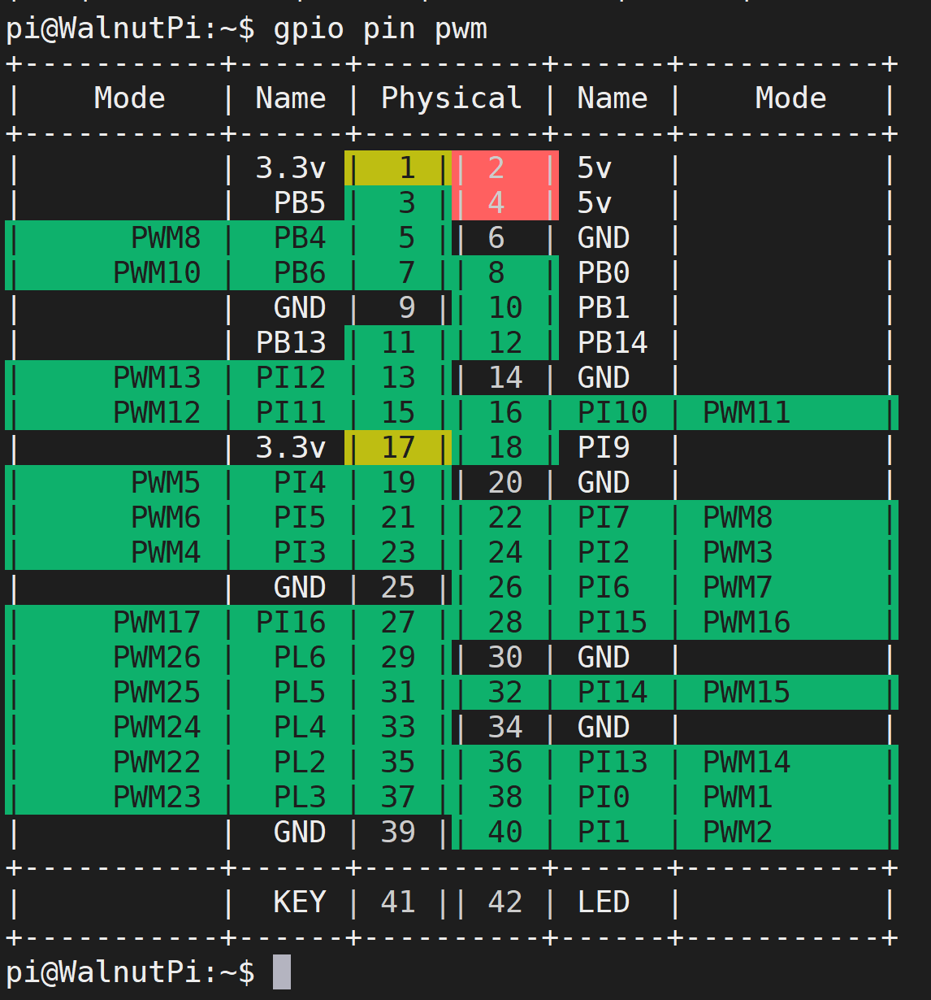
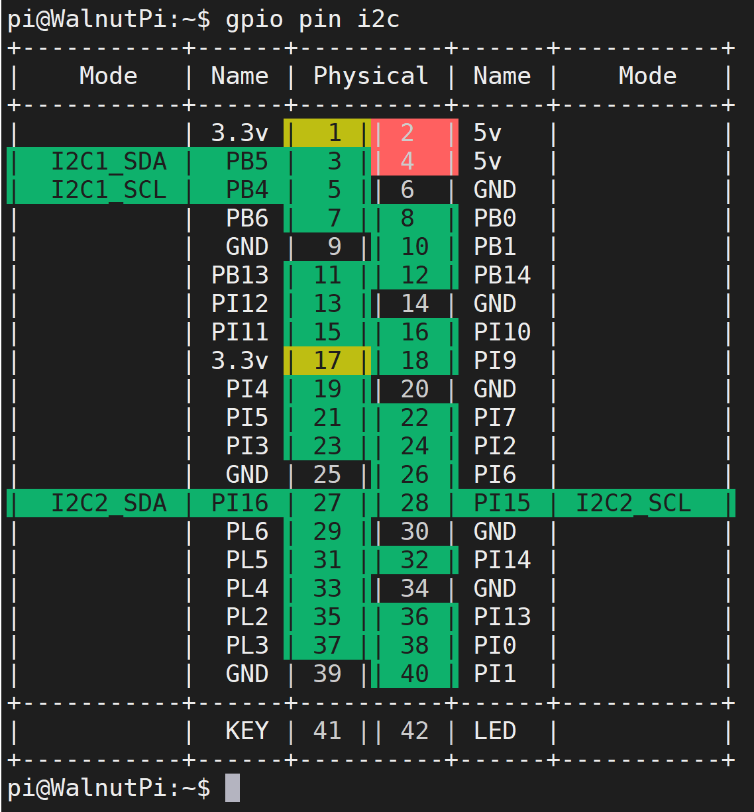
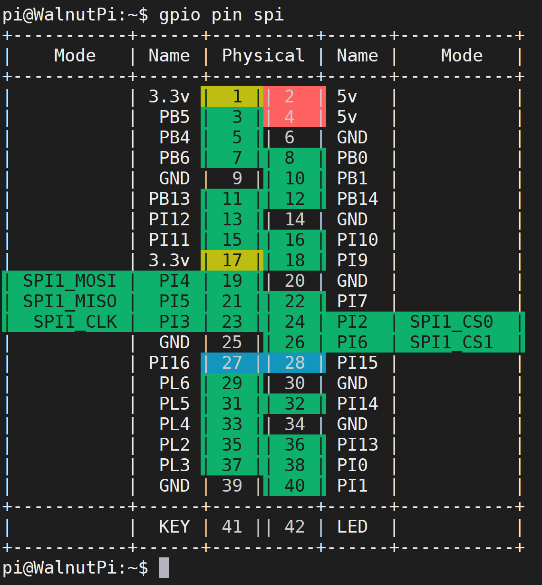

# GPIO Introduction

Let's take a detailed look at the Walnut Pi's GPIO, i.e., its 40-pin GPIO header (similar to Raspberry Pi). The Walnut Pi is already a great single-board computer, but the GPIO design makes it easier for users to perform various DIY electronic projects, giving you an experience similar to using a powerful microcontroller development board.


Below is the Walnut Pi GPIO pinout diagram:

- Walnut Pi 2B


As shown in the table and diagram above, GPIO is similar to traditional microcontroller development. In addition to regular I/O pins, it also features I2C, UART, SPI and other bus interfaces, as well as power output pins (3.3V and 5V). You can connect various sensors and modules, all of which will be covered in the later embedded programming chapters.

## Power Pins

The Walnut Pi GPIO header provides two 5V and two 3.3V output pins, as well as 8 GND pins for external power supply.

## General-Purpose I/O

Except for the power pins, all I/O pins can be configured as input/output pins. The I/O voltage level is 3.3V.

## Other Functions

Some pins have additional functions, as detailed below:

### PWM (Pulse Width Modulation)

PB4, PB6, PI10, PI11, PI12, PI2, PI3, PI4, PI5, PI6, PI7, PI15, PI16, PI13, PI14, PI0, PI1, PL2, PL3, PL4, PL5, PL6 support hardware PWM.

Query command:

```bash
gpio pin pwm
```


### UART

- TX2(PB0), RX2(PB1)
- TX3(PI11), RX3(PI12)
- TX4(PI0), RX4(PI1)
- TX5(PI2), RX5(PI3)
- TX6(PI6), RX6(PI7)
- TX7(PB13), RX7(PB14)
- TX8(PL2), RX8(PBL3)

Query command:
```bash
gpio pin uart
```


### I2C

- SDA1(PB5), SCL1(PB4)
- SDA2(PI16), SCL2(PI15)

Query command:
```bash
gpio pin i2c
```


### SPI

- SPI1: MOSI (PI4); MISO (PI5); SCLK (PI3); CS0 (PI2), CS1 (PI6)

Query command:
```bash
gpio pin spi
```

