# PWM

This guide mainly introduces how to use the onboard hardware PWM functionality, based on the general Linux PWM operation method.

Root privileges are required to operate hardware PWM. First, switch from user pi to root user:
```
su root
```
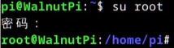

## View PWM Pin Distribution
Run the `gpio pin pwm` command to see which pins support hardware PWM:
```
gpio pin pwm
```
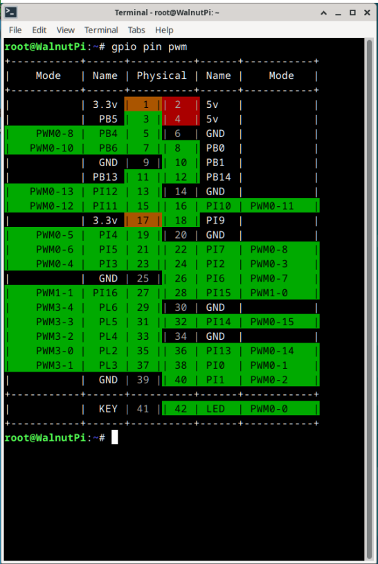


## Switch Pin to PWM Function
Unlike UART, SPI, I2C functions, if you want to use the PWM function of a pin, simply use the `set-device` command to disable other functions on that pin. (Changes made by set-device require a restart to take effect.)

For example, pin 24 (PI2) of the Walnut Pi 2B can serve as pwm3, uart5_tx, or spi1_cs0. As long as uart5 and spi1 are not enabled during the current boot, this pin 24 (PI2) can be set as a hardware PWM output.

## PWM Control Method

### 1. Export PWM Control Files
There are 4 folders under the path **/sys/class/pwm/**, corresponding to the 4 hardware PWM controllers of the chip. Write the channel number to the internal **export** file to generate the control file for the corresponding PWM channel. We will use these generated files later to control PWM parameters such as period and duty cycle.

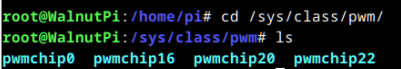

- For example, pin 19 is PWM0-5, channel 5 of PWM controller 0, belonging to **pwmchip0**
- For example, pin 27 is PWM1-1, channel 1 of PWM controller 1, belonging to **pwmchip16**
- For example, pin 29 is PWM3-4, channel 4 of PWM controller 3, belonging to **pwmchip22**

Here I want to control PWM0-13, channel 13 of PWM controller 0. Enter the pwmchip0 folder and write 13 to the **export** file:
```
cd /sys/class/pwm/pwmchip0
echo 13 > export
```

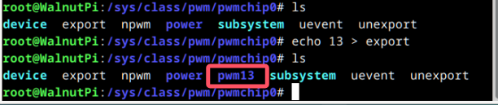

Enter this **pwm13** folder; the files inside can be used to configure PWM.

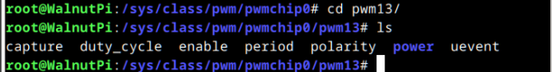

### 2. Set Period

The **period** file is used to set the PWM period, in nanoseconds (ns).

For example, to output a PWM signal with a 20ms period, enter the following command:
```
echo 20000000 > period #Set period to 20ms
```
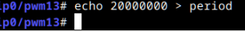


### 3. Set Duty Cycle
The **duty_cycle** file is used to set the high-level duration within one period, in nanoseconds (ns). (Another file can be set so that duty_cycle represents the low-level duration.)

For example, to set the PWM high-level duration to 1.5ms, enter the following command:
```
echo 1500000 > duty_cycle #High-level duration is 1.5ms
```


### 4. Set Duty Cycle Polarity
The **polarity** file is used to set which part of the level the duty_cycle file parameter represents.
- Set to `normal`: the value of the **duty_cycle** file represents the high-level duration within one period.
- Set to `inversed`: the value of the **duty_cycle** file represents the low-level duration within one period.

To have the 1.5ms written above represent high-level duration, simply write `normal` to this file:
```
echo normal > polarity
```
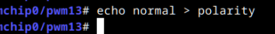


### 5. Enable/Disable Output
The **enable** file is used to enable PWM output:
- Write 1 to enable PWM output
- Write 0 to disable PWM output

```
echo 1 > enable #Enable PWM output
echo 0 > enable #Disable PWM output
```
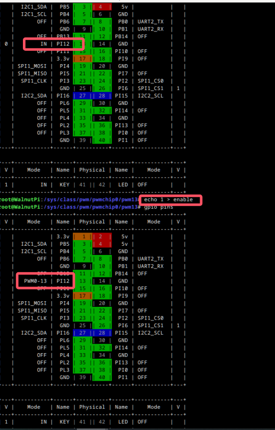
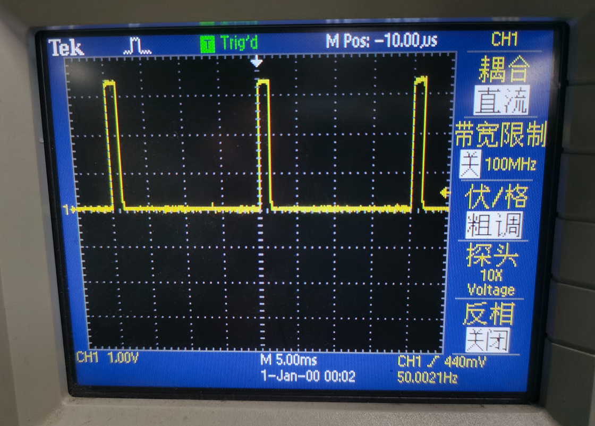


## Example: Control PWM1-1 Output

First, run the `gpio pins` command to check if the pin has already been configured for another function.

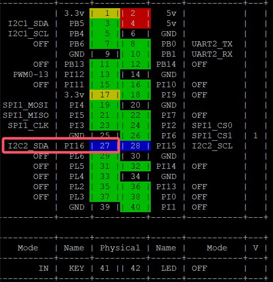

As shown above, this pin has already been enabled as I2C2. We need to use the `set-device` command to disable I2C2, then run `sudo reboot` to restart and apply the changes.
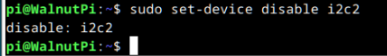

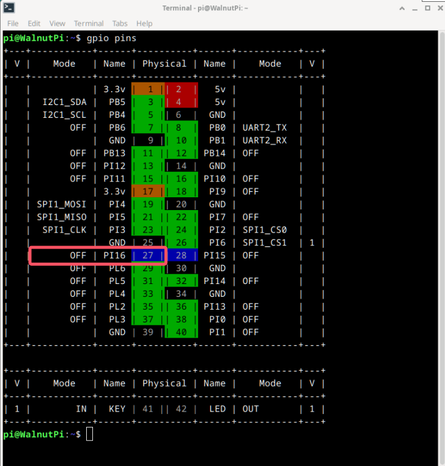
After restarting, you can see that the pin mode has changed to off, and PWM output is now available.


To make PWM1-1 output a waveform with a frequency of 100Hz (period 10ms) and a duty cycle of 50% (high-level duration 5ms), the complete procedure is as follows:
```
sudo su #Switch to root user
echo 1 > /sys/class/pwm/pwmchip16/export
echo 10000000 > /sys/class/pwm/pwmchip16/pwm1/period #Set period to 10ms
echo 5000000 > /sys/class/pwm/pwmchip16/pwm1/duty_cycle #High-level duration is 5ms
echo normal > /sys/class/pwm/pwmchip16/pwm1/polarity #duty_cycle represents high-level duration
echo 1 > /sys/class/pwm/pwmchip16/pwm1/enable #Enable PWM output
```
```
echo 0 >/sys/class/pwm/pwmchip16/pwm1/enable #Disable PWM output
```
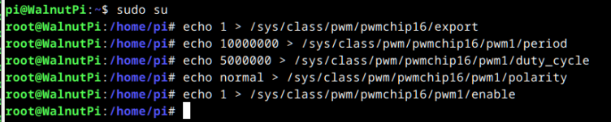

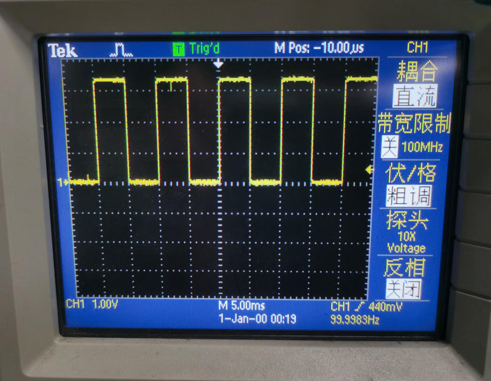
