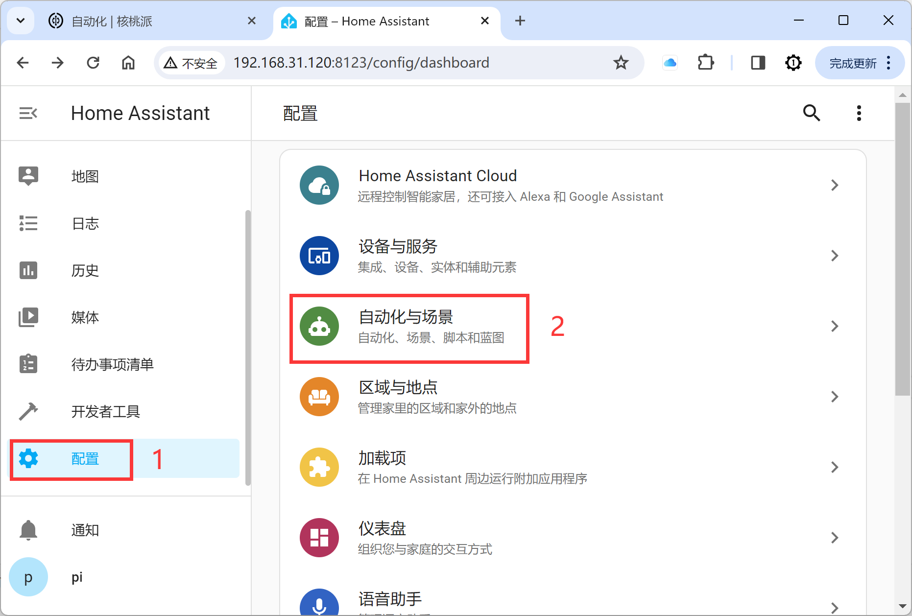
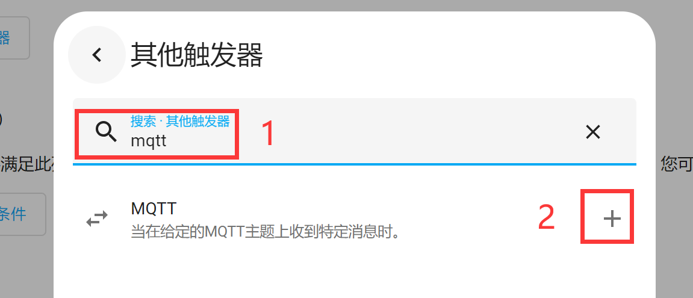
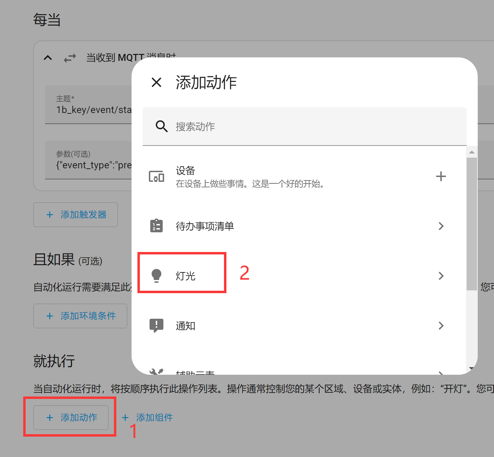
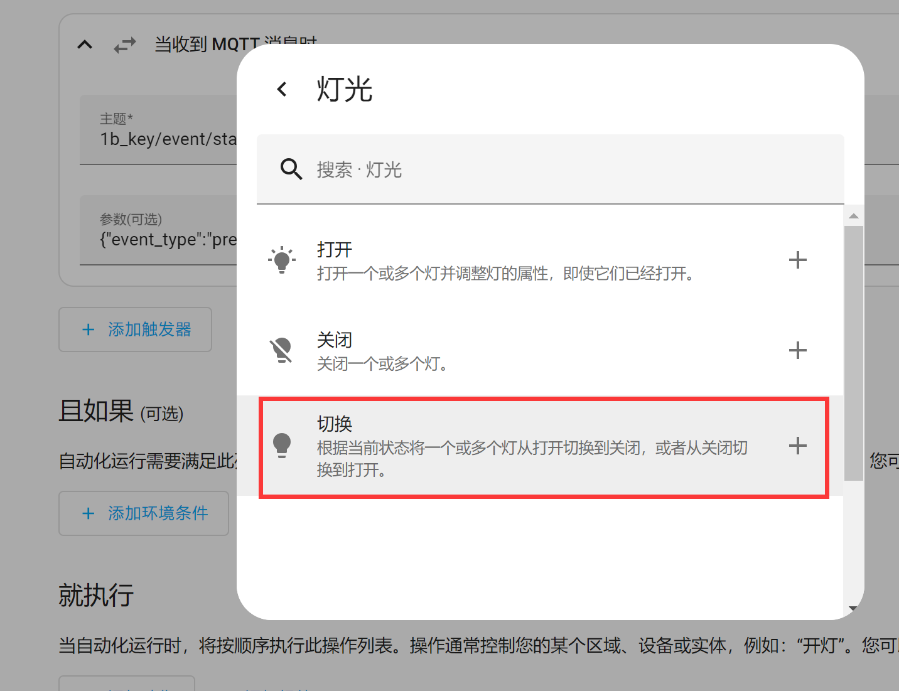
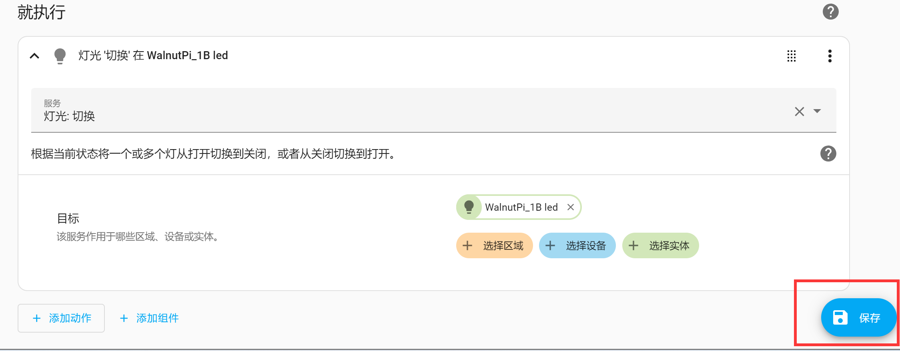
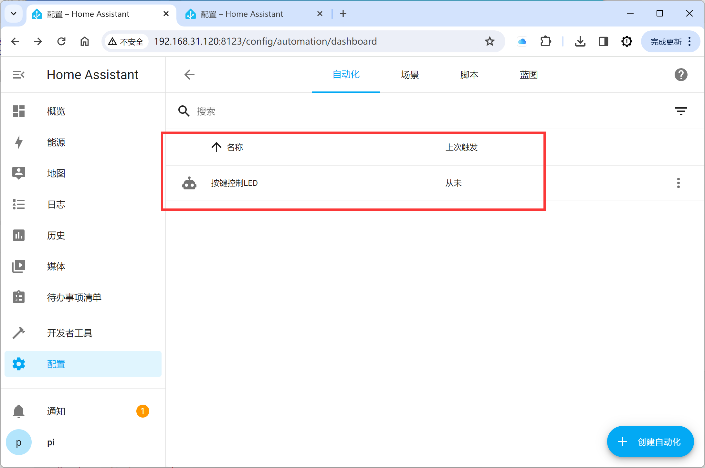

# Automations

In the previous sections we added many devices and entities. The Automation feature covered in this section is what enables coordination between these devices, entities, and events.

An automation consists of three key components:

1. Triggers — Events that start an automation. For example, when the sun sets or a motion sensor is activated.
2. Conditions — Optional tests that must pass before an action can run. For example, if someone is home.
3. Actions — Interactions with devices. For example, turning on a light.

## Button and LED

In the MQTT integration, we added LED and button entities, both controlled through the Home Assistant interface. Here we will create an automation so that pressing the button on the WalnutPi 2B board toggles the LED on and off, as a way to learn how to use Home Assistant automations.

For adding LED and button entities, refer to the tutorials: [LED](../home_assistant/mqtt/device_entity/led.md) and [Button](../home_assistant/mqtt/device_entity/key.md). We won't repeat them here.

Copy the LED and button code from the examples above to your WalnutPi 2B board. You can run both scripts simultaneously in the terminal with the following command to register the entities in Home Assistant:

```bash
sudo python led.py & sudo python key.py
```


For more ways to run Python scripts, see: [Running Python Code](../python/python_run.md)

After running the code successfully, open the Home Assistant MQTT device — you will see 2 new entities:


Now let's start setting up the automation. Click **Settings → Automations & Scenes**:


<br></br>

Then click **Create Automation** at the bottom right:


<br></br>

Click **Create new automation**:


<br></br>

Click **Add Trigger** and select **Other trigger**: (Because the Home Assistant device trigger does not support button devices, we can use MQTT messages as the trigger.)


<br></br>

Search for "mqtt", then click **+** to add:


<br></br>

In the popup window, enter the MQTT topic and payload. From the [Button](../home_assistant/mqtt/device_entity/key.md) experiment, we know the topic and payload published when the WalnutPi 2B button is pressed:


<br></br>

MQTT Topic:
```
1b_key/event/state
```
MQTT Payload:
```
{"event_type":"press"}
```

Fill in the above topic and payload in the trigger:


<br></br>

In the **Then do** section below, click **Add Action** and select **Light**:


<br></br>

Select **Toggle**, meaning each button press toggles the LED on/off:


<br></br>

Then click **+ Choose Entity**:


<br></br>

The LED entity is automatically recognized — click to select it:


<br></br>

Click **Save** at the bottom right:


<br></br>

In the popup, enter a name for this automation. The content can be whatever you like:


<br></br>

Returning to the automation main page, you can see the newly created "Automation" has been added:


<br></br>

Press the KEY button on the WalnutPi 2B. You will see the blue LED toggles on and off — the light-switching automation is working:


<br></br>
