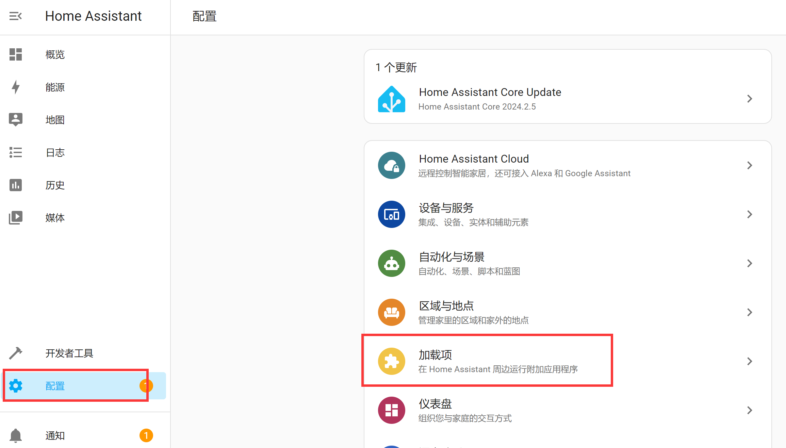

# Concepts and Terminology

After the installation and configuration in previous steps, we have successfully entered Home Assistant. Now let's go over some of the most important Home Assistant concepts. Understanding these concepts will greatly help with later usage. For now, a general understanding is enough — later tutorials will cover them in detail during practical use.

## Integrations

Integrations are software that allow Home Assistant to connect to other software and platforms. For example, the Philips Hue product line uses the Philips Hue integration to let Home Assistant communicate with the Hue Bridge hardware controller. Any Home Assistant-compatible device connected to the Hue Bridge will appear as a device in Home Assistant.

Link to all integrations: https://www.home-assistant.io/integrations

## Entities

Entities are the basic building blocks that hold data in Home Assistant. An entity represents a sensor or a capability in Home Assistant. Entities are used to monitor physical properties or control other entities. An entity is typically part of a device or service.

## Devices

A device is a logical grouping of one or more entities. A device may represent a physical device that can have one or more sensors. Sensors appear as entities associated with the device. For example, a motion sensor is represented as a device. It can provide motion detection, temperature, and light level as entities. Entities have states such as "detected" when motion is triggered and "cleared" when there is none.

:::tip Note
The relationship between Integrations, Devices, and Entities can be understood with the following example: Under the Xiaomi integration, there is a Xiaomi temperature/humidity sensor (1 device), and under that sensor, there are 2 entities: temperature and humidity values.
:::

**Integrations, Devices, and Entities are located under the Settings menu:**

## Automations

Automations enable device or event coordination and consist of three key components:

1. Triggers — Events that start an automation. For example, when the sun sets or a motion sensor is activated.
2. Conditions — Optional tests that must pass before an action can run. For example, if someone is home.
3. Actions — Interactions with devices. For example, turning on a light.

## Scenes

Scenes capture the states of entities so you can recall the same scene later. For example, a "Watching TV" scene dims the living room lights, sets them to warm white, and turns on the TV.

**Automations and Scenes are located under the Settings menu:**

## Add-ons

Add-ons are typically applications that can run alongside Home Assistant, providing a quick and easy way to install, configure, and run within Home Assistant. Add-ons provide additional functionality, while integrations connect Home Assistant to other applications.

