# Initial Configuration

## Network Connection

After installation, power the WalnutPi with a 5V supply and connect it to your router via Ethernet or WiFi.

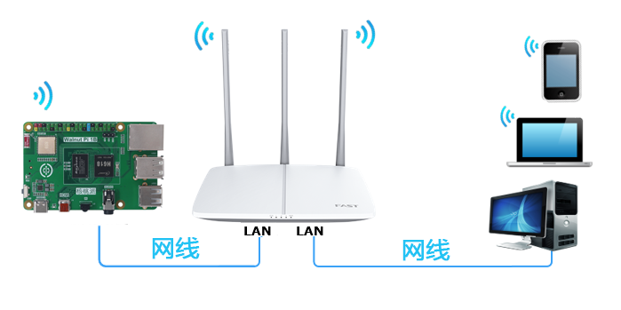

### Via Ethernet

Connect one end of the Ethernet cable to the WalnutPi board and the other end to your router.

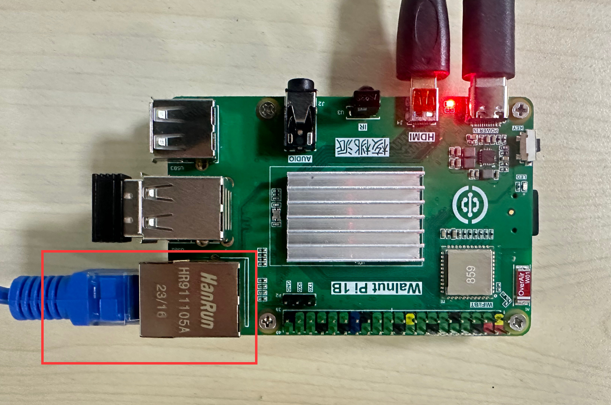

### Via WiFi

For WalnutPi WiFi connection instructions, see: [WiFi Connection](../os_software/wifi.md)

## Mobile App Download (Optional)

Home Assistant provides an official app that works the same as the PC browser. Installation methods:

### iPhone

Search for "Home Assistant" in the App Store and install:

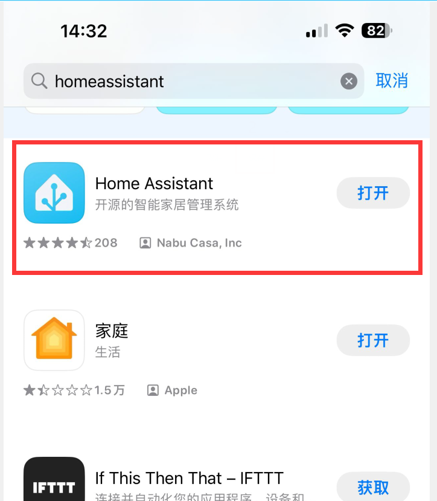

### Android Phone

Download the APK to install. The APK can be found in the WalnutPi Home Assistant resource package — APP folder:

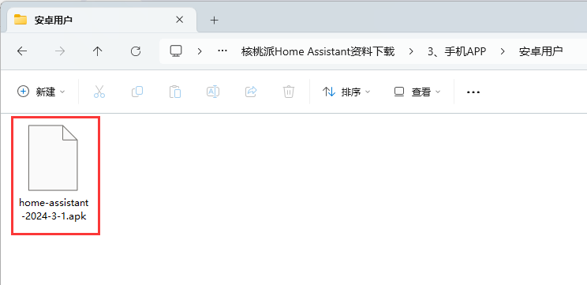

## Initial Setup

### Open the Configuration Page

The Home Assistant host takes about 2-3 minutes to fully start up. Once started and connected to the network, you can initialize Home Assistant via a mobile phone or computer browser:

:::tip Note
After the WalnutPi boots, the blue LED will blink, indicating that Home Assistant is starting. Once Home Assistant is fully started, the LED stays solid on, meaning it is ready for the following configuration steps.
:::

- From Mobile Phone

The benefit of using the app is that it can automatically discover the Home Assistant host on the local network when both the phone and Home Assistant are connected to the same router. Open the app and it will be found:

- From Browser

Enter http://walnutpi.local:8123 in your computer browser or WalnutPi browser (Desktop edition) to access the initialization page.

(If this link does not work, use: http://XXXX:8123, where XXXX is the current IP address of your WalnutPi, e.g., http://192.168.1.100:8123) [How to Get WalnutPi IP Address](../os_software/ip_get.md)

:::tip Note
After configuration, we recommend logging in using the IP address. http://walnutpi.local:8123 sometimes fails to open in practice.
:::

### Start Configuration

You will see the following welcome screen:

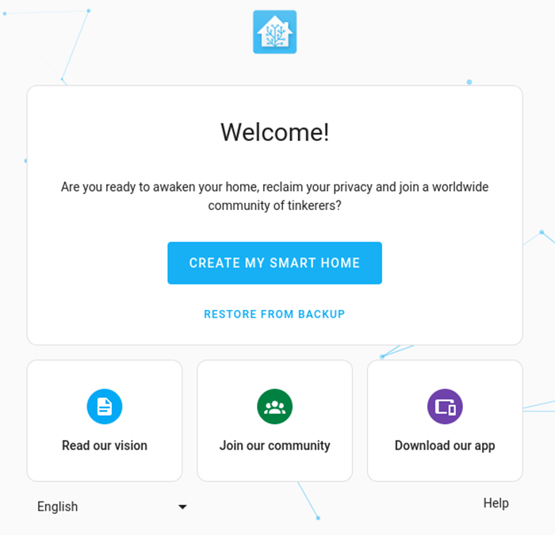

Select your language in the bottom left, then click the **Create My Smart Home** button.

Enter your custom name, username, and password (please remember your credentials), then click Create Account:

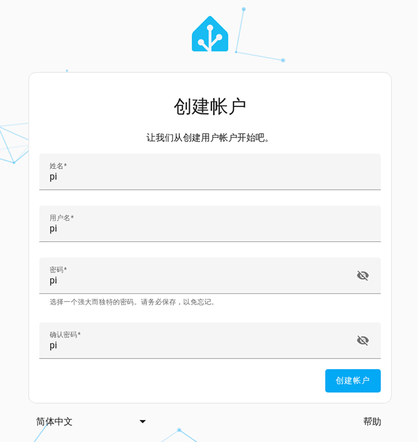

Enter your geographic location. Users without proxy/VPN may not see the map — you can simply click Next to skip this step:

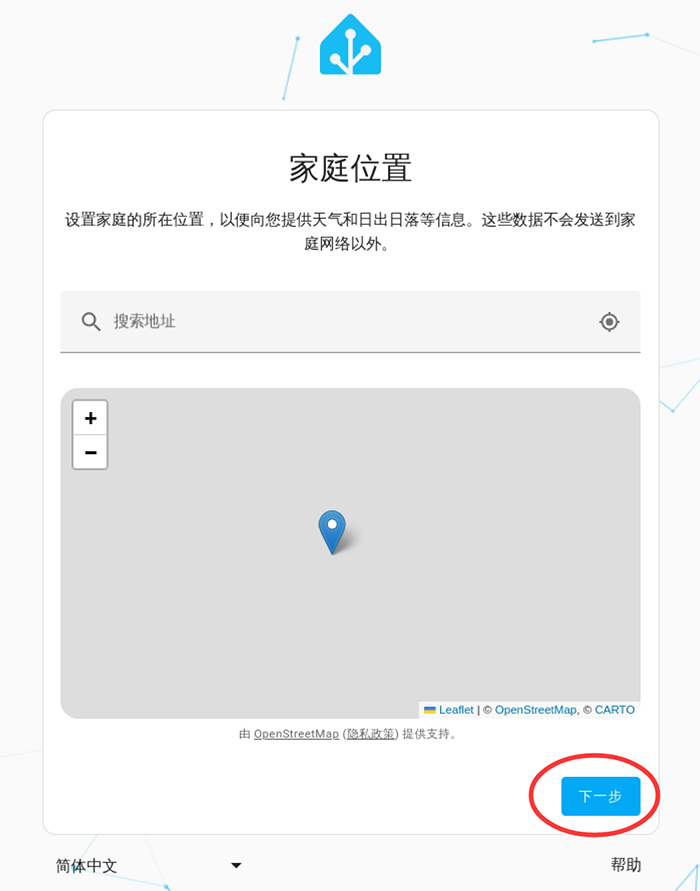

Select your region:

Choose whether to share usage data with the official team:

The system prompts that some devices were discovered — click Finish.

You will then enter the main interface. After this initial setup, logging in will always bring you to this dashboard page. The devices discovered earlier may appear on the dashboard:

## Fix Warnings

The warning **System unhealthy - not privileged** appears because this is the first boot from the image. Click Ignore. Note that after ignoring, you need to restart the host, otherwise online updates and some add-on installations will not work.

:::tip Note

Restart Methods:

1. Execute `sudo reboot` in the WalnutPi terminal to restart.

2. Press and hold the button for more than 6 seconds to shut down, then power off and on again to restart.

**Directly cutting power is not recommended, as unsaved content may be lost.**
:::

The warning **Unsupported system - CGroup version** can be ignored directly:

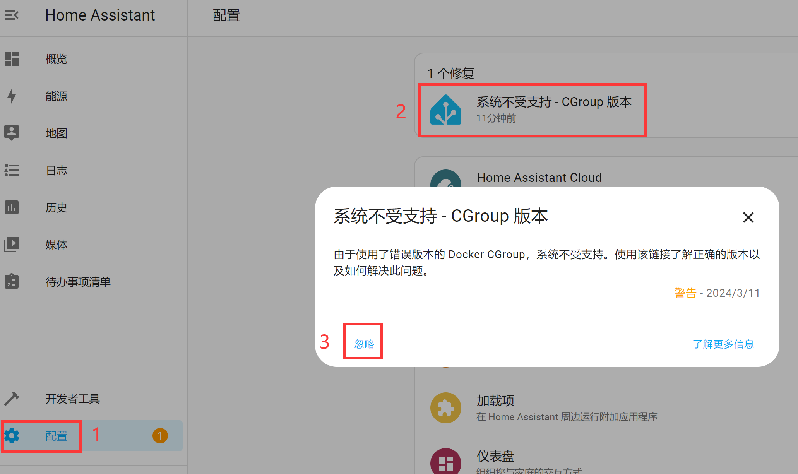

## System Update

When a Home Assistant update is available, you can click to enter and update directly. For users without proxy/VPN access, the update may take quite a while (10+ minutes). Please be patient.

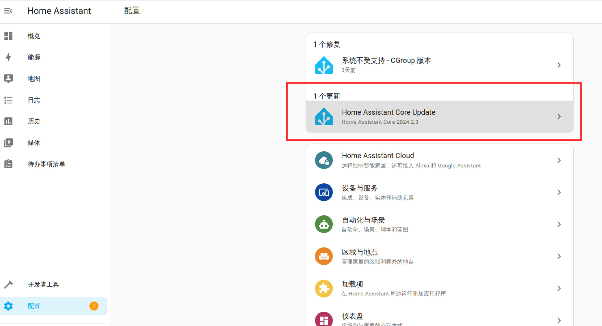

## Network Management

Network management is used to manage wired and wireless (WiFi) connections of the Home Assistant host.

Click **Settings** → **System**:

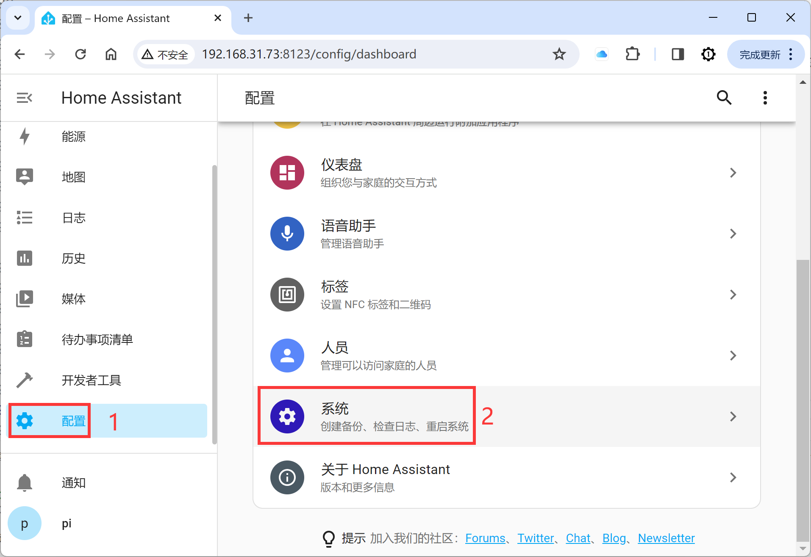

Click **Network**:

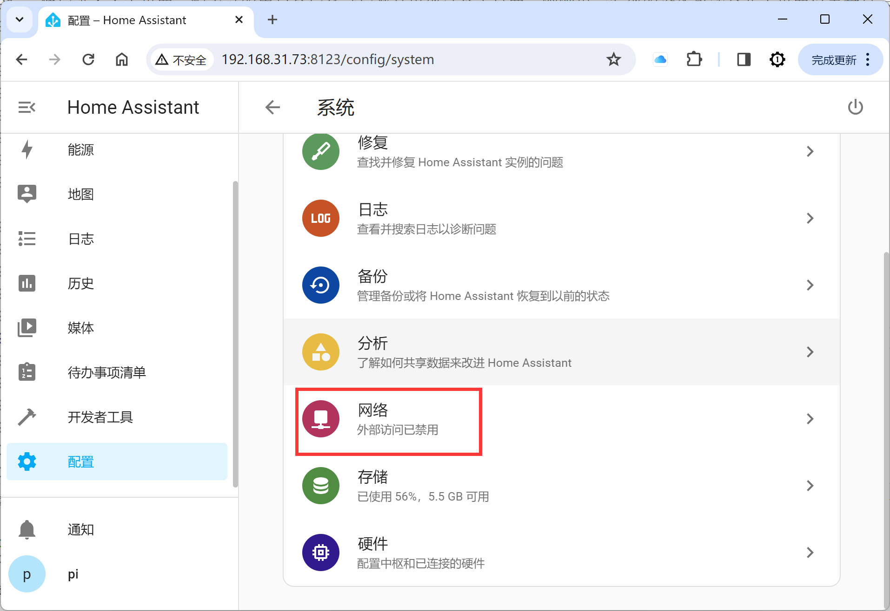

Here you can see the network status of wired Ethernet (ETH0) and wireless WiFi (WLAN0), including IP addresses, as well as scan for WiFi hotspots and connect, and other settings.

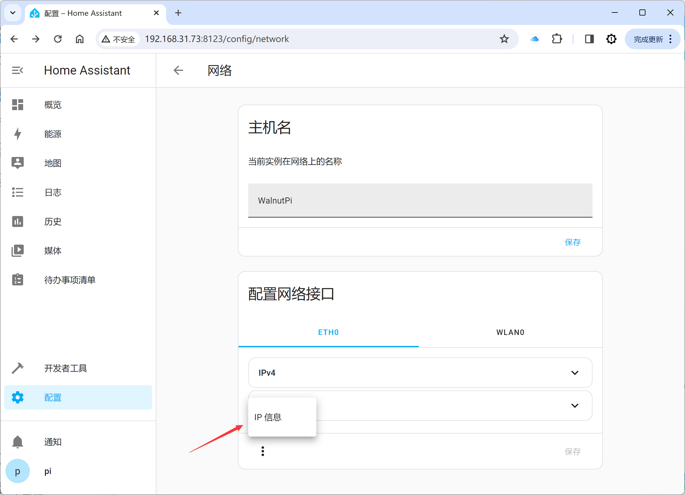

To connect to a WiFi hotspot, enable both IPv4 and IPv6 for WLAN0, then scan, select the hotspot, enter the password, and connect. Once connected, you can see the IP information.

:::tip Note
When switching network methods, the IP address will change. Remember to update the login address for the Home Assistant host accordingly.
:::

## Safe Shutdown

Press and hold the WalnutPi button for more than 6 seconds. The LED will blink a few times, then you can release. The shutdown process will begin. Wait until the blue LED turns off, indicating that shutdown is complete.

:::danger Warning
Do not directly cut power to turn off the WalnutPi, as this may cause Home Assistant data errors or loss.
:::
