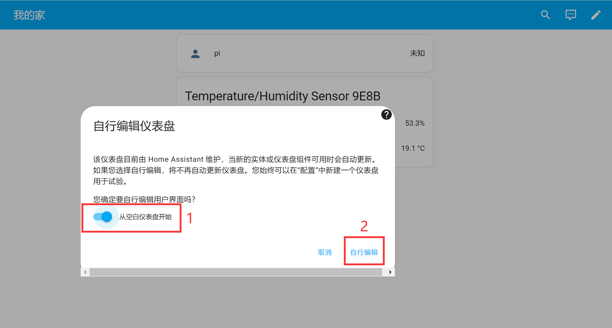
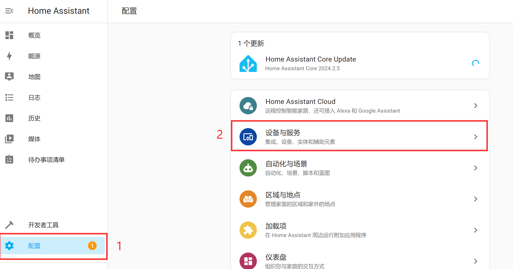
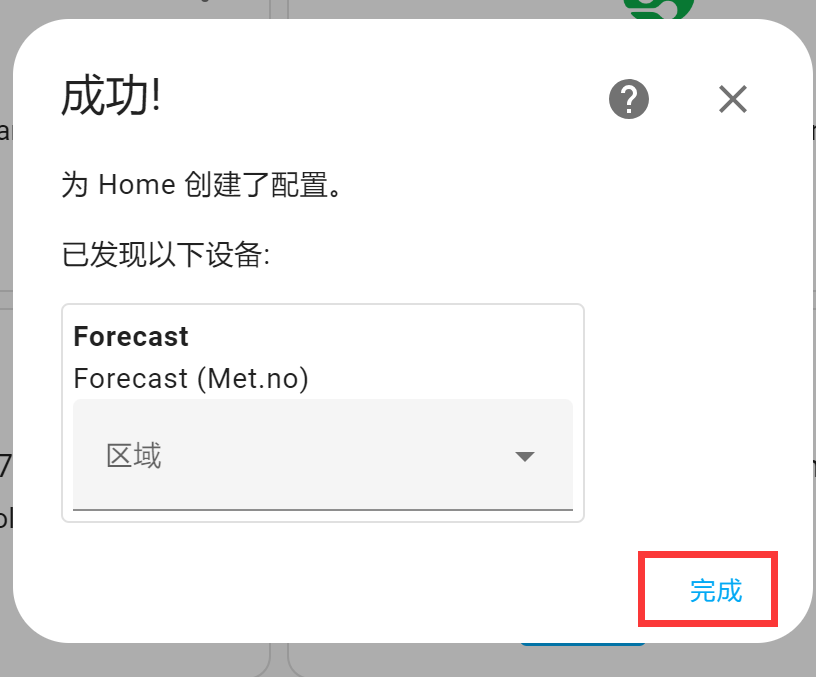
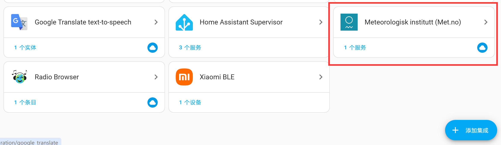
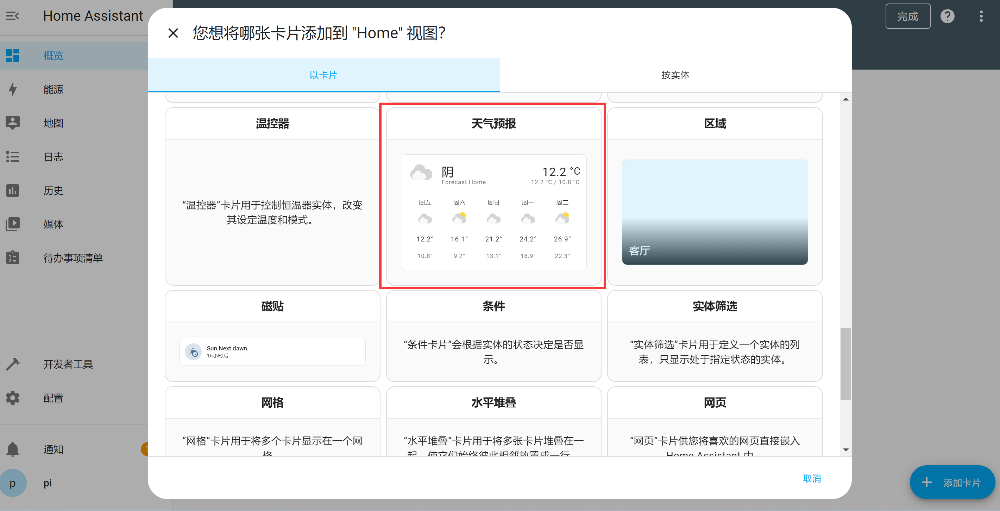
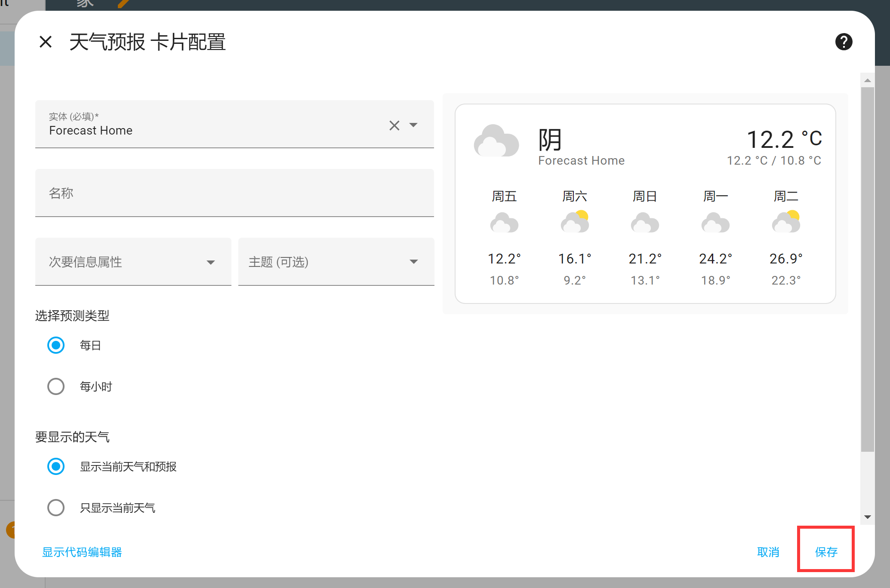
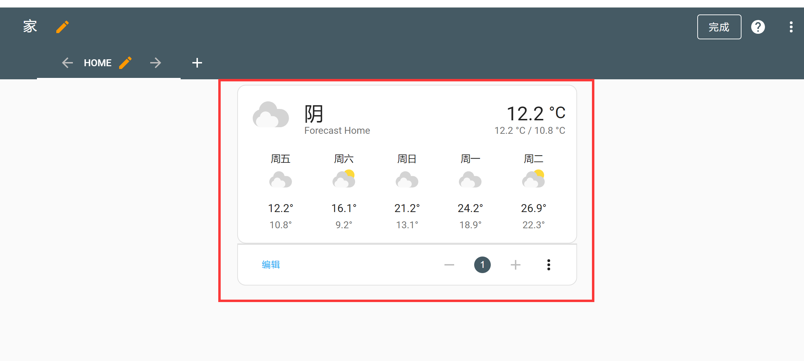

# Dashboard

The Dashboard is the home page you see after logging into Home Assistant. It is used to display various information and can be customized by the user. By default, there are **Overview** and **Energy** pages. The most commonly used is the **Overview** page, which appears almost empty when you first log in.

Now let's explain how to add new cards to the dashboard. Click the **pencil** button in the top right corner, then in the popup dialog, click the top-right button and select **Edit Dashboard**:

A new window will pop up. If you want to start from a blank dashboard, check the option at the bottom left (don't worry about losing devices — you can add them back later), then click **Start with an empty dashboard**:

The interface below will then appear. From now on, clicking the **pencil** button in the top right corner will always bring up this view. Click the **Add Card** button at the bottom right:

Let's take adding a **Weather Forecast** card as an example to see how to add cards to the dashboard. You can see many card types. Scroll down to Weather Forecast, and you'll notice that the card only shows a description, meaning this card hasn't been linked to a service yet:

Go back to the Overview page and first set your location using the map:

Add an integration under Settings → Devices & Services:

In the popup window, search for the keyword "**meteoro**" and select the Meteorologisk institutt service (a weather service):

Then set the name and latitude/longitude coordinates. If you already set the location using the map earlier, you don't need to enter it again. Click the **Submit** button to complete the configuration:

You can see that the service has been successfully added under Integrations:

Now go back to the Overview home page, click the **pencil** button at the top right, then click **Add Card**, and find Weather Forecast. You will see that weather data is now available:

Click to select it, then configure the relevant information in the popup window. For this demo, use the default settings and click Save.

The weather forecast card now appears on the dashboard:

When there are multiple cards on the dashboard, you can change their positions by editing the order number below:

