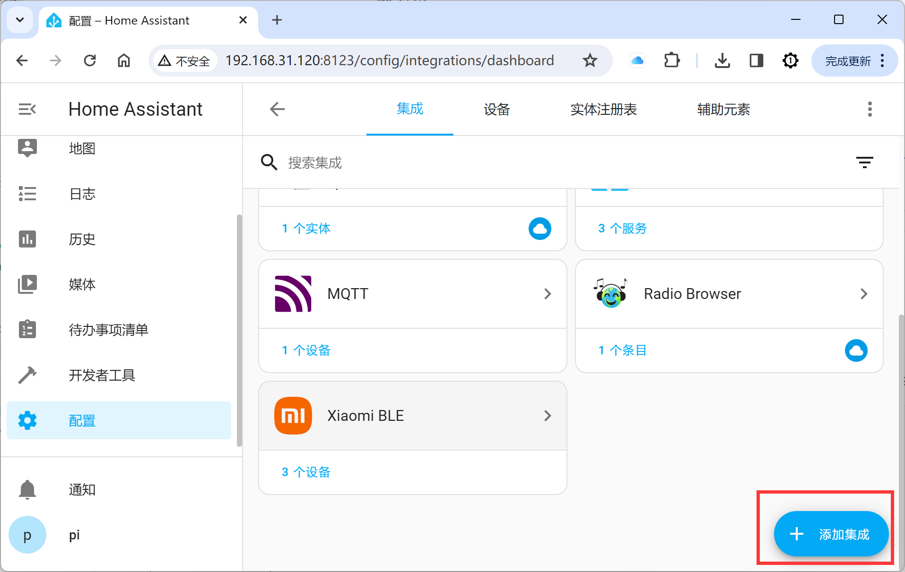
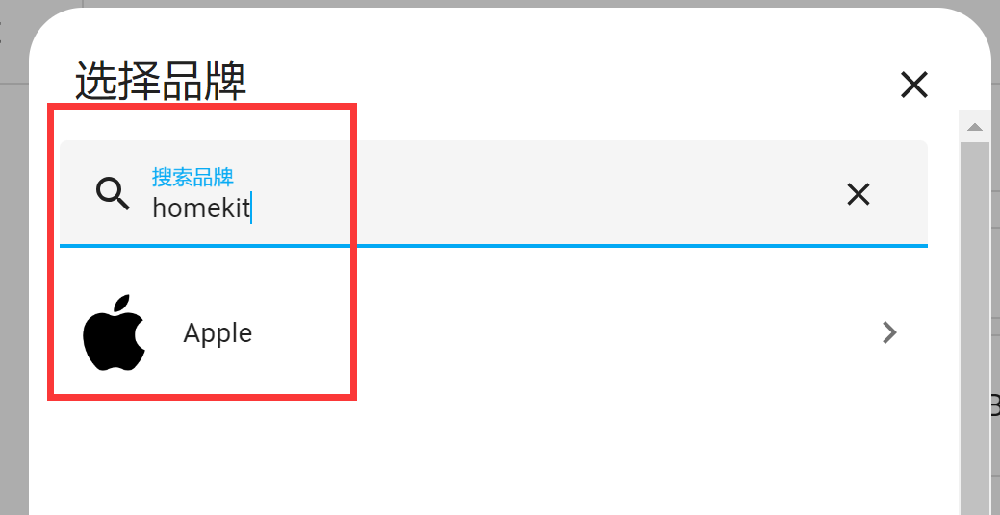
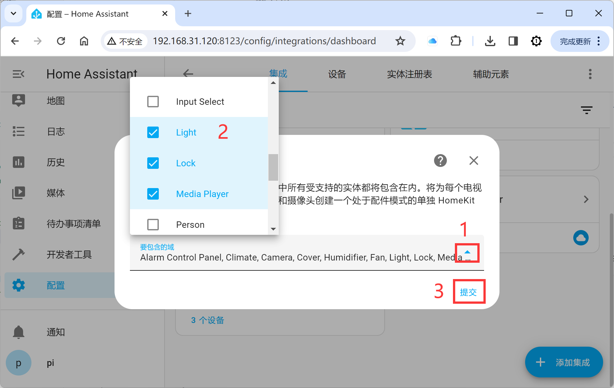
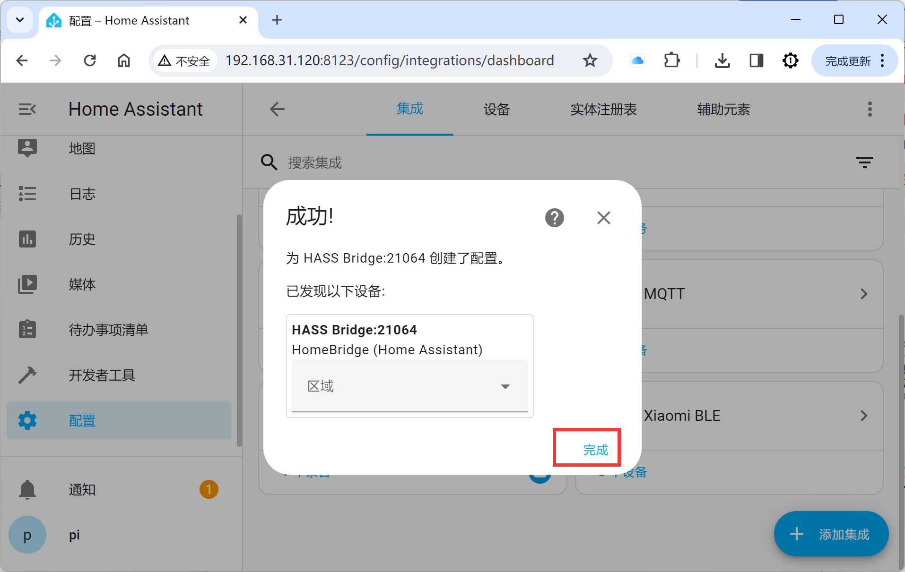
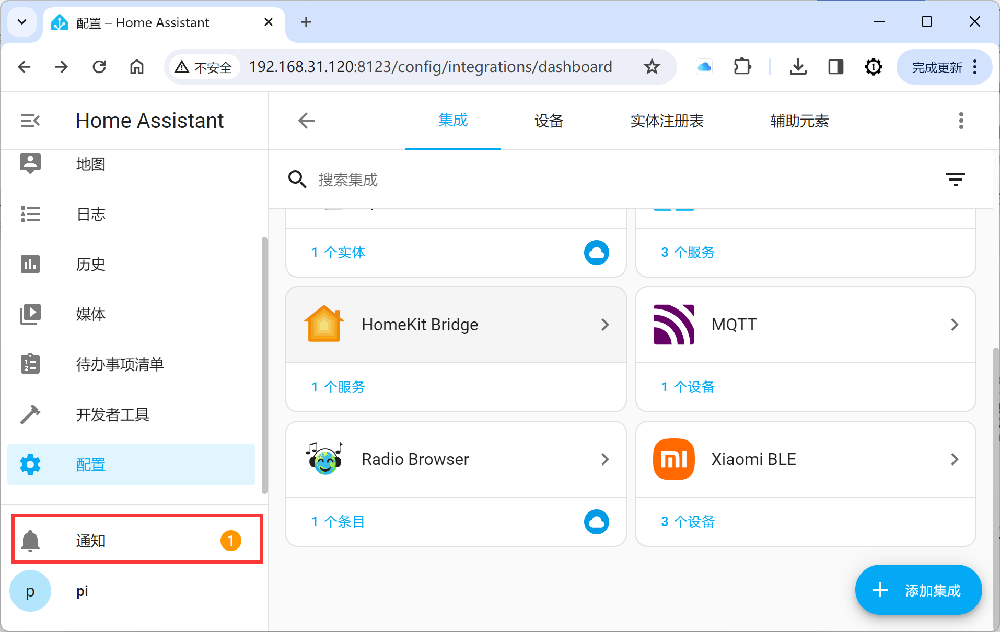
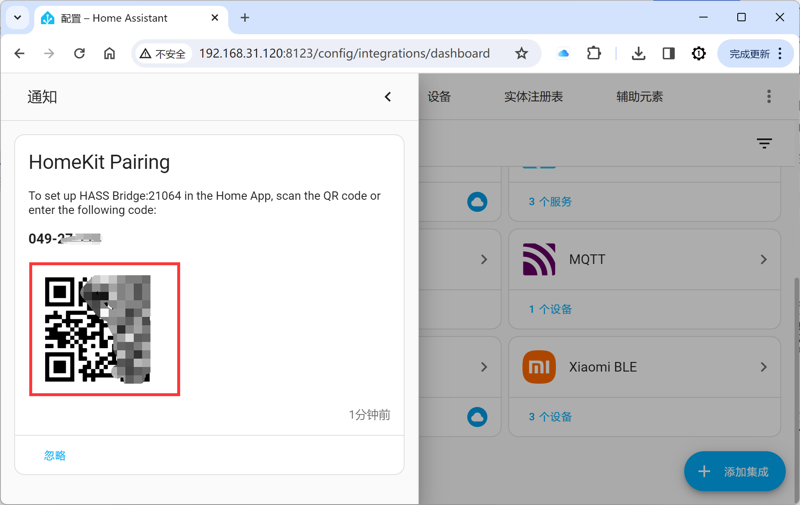
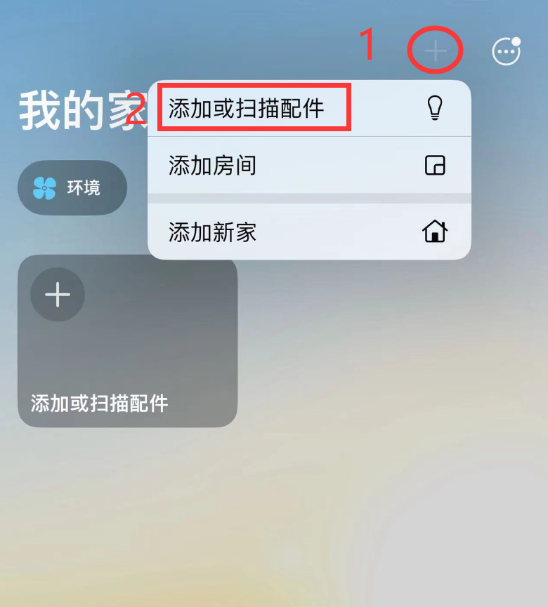
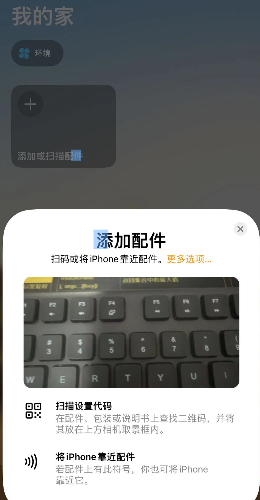
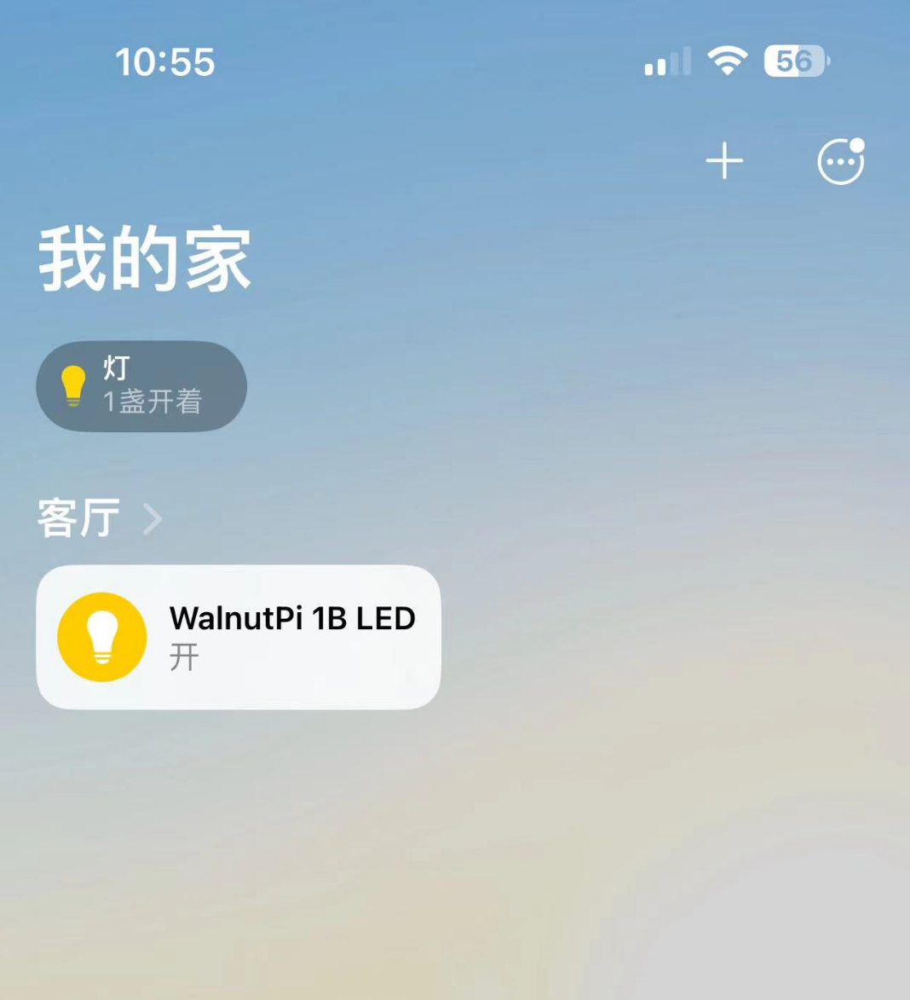
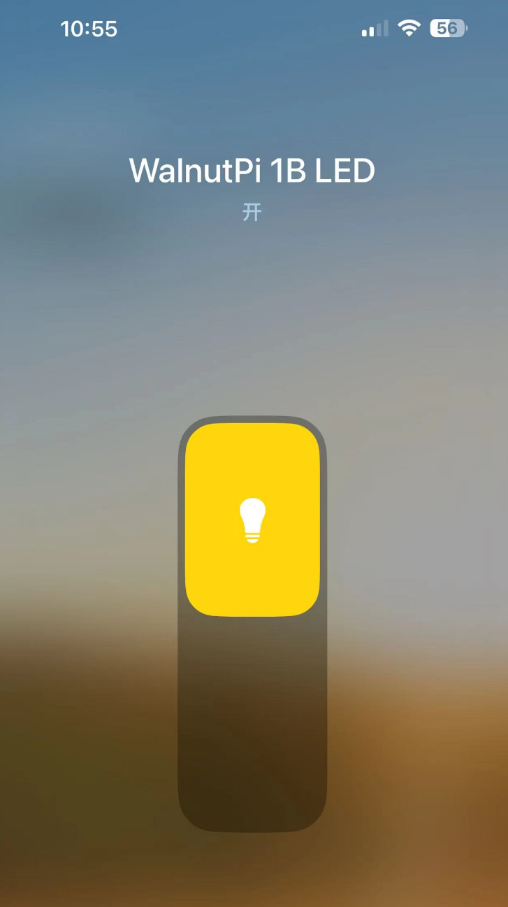

# Integrating with Apple HomeKit

Apple HomeKit is the built-in smart home app on iPhones. By adding the HomeKit Bridge integration to your WalnutPi Home Assistant, you can bind specific devices and control them from your iPhone.

This section uses an LED as an example, adding a registered LED entity into HomeKit. Make sure the LED entity is already added — see the [LED](../home_assistant/mqtt/device_entity/led.md) tutorial.

First, add the HomeKit Bridge integration to bridge HomeKit and Home Assistant devices.

Search for the keyword "homekit" and click the Apple entry that appears:

Click **HomeKit Bridge**:

Here you can select the domains to include, which correspond to Home Assistant component categories. Since the LED used here belongs to the Light domain, make sure Light is checked.

Click Finish:

At this point, a new notification will appear in the left notification panel:

A QR code will appear.

Open the built-in "Home" app on your iPhone:

Select Scan Accessory:

Scan the QR code displayed by Home Assistant:

Then follow the prompts to add it. After successfully adding, you will see the LED device entity appear in the Apple Home app.

You can now control the WalnutPi LED via the Apple Home app.

