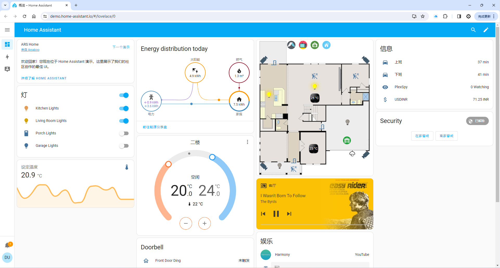
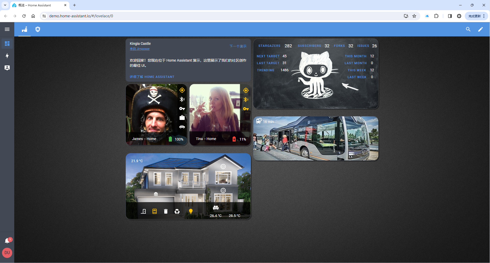

# Introduction

- Video Demo:

<!-- <iframe src="//player.bilibili.com/player.html?aid=1401200644&bvid=BV1rr421p788&cid=1452093879&p=1" high_quality="1" allowfullscreen="allowfullscreen" width="100%" height="500" scrolling="no" frameborder="0" sandbox="allow-top-navigation allow-same-origin allow-forms allow-scripts"></iframe> -->

<iframe src="//player.bilibili.com/player.html?aid=1401200644&bvid=BV1rr421p788&cid=1452093879&p=1" scrolling="no" border="0" frameborder="no" framespacing="0" allowfullscreen="true" width="100%" height="500"></iframe>

  
  

Home Assistant is a free and open-source software for home automation, designed to be an integration platform independent of IoT ecosystems and a central control system for smart home devices, with a focus on local control and privacy. Users can access it through a web-based UI or companion apps for Android and iOS to control various IoT devices.

Simply put, Home Assistant is a software application that can be installed on multiple platforms, including Windows, macOS, Linux operating systems, virtual machines, NAS systems, as well as single-board computers (e.g., WalnutPi, Raspberry Pi, etc.). Think of it as an advanced smart home hub compatible with protocols from many manufacturers (over 2000 integrations), such as Apple HomeKit, Xiaomi, Midea appliances, and more. Since products from different brands are independent, Home Assistant bridges them together, and also supports custom device hardware. With dashboards, you can visually edit your personal interface, making it ideal for DIY applications in smart homes and smart offices.

## What Can Home Assistant Do and What Are the Benefits

- **True Whole-Home Device Coordination**

Home Assistant can connect and control most smart home products on the market — a thermometer from brand A, a wireless switch from brand B, a smart plug from brand C. No more installing a bunch of apps on your phone. Access Home Assistant through the app or web interface to manage all your home devices from one place.

Home Assistant provides an Automation feature. Set up trigger conditions and actions to make devices in your home truly work together. To have lights turn on automatically when a door opens, simply open the app, click to create an automation, and add the motion sensor and light bulb.

- **Program Yourself, Unlimited Possibilities**

If you are not satisfied with smart home devices available on the market, just make your own. Home Assistant offers many integration methods, allowing your DIY devices to coordinate with the whole house.

If Home Assistant's built-in features still don't meet your needs, no problem — you can write your own programs to control various devices at home. Home Assistant provides APIs, so you can write a Python program to directly read and control smart home devices from various brands without having to study each manufacturer's communication protocol yourself.

## Official Website

https://www.home-assistant.io/

Below are some examples from the official website:

