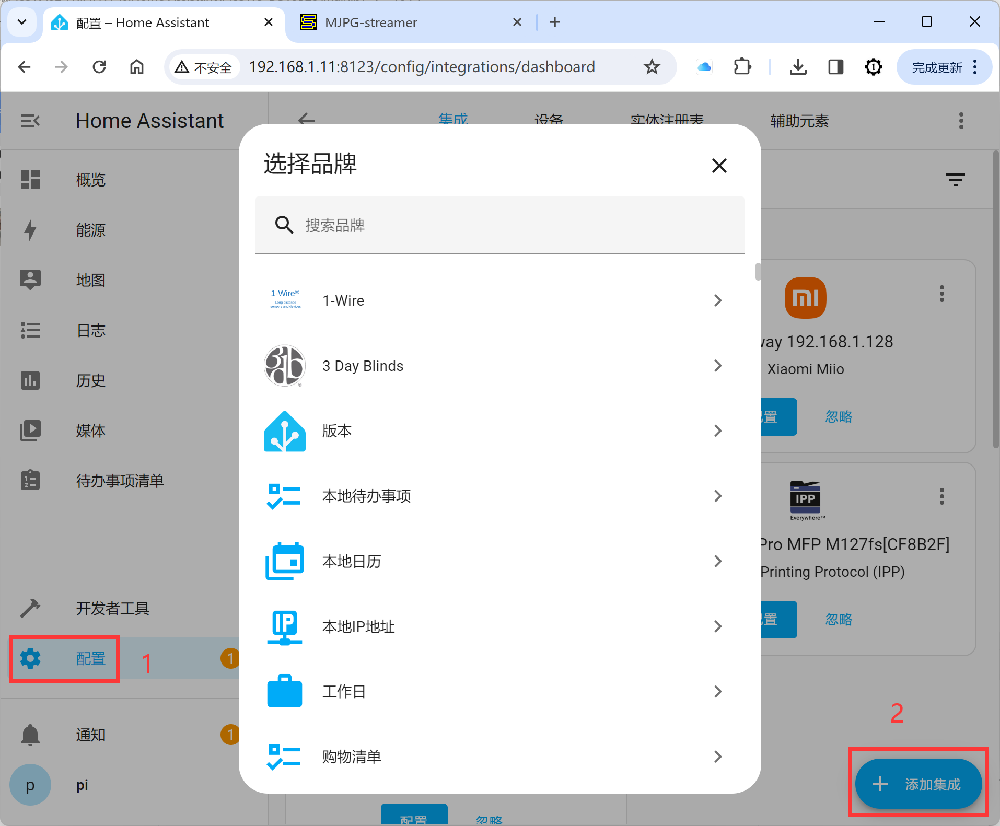
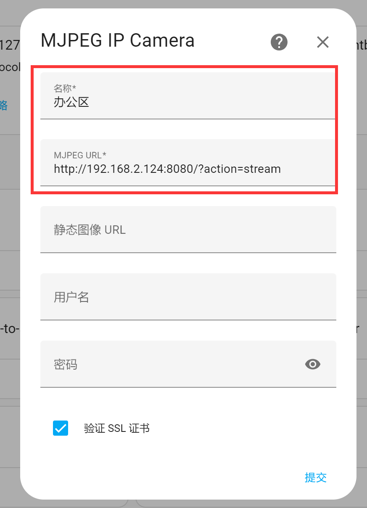
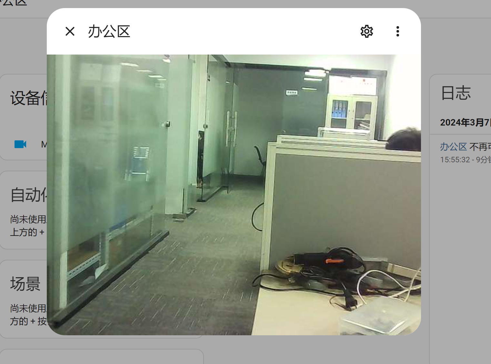
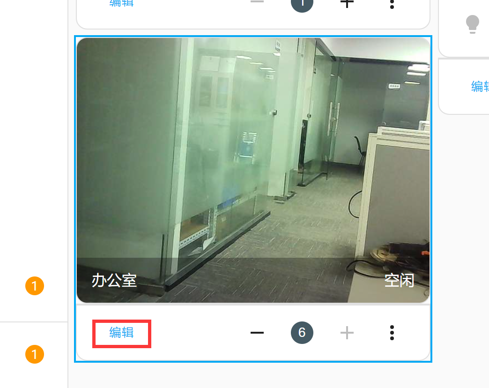
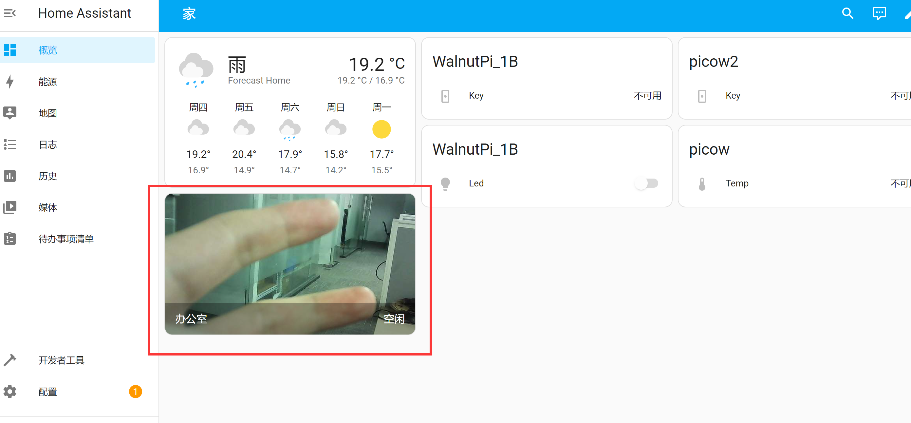

# Camera Monitoring

Home Assistant integrates the **MJPEG IP Camera** integration, which can work with the WalnutPi USB camera setup from earlier to enable monitoring through the Home Assistant interface.

For the WalnutPi USB camera tutorial, see the previous [USB Camera section](../os_software/usb_cam.md). We won't repeat it here.

After following the tutorial above to start the camera and verify it works, proceed to add the device in Home Assistant:

Open **Settings** → **Add Integration**:

In the popup, search for the keyword **MJPEG**, then select **MJPEG IP Camera** below:

Next, fill in the camera information:

- `Name`: Custom;
- `MJPEG URL`: Enter the IP address of the USB camera plus the path string. [Get WalnutPi IP Address](../os_software/ip_get.md). Example: http://192.168.1.11:8080/?action=stream. If the USB camera is connected to the Home Assistant host itself, you can use 127.0.0.1 (localhost IP).

Once completed, you'll see MJPEG IP Camera added under Integrations:

Open the device and click the small circle below to view the camera feed:

It can be added to the Overview dashboard:

After adding, you may notice the dashboard monitoring feed does not refresh in real time. Configure it as follows:

Click the small pencil button in the top right corner to enter card editing mode:

Click **Edit** at the bottom left of the monitoring card:

Set Camera View to: Live:

After saving and going back, refresh the webpage, and you'll see the camera feed updating in real time:

