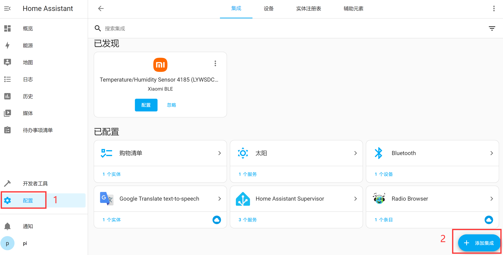
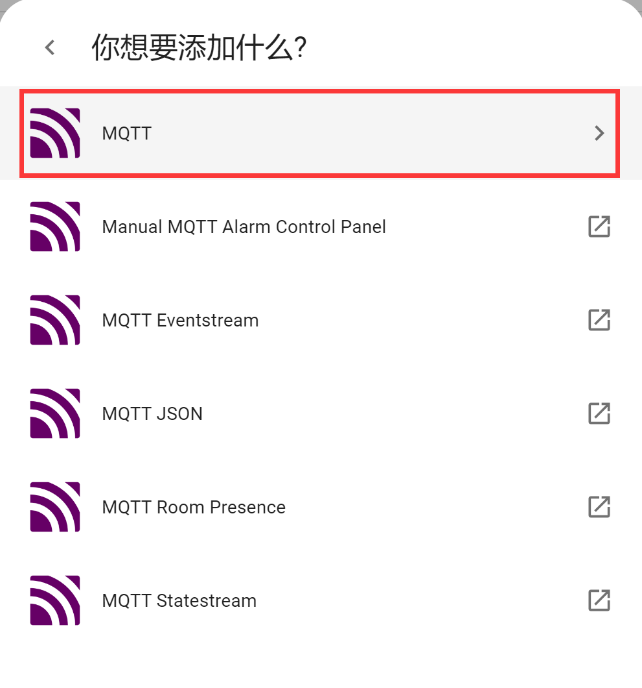
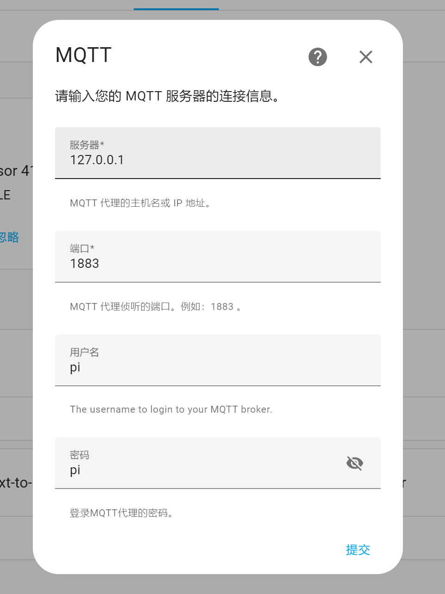
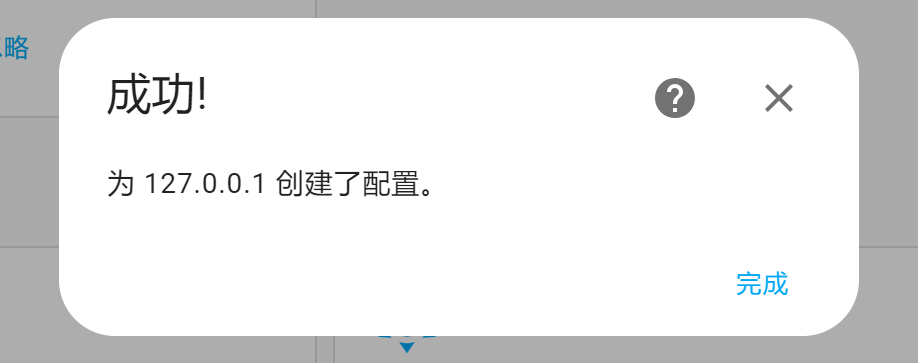
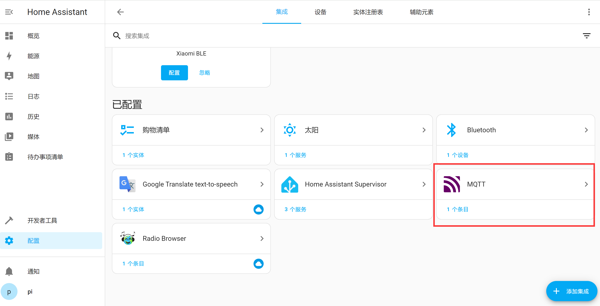
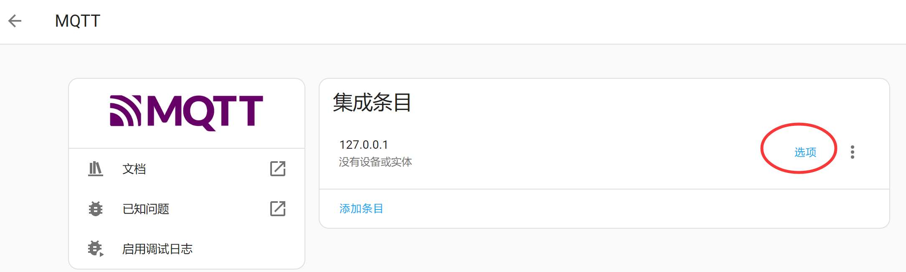

# Adding MQTT Integration

After setting up the MQTT server in the previous section, this section explains how to add the MQTT integration in Home Assistant. Once added, we can integrate all kinds of custom devices according to the protocol.

Click **Settings**, then click **Add Integration** at the bottom right:

In the popup, search for "mqtt" and select MQTT:

Then select the option shown below:

Fill in the MQTT server information step by step:
- `Broker`: The domain name or IP address of the MQTT server. Since the MQTT server is also installed on the WalnutPi, you can use: 127.0.0.1 (which means localhost);
- `Port`: 1883 if unchanged;
- `Username` and `Password`: Both set to pi in the previous tutorial.

Click Submit. If the connection is successful, a prompt will appear. If not, check whether the MQTT server is properly installed by referring to the previous section.

After successful installation, you'll see MQTT added under Integrations.

Click to enter and view MQTT integration details. Through **Configure**, you can reconfigure the MQTT integration server and other settings:

After adding the integration, you can proceed to add various MQTT devices.
