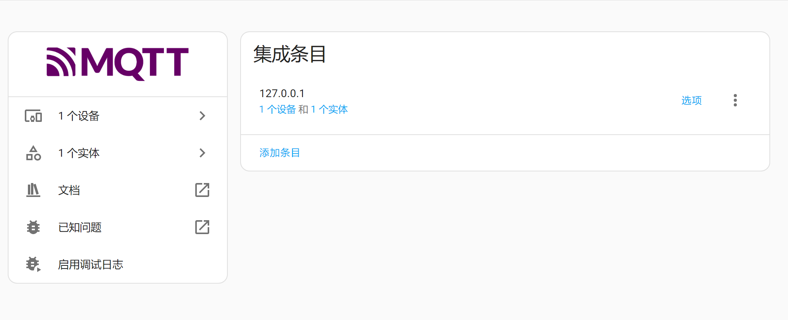
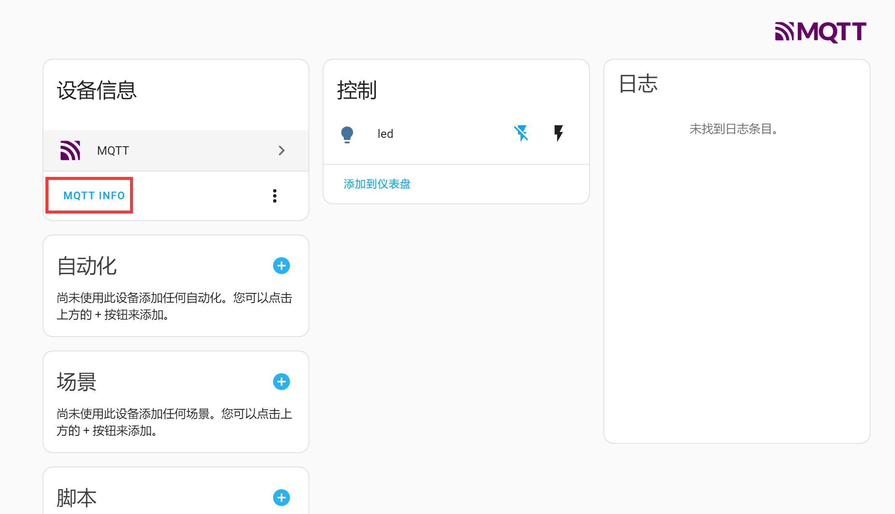
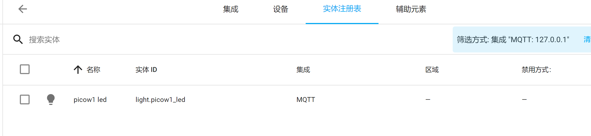

# Discovering Devices and Entities

MQTT device discovery allows us to use specific MQTT devices directly without excessive configuration. This configuration method works through MQTT topics and payloads. In simple terms, if there is a light device that publishes a specific topic and payload to the MQTT server, Home Assistant receives the relevant information and automatically configures the device and entity.

To avoid duplication, each entity must have a unique identifier. This means that the MQTT topics and payloads of different devices and entities must follow a specific format.

## Topic Format

This refers to the MQTT topic.

```
<discovery_prefix>/<component>/[<node_id>/]<object_id>/config
```
- `<discovery_prefix>`: The discovery prefix, defaults to homeassistant
- `<component>`: One of the predefined components in the MQTT integration, e.g., light
- `<node_id>` (optional): The ID of the node providing the topic. Generally not used. The node ID can only contain characters from the character class `[a-zA-Z0-9_-]` (alphanumeric, underscore, and hyphen).
- `<object_id>`: The entity ID, must be unique, can only contain characters from `[a-zA-Z0-9_-]` (alphanumeric, underscore, and hyphen).

Example: `homeassistant/light/picow1_led/config` could represent an LED on the WalnutPi PicoW (WalnutPi MCU board), with component type light.

For more information, refer to the official documentation: https://www.home-assistant.io/integrations/mqtt#mqtt-discovery

## Payload Format

The payload is sent together with the topic above to inform the host of the relevant information about the current entity and device. The format must be `json`. Since different devices and entities have different information, and Home Assistant officially has many components, we'll use an example to help understand. For future needs with different components, just refer to the official documentation.

Below is an example of registering an entity and binding a device:

```json
{
    "name":"led",
    "device_class":"LIGHT",
    "command_topic":"picow1/light/led/state",
    "unique_id":"picow1_led",

    "device":{
                "identifiers":"picow_01",
                "name":"picow1"
            }
}
```

### Entity

- `name`: Entity name, can be customized;
- `device_class`: Component type, related to the topic configuration above. Must not be wrong. For example, `LIGHT` here is a valid entity under the `light` component;
- `command_topic`: Used to publish relevant attribute topics after registering the entity, such as the on/off state of a light. Can be customized; just make sure different entities have different topics;
- `unique_id`: Entity ID, can be customized, must be unique for each entity;

### Device

Informs Home Assistant of the device corresponding to the entity.

- `identifiers`: Identification identifier, unique per device;
- `name`: Device name, can be customized;

**Multiple entities can be registered to the same device (make sure the topics are unique).** For example:

A development board (device) with LED1 (entity) and LED2 (entity).

A temperature/humidity sensor (device) with temperature (entity) and humidity (entity).

:::tip Note
In Home Assistant, entities are the smallest unit. Users are allowed to register only entities without registering a device. However, for ease of use and distinction, registering both the device and entities together is generally recommended.
:::

## Device Discovery Test

We'll use the MQTT helper tool to test having the Home Assistant host discover an entity and device.

Use MQTTX to connect to the WalnutPi MQTT server. See: [MQTTX Usage Tutorial](../install.md#connect-to-walnutpi-mqtt-server-and-test).

Select the data format as `json`, then enter in the send field:

Topic:
```
homeassistant/light/picow1_led/config
```

Payload:
```json
{
  "name": "led",
  "device_class": "LIGHT",
  "command_topic": "picow1_led/light/state",
  "unique_id": "picow1_led",

  "device": {
            "identifiers": "picow_1",
            "name": "picow1"
  }
}
```

After entering, click the send button at the bottom right:


Open the MQTT integration you just added:


You can see 1 new device and 1 new entity have appeared. This page refreshes dynamically:



Click to view detailed information about the device and entity:





We have successfully discovered devices and entities. Detailed usage will be explained in later tutorials for different devices and entities.
