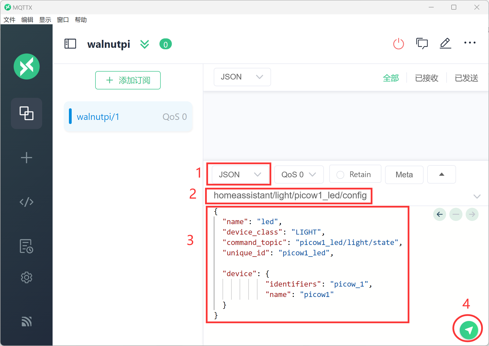
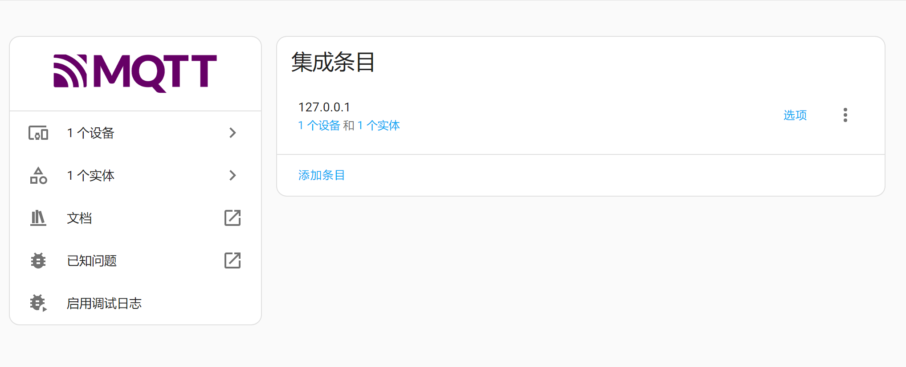

# 发现设备和实体

MQTT设备的发现可以让我们免去过多的配置工作就可以直接使用特定的额MQTT设备，这种配置方式是通过MQTT主题和内容实现的。简单来说就是比如有一个灯设备，这个设备往MQTT服务器发送一个特定的主题（topic）和内容（message），Home Assistant接收到相关信息后自动配置该设备和实体信息。

为了避免重复，每个实体需要有唯一的标识符来区分。也就是说不同设备和实体的MQTT主题和内容需要遵循特定的格式。

## 主题格式

这个是指MQTT的主题topic。

```
<discovery_prefix>/<component>/[<node_id>/]<object_id>/config
```
- `<discovery_prefix>`: 发现的前缀默认为 homeassistant
- `<component>`: MQTT集成里面预定义好的元件，例如：light
- `<node_id>`（可选）: 提供主题的节点的 ID，一般不使用。节点的 ID 只能包含字符类中的字符`[a-zA-Z0-9_-]`（字母数字、下划线和连字符）。
- `<object_id>`: 实体的ID，需要唯一，只能包含字符类中的字符`[a-zA-Z0-9_-]`（字母数字、下划线和连字符）。

例：`homeassistant/light/picow1_led/config` , 可表示核桃派PicoW(核桃派MCU开发板)上的一个led, 组件类型为light。

更多内容请参考官方文档：https://www.home-assistant.io/integrations/mqtt#mqtt-discovery

## 消息格式

这个消息是搭配上面的主题一起发送，主要是告诉主机当前实体和设备的相关信息。格式需要使用`json`类型，由于不同设备和实体信息不一样，而Home Assistant官方有非常多的组件，这里直接以例子举例方便了解，后续有需要用到不同组件查阅官方文档即可。

下面是注册一个实体和绑定设备：

```json
{
    "name":"led",
    "device_class":"LIGHT",
    "command_topic":"picow1/light/led/state",
    "unique_id":"picow1_led",
               
    "device":{
                "identifiers":"picow_01",
                "name":"picow1"
            }
}
```

### 实体

- `name`: 实体名称，自定义填写；
- `device_class`: 组件类型，跟前面主题配置信息相关，不能填错，比如这里的`LIGHT`是组件`light`下的一个可用实体；
- `command_topic`: 用于注册实体后发布相关属性主题，比如灯的亮和灭状态，自定义，保证不同实体的主题不一样即可；
- `unique_id`: 实体ID，自定义，务必保证每个实体唯一；

### 设备

告知Home Assistant实体对应的设备。

- `identifiers`: 识别标识符，每个设备唯一；
- `name`: 设备名称，自定义；

**可以将多个实体注册到同一个设备（注意配置主题要唯一）。** 例如：

一个开发板（设备）有LED1灯（实体）和LED2灯（实体）。

一个温湿度传感器（设备）有温度（实体）和湿度（实体）。

:::tip 提示
在Home Assistant里面实体是最小单元，允许用户只注册实体而不注册设备。但为了方便使用时候区分一般建议同时注册设备。
:::

## 发现设备测试

我们使用MQTT助手来测试让Home Assistant主机发现一个实体和设备。

使用MQTTX助手连接到核桃派MQTT服务器，参考：[MQTTX使用教程](../install.md#连接核桃派mqtt服务器并测试)。 

数据格式选`json`，然后在发送栏输入：

主题：
```
homeassistant/light/picow1_led/config
```

消息：
```json
{
  "name": "led",
  "device_class": "LIGHT",
  "command_topic": "picow1_led/light/state",
  "unique_id": "picow1_led",
  
  "device": {
            "identifiers": "picow_1",
            "name": "picow1"
  }
}
```

输入后点击右下角发送按钮：



打开刚刚添加的MQTT集成：


可以看到多了1个设备和1个实体，这个页面是动态刷新的：



点击进去可以看到设备和实体的详细信息：


到这里我们搜索发现设备和实体成功了，详细的使用方法会在后面教程针对不同设备和实体进行讲解。


