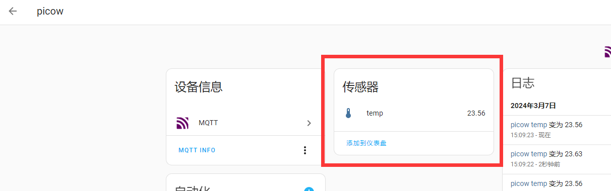

# Temperature Sensor DS18B20

## Overview
This section focuses on adding a common DS18B20 temperature sensor to the Home Assistant host for periodic temperature collection. For easy demonstration, this tutorial uses the WalnutPi PicoW (ESP32S3) to drive the DS18B20 and report temperature data to the WalnutPi Home Assistant host every second.

- DS18B20 Metal Probe Package


## Objective
Add a DS18B20 temperature sensor to the WalnutPi Home Assistant host to collect temperature data.

## Explanation

The temperature sensor uses the sensor component from the Home Assistant MQTT integration. The key to the experiment is understanding the topic information for discovering MQTT devices and the control method, as detailed below:

## MQTT Topic

The following topic is used for the Home Assistant host to discover this device via MQTT:

```
homeassistant/sensor/picow_ds18b20/config
```

- `homeassistant`: Default prefix
- `sensor`: The MQTT component used for temperature sensors is sensor
- `picow_ds18b20`: Entity ID, must be unique. This is a custom value representing the WalnutPi PicoW's temperature sensor;
- `config`: Default suffix

## MQTT Payload

```json
{
    "name": "temp",
    "device_class": "temperature",
    "state_topic": "picow_ds18b20/sensor/temperature/state",
    "unique_id": "picow_ds18b20",
    "value_template": "{{ value_json.temperature }}" ,

    "device": {
                "identifiers": "picow_x",
                "name": "picow"
              }
}
```

### Entity

- `"name":"temp"`: Entity name, can be customized;
- `"device_class":"temperature"`: Component type, related to the topic configuration above. Must not be wrong. For example, `temperature` here is a valid entity under the `sensor` component;
- `"state_topic":"picow_ds18b20/sensor/temperature/state"`: Used to publish relevant attribute topics after registering the entity. Here it sends temperature data. The topic content can be customized; just make sure different entities have different topics;
- `"unique_id":"picow_ds18b20"`: Entity ID, can be customized, must be unique for each entity;

### Device

Informs Home Assistant of the device corresponding to the entity.

- `"identifiers":"picow_x"`: Identification identifier, unique per device, e.g., picow_1, pico_2, ...
- `"name":"picow"`: Device name, can be customized;

For more MQTT sensor content, see the official documentation: https://www.home-assistant.io/integrations/sensor.mqtt/

The code flow is as follows:

```mermaid
graph TD
    Import modules-->Build DS18B20 object-->Connect WiFi-->Connect MQTT server-->Register DS18B20 entity and device-->Collect temperature-->Send temperature via MQTT-->Delay 1 second-->Collect temperature;
```

## Implementation Using WalnutPi PicoW

This experiment uses the WalnutPi PicoW (ESP32-S3) connected to a DS18B20 temperature sensor. For usage, see: [WalnutPi PicoW Tutorial](https://www.walnutpi.com/docs/walnutpi_picow/sensor/ds18b20.md). Ensure that both the WalnutPi PicoW and the WalnutPi 2B are connected to the same router:


### Reference Code
```python
'''
Experiment Name: Home Assistant Temperature Sensor DS18B20
Platform: WalnutPi 2B + WalnutPi PicoW
Author: WalnutPi
Description: Program Home Assistant to collect DS18B20 temperature data
'''

import network,time
from simple import MQTTClient #Import MQTT module
from machine import Pin,Timer

import onewire,ds18x20

LED=Pin(46, Pin.OUT) #Initialize WiFi indicator LED

#WiFi connection function
def WIFI_Connect():

    global LED

    wlan = network.WLAN(network.STA_IF) #STA mode
    wlan.active(True)                   #Activate interface
    start_time=time.time()              #Record time for timeout check

    if not wlan.isconnected():
        print('connecting to network...')
        wlan.connect('01Studio', '88888888') #Enter WiFi SSID and password

        while not wlan.isconnected():

            #LED blinking indicator
            LED.value(1)
            time.sleep_ms(300)
            LED.value(0)
            time.sleep_ms(300)

            #Timeout check: if not connected within 15 seconds, treat as timeout
            if time.time()-start_time > 15 :
                print('WIFI Connected Timeout!')
                break

    if wlan.isconnected():
        #Turn on LED
        LED.value(1)

        #Print network info to serial
        print('network information:', wlan.ifconfig())

        return True

    else:
        return False


#Receive data task
def MQTT_Rev(tim):
    client.check_msg()

#Execute WiFi connection and check if successful
if WIFI_Connect():

    CLIENT_ID = 'WalnutPi-PicoW-X' # Client ID
    SERVER = '192.168.1.118'  # MQTT server address
    PORT = 1883
    USER='pi'
    PASSWORD='pi'

    client = MQTTClient(CLIENT_ID, SERVER, PORT, USER, PASSWORD) #Create client object
    client.connect()

    #Register device
    TOPIC = "homeassistant/sensor/picow_ds18b20/config"
    mssage = """{
                  "name": "temp",
                  "device_class": "temperature",
                  "state_topic": "picow_ds18b20/sensor/temperature/state",
                  "unique_id": "picow_ds18b20",
                  "value_template": "{{ value_json.temperature }}" ,

                  "device": {
                    "identifiers": "picow_x",
                    "name": "picow"
                      }
                 }
            """

    client.publish(TOPIC, mssage)


#Initialize DS18B20
ow= onewire.OneWire(Pin(1)) #Enable OneWire bus
ds = ds18x20.DS18X20(ow)        #Sensor is DS18B20
rom = ds.scan()         #Scan sensor addresses on the OneWire bus, supports multiple sensors

def temp_get(tim):
    ds.convert_temp()
    temp = ds.read_temp(rom[0]) #Read temperature from first DS18B20

    print(str('%.2f'%temp)+' C') #Print temperature to terminal

    TOPIC = "picow_ds18b20/sensor/temperature/state"
    mssage = '{"temperature": %.2f}'%temp
    client.publish(TOPIC, mssage)


#Start RTOS timer 1
tim = Timer(1)
tim.init(period=1000, mode=Timer.PERIODIC,callback=temp_get) #Period = 1000ms

while True:

    pass

```

### Results

Based on the code above, connect the DS18B20 to pin 1 of the WalnutPi PicoW. The wiring diagram is as follows:


Use Thonny IDE to connect to the WalnutPi PicoW board and run the code above:


After running successfully, you can find the DS18B20 sensor device in the MQTT integration:



It can be added to the Overview dashboard:


