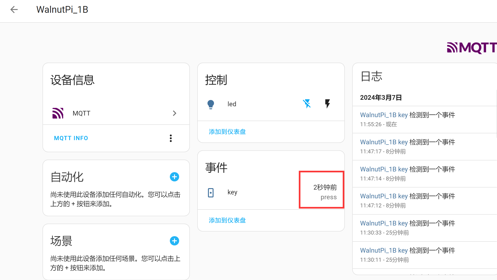
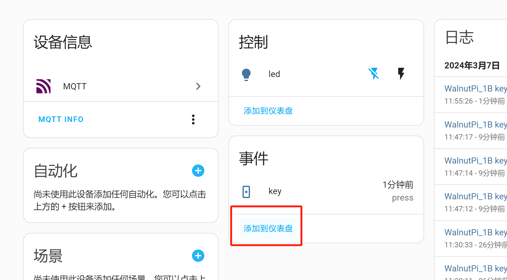
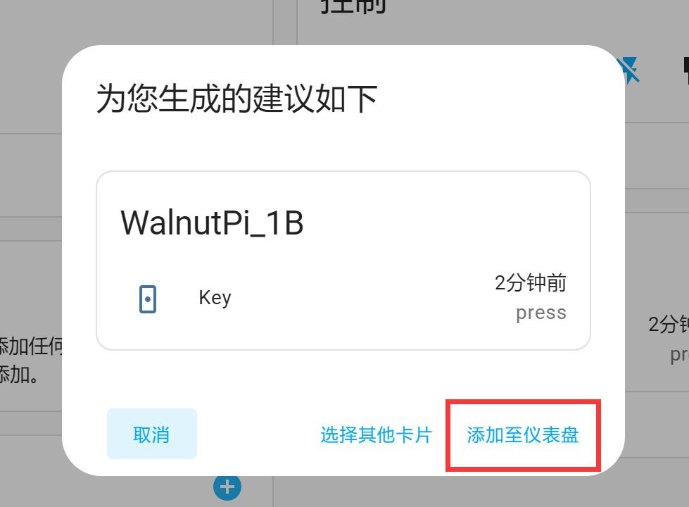
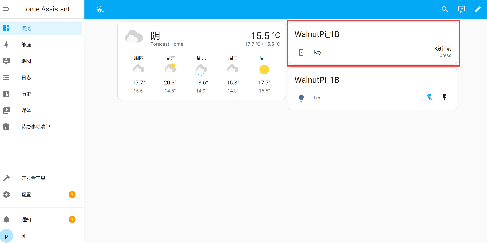
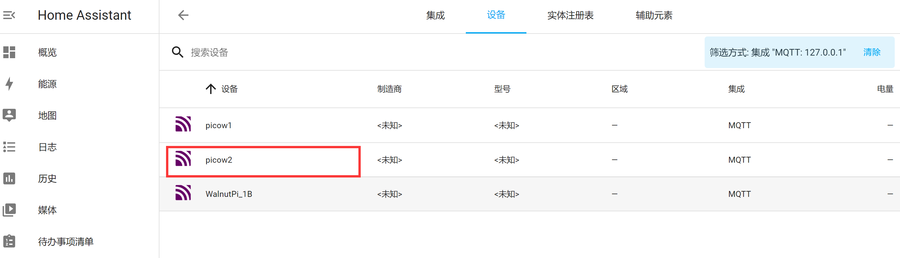
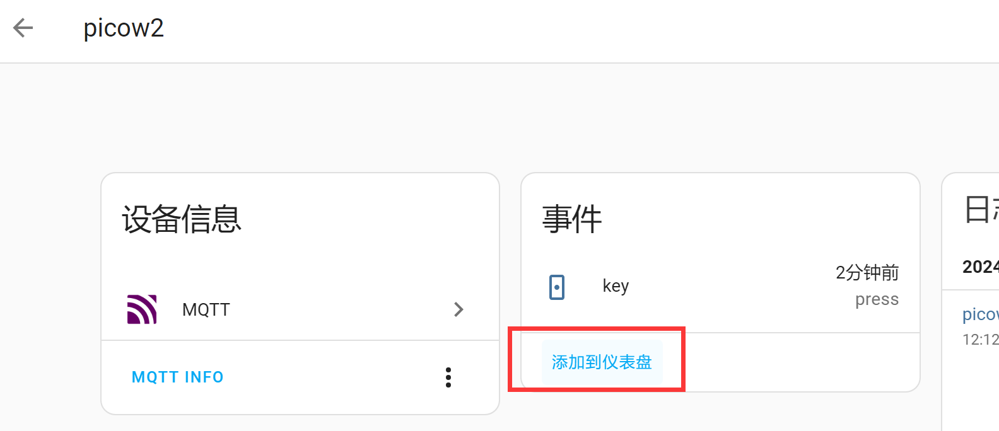

# Button

## Overview
This section focuses on adding a button to the Home Assistant host to detect button press events. For easy demonstration, this tutorial uses both the WalnutPi 2B and the WalnutPi PicoW (ESP32S3) as MQTT nodes to operate.

- WalnutPi 2B Button


- WalnutPi PicoW Button


## Objective
Add a button to the WalnutPi Home Assistant host and implement button press event detection.

## Explanation

The button uses the event component from the Home Assistant MQTT integration. The key to the experiment is understanding the topic information for discovering MQTT devices and the control method, as detailed below:

## MQTT Topic

The following topic is used for the Home Assistant host to discover this device via MQTT:

```
homeassistant/event/1b_key/config
```

- `homeassistant`: Default prefix
- `event`: The MQTT component used for buttons is event
- `1b_key`: Entity ID, must be unique. This is a custom value representing the WalnutPi 1B's button;
- `config`: Default suffix

## MQTT Payload

```json
{
    "name":"key",
    "device_class":"doorbell",
    "state_topic": "1b_key/event/state",
    "event_types": "press",
    "unique_id":"1b_key",

    "device":{
                "identifiers":"1b_01",
                "name":"WalnutPi_1B"
              }
}
```

### Entity

- `"name":"key"`: Entity name, can be customized;
- `"device_class":"doorbell"`: Component type, related to the topic configuration above. Must not be wrong. For example, `doorbell` here is a valid entity under the `event` component;
- `"state_topic":"1b_key/event/state"`: Used to publish relevant attribute topics after registering the entity. Here it sends button state. The topic content can be customized; just make sure different entities have different topics;
- `"unique_id":"1b_key"`: Entity ID, can be customized, must be unique for each entity;

### Device

Informs Home Assistant of the device corresponding to the entity.

- `"identifiers":"1b_01"`: Identification identifier, unique per device;
- `"name":"WalnutPi_1B"`: Device name, can be customized;

For more MQTT event content, see the official documentation: https://www.home-assistant.io/integrations/event.mqtt/

The code flow is as follows:

```mermaid
graph TD
    Import modules-->Build KEY object-->Connect MQTT server-->Register KEY entity and device-->Detect button state-->Send state via MQTT-->Detect button state;
```

## Implementation Using WalnutPi 1B

The WalnutPi 1B has an onboard programmable button. We learned about WalnutPi Python MQTT communication in a previous tutorial [MQTT Communication](../../../python/network/mqtt.md). We build on that foundation:

### Reference Code

```python
'''
Experiment Name: Home Assistant Button
Platform: WalnutPi 1B
Author: WalnutPi
Description: Program Home Assistant button detection.
'''

#Import libraries
import paho.mqtt.client as mqtt

import board,time
from digitalio import DigitalInOut, Direction

#Build button object and initialize
key = DigitalInOut(board.KEY) #Define pin
key.direction = Direction.INPUT #IO as input

#MQTT server and user info
CLIENT_ID = 'WalnutPi-KEY' # Client ID
SERVER = '127.0.0.1' #Localhost IP address
PORT = 1883
USER='pi'
PASSWORD='pi'

#Build MQTT client object
client = mqtt.Client(CLIENT_ID)

#Configure username and password
client.username_pw_set(USER, PASSWORD)

#Initiate connection
client.connect(SERVER,PORT)

#Register device on first boot
topic = "homeassistant/event/1b_key/config"
message = """{
           "name":"key",
           "device_class":"doorbell",
           "state_topic": "1b_key/event/state",
           "event_types": "press",
           "unique_id":"1b_key",

           "device":{
                      "identifiers":"1b_01",
                      "name":"WalnutPi_1B"
                    }
            }"""

client.publish(topic, message)

# Start a new thread to maintain MQTT connection.
client.loop_start()

while True:

    if key.value == 0: #Button pressed

        time.sleep(0.01) #10ms debounce delay

        if key.value == 0: #Button pressed

            client.publish("1b_key/event/state", """{"event_type":"press"}""") #Send button event

            while key.value == 0: #Wait for button release

                pass
```

### Results

Here we use Thonny to remotely run the Python code on the WalnutPi. For methods to run Python code on WalnutPi, see: [Running Python Code](../../../python/python_run.md)


After running, the Home Assistant host shows 2 devices and 3 entities. This is because we registered the button under the same device as the LED from the previous section:


Click **Devices** to open the WalnutPi_1B device:


On the right side, you can see one more event entity — this is the button we just added (one device can have multiple entities):


Press the button on the WalnutPi 1B:


On the Home Assistant host page, you can see that a Press event was triggered:



You can click **Add to Dashboard**:



Home Assistant automatically selects the card type:



After adding, you can see the button entity on the Overview dashboard:



## Implementation Using WalnutPi PicoW

The WalnutPi PicoW (ESP32-S3) has an onboard programmable button. For usage, see: [WalnutPi PicoW Tutorial](https://www.walnutpi.com/picow/directory). Ensure that both the WalnutPi PicoW and the WalnutPi 1B are connected to the same router:


### Reference Code
```python
'''
Experiment Name: Home Assistant Button
Platform: WalnutPi 1B + WalnutPi PicoW
Author: WalnutPi
Description: Program Home Assistant button detection
'''
import network,time
from simple import MQTTClient #Import MQTT module
from machine import Pin,Timer

LED=Pin(46, Pin.OUT) #Initialize WiFi indicator LED

#WiFi connection function
def WIFI_Connect():

    global LED

    wlan = network.WLAN(network.STA_IF) #STA mode
    wlan.active(True)                   #Activate interface
    start_time=time.time()              #Record time for timeout check

    if not wlan.isconnected():
        print('connecting to network...')
        wlan.connect('01Studio_2.4G', '01studio0123456789') #Enter WiFi SSID and password

        while not wlan.isconnected():

            #LED blinking indicator
            LED.value(1)
            time.sleep_ms(300)
            LED.value(0)
            time.sleep_ms(300)

            #Timeout check: if not connected within 15 seconds, treat as timeout
            if time.time()-start_time > 15 :
                print('WIFI Connected Timeout!')
                break

    if wlan.isconnected():
        #Turn on LED
        LED.value(1)

        #Print network info to serial
        print('network information:', wlan.ifconfig())

        return True

    else:
        return False


#Receive data task
def MQTT_Rev(tim):
    client.check_msg()

#Execute WiFi connection and check if successful
if WIFI_Connect():

    CLIENT_ID = 'WalnutPi-PicoW2' # Client ID
    SERVER = '192.168.1.118'  # MQTT server address
    PORT = 1883
    USER='pi'
    PASSWORD='pi'

    client = MQTTClient(CLIENT_ID, SERVER, PORT, USER, PASSWORD) #Create client object
    client.connect()

    #Register device
    TOPIC = "homeassistant/event/picow2_key/config"
    mssage = """{
                  "name": "key",
                  "device_class": "doorbell",
                  "state_topic": "picow2_key/event/state",
                  "event_types": "press",
                  "unique_id": "picow2_key",

                  "device": {
                    "identifiers": "picow_2",
                    "name": "picow2"
                  }
                }
            """

    client.publish(TOPIC, mssage)


KEY=Pin(0,Pin.IN,Pin.PULL_UP) #Build KEY object

#Button interrupt handler
def fun(KEY):
    time.sleep_ms(10) #Debounce
    if KEY.value()==0: #Confirm button pressed

        #Send MQTT button info
        TOPIC = "picow2_key/event/state"
        mssage = """{"event_type":"press"}"""
        client.publish(TOPIC, mssage)

KEY.irq(fun,Pin.IRQ_FALLING) #Define interrupt, falling edge trigger

while True:

    pass

```

### Results

Use Thonny to connect to the WalnutPi PicoW board and run the code above:


After a successful connection, you can see one additional device on the WalnutPi Home Assistant host:



Enter the device to see the registered key event entity:


Press the button on the WalnutPi PicoW:


The WalnutPi Home Assistant host detects the press event:


You can also control the LED on the right and add it to the dashboard:




