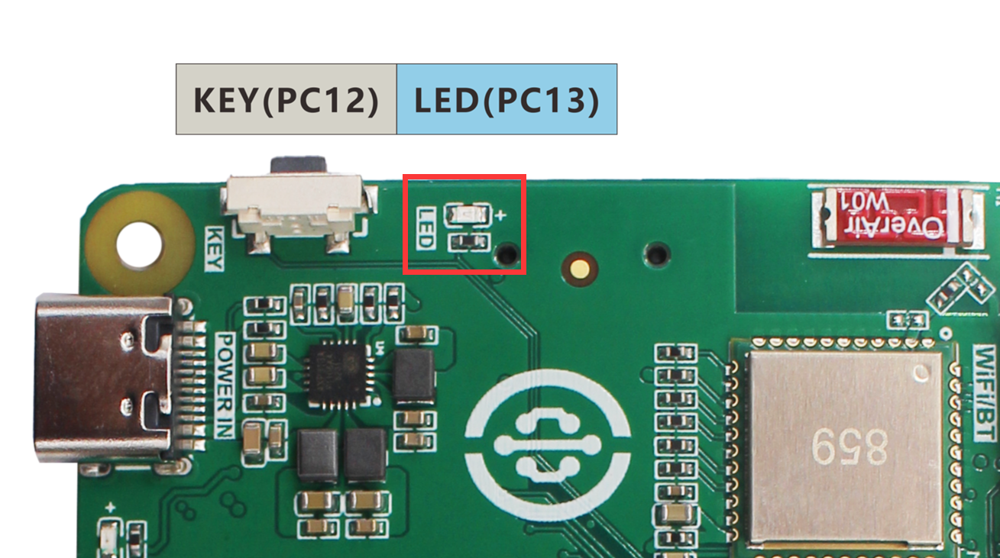
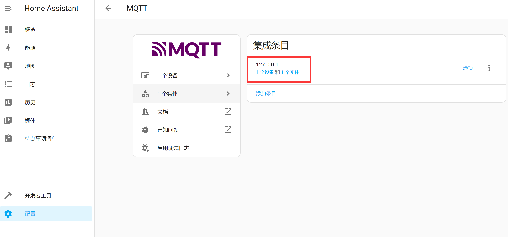
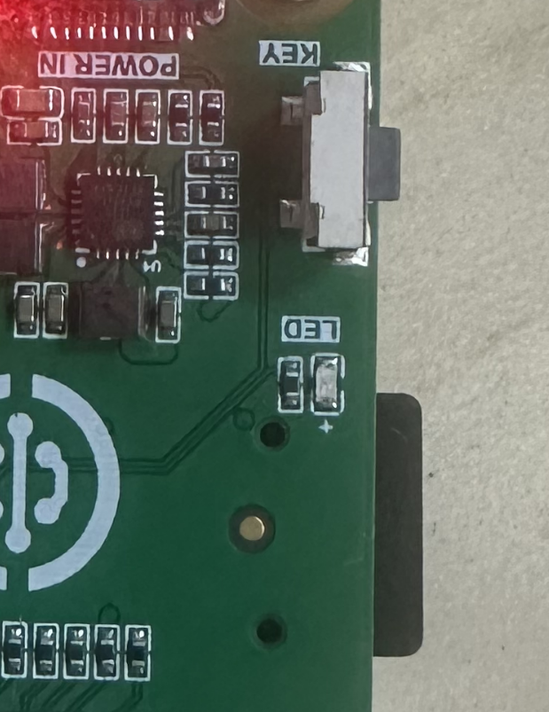
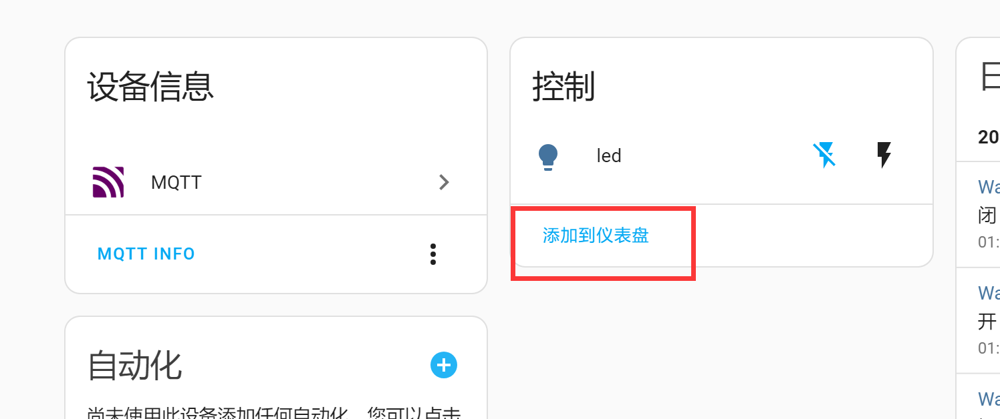
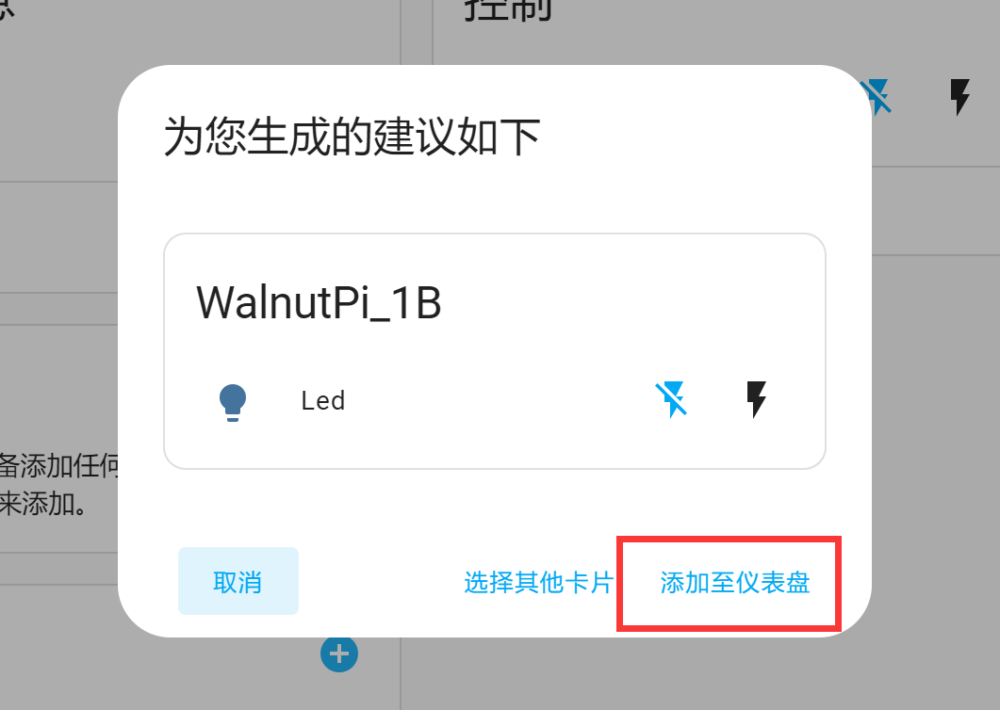
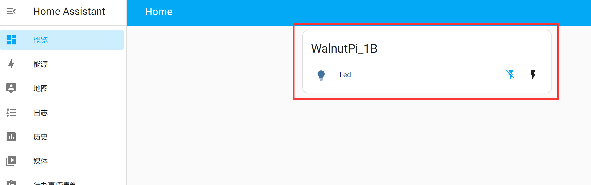
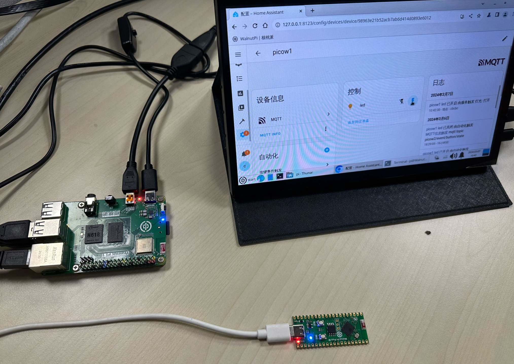
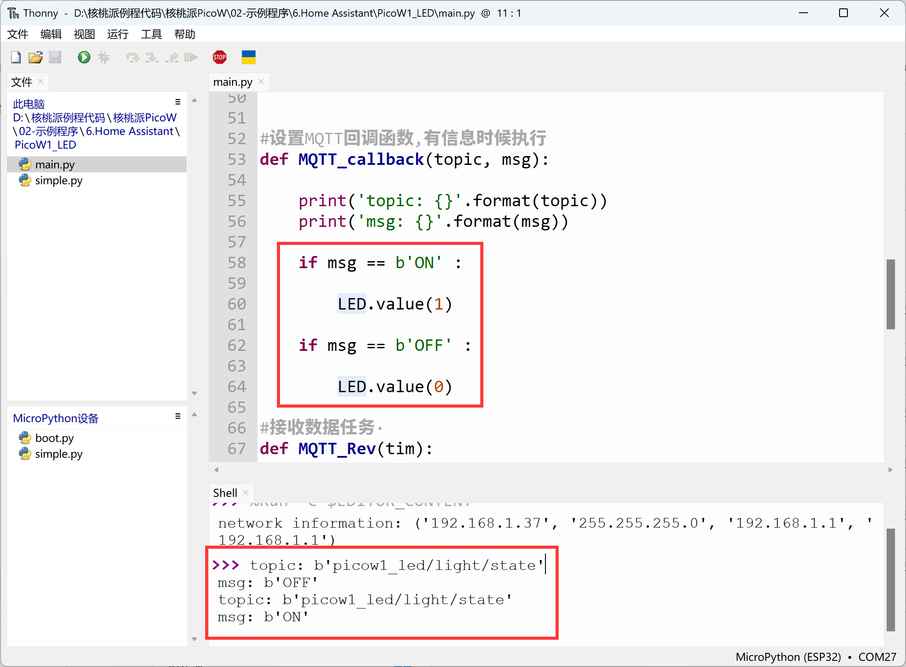

# LED

## Overview
This section focuses on adding an LED to Home Assistant for on/off control. For easy demonstration, this tutorial uses both the WalnutPi 1B and the WalnutPi PicoW (ESP32S3) as MQTT nodes to operate.

- WalnutPi 1B LED



- WalnutPi PicoW LED


## Objective
Add an LED to the WalnutPi Home Assistant host and implement on/off control.

## Explanation

An LED can be thought of as a single-color light fixture, using the light component from the Home Assistant MQTT integration. The key to the experiment is understanding the topic information for discovering MQTT devices and the control method, as detailed below:

## MQTT Topic

The following topic is used for the Home Assistant host to discover this device via MQTT:

```
homeassistant/light/1b_led/config
```

- `homeassistant`: Default prefix
- `light`: The MQTT component used for LEDs is light
- `1b_led`: Entity ID, must be unique. This is a custom value representing the WalnutPi 1B's LED;
- `config`: Default suffix

## MQTT Payload

```json
{
    "name":"led",
    "device_class":"LIGHT",
    "command_topic":"1b_led/light/state",
    "unique_id":"1b_led",

    "device":{
                "identifiers":"1b_01",
                "name":"WalnutPi_1B"
            }
}
```

### Entity

- `"name":"led"`: Entity name, can be customized;
- `"device_class":"LIGHT"`: Component type, related to the topic configuration above. Must not be wrong. For example, `LIGHT` here is a valid entity under the `light` component;
- `"command_topic":"1b_led/light/state"`: Used to publish relevant attribute topics after registering the entity, such as the on/off state of a light. Can be customized; just make sure different entities have different topics;
- `"unique_id":"1b_led"`: Entity ID, can be customized, must be unique for each entity;

### Device

Informs Home Assistant of the device corresponding to the entity.

- `"identifiers":"1b_01"`: Identification identifier, unique per device;
- `"name":"WalnutPi_1B"`: Device name, can be customized;

For more MQTT light content, see the official documentation: https://www.home-assistant.io/integrations/light.mqtt/

The code flow is as follows:

```mermaid
graph TD
    Import modules-->Build LED object-->Connect MQTT server-->Register LED entity and device-->Receive MQTT messages-->Control LED on/off-->Receive MQTT messages;
```

## Implementation Using WalnutPi 2B

The WalnutPi 2B has an onboard programmable LED. We learned about WalnutPi Python MQTT communication in a previous tutorial [MQTT Communication](../../../python/network/mqtt.md). We build on that foundation:

### Reference Code

```python
'''
Experiment Name: Home Assistant LED Light
Platform: WalnutPi
Description: Program Home Assistant LED light control.
'''

#Import libraries
import paho.mqtt.client as mqtt

import board
from digitalio import DigitalInOut, Direction

#Build LED object and initialize
led = DigitalInOut(board.LED) #Define pin
led.direction = Direction.OUTPUT  #IO as output

led.value = 0 #Output low level, turn off blue LED

#MQTT server and user info
CLIENT_ID = 'WalnutPi-LED' # Client ID
SERVER = '127.0.0.1' #Localhost IP address
PORT = 1883
USER='pi'
PASSWORD='pi'

#Build MQTT client object
client = mqtt.Client(CLIENT_ID)

#Configure username and password
client.username_pw_set(USER, PASSWORD)

topic = "picow1/light/led/state"

#Callback executed when client receives a CONNACK response from the server
def on_connect(client, userdata, flags, rc):
    print("Connected with result code "+str(rc))
    # Subscribing in on_connect() means if we lose connection and reconnect, subscriptions will be renewed.
    client.subscribe("1b_led/light/state")

# Callback executed when a published message is received from the server
def on_message(client, userdata, msg):

    print(msg.topic+" "+str(msg.payload)) #Print topic and payload

    if msg.payload == b'ON' : #Turn on LED

        led.value = 1

    if msg.payload == b'OFF' : #Turn off LED

        led.value = 0

#Configure connection and message callback functions
client.on_connect = on_connect
client.on_message = on_message

#Initiate connection
client.connect(SERVER,PORT)

#Register device on first boot
topic = "homeassistant/light/1b_led/config"
message = """{
           "name":"led",
           "device_class":"LIGHT",
           "command_topic":"1b_led/light/state",
           "unique_id":"1b_led",

           "device":{
                      "identifiers":"1b_01",
                      "name":"WalnutPi_1B"
                    }
            }"""

client.publish(topic, message)

# Start a new thread to maintain MQTT connection.
client.loop_start()

while True:

    pass

```

### Results

Here we use Thonny to remotely run the Python code on the WalnutPi. For methods to run Python code on WalnutPi, see: [Running Python Code](../../../python/python_run.md)


After running, you can see a new device and entity appear in the Home Assistant host:



Click **Devices** to see device information. On the right, led is the entity. Click the toggle switch to turn the LED on/off:


At the same time, MQTT messages are sent to the device:


Controlling the WalnutPi 1B LED on/off:




You can also click **Add to Dashboard**:



Home Assistant automatically selects the card type:



After adding, you can see the device on the Overview dashboard:



## Implementation Using WalnutPi PicoW

The WalnutPi PicoW (ESP32-S3) has an onboard programmable LED. For usage, see: [WalnutPi PicoW Tutorial](https://www.walnutpi.com/picow/directory). Ensure that both the WalnutPi PicoW and the WalnutPi 2B are connected to the same router:



### Reference Code
```python
'''
Experiment Name: Home Assistant LED Light
Platform: WalnutPi + WalnutPi PicoW
Author: WalnutPi
Description: Program Home Assistant LED light control
'''

import network,time
from simple import MQTTClient #Import MQTT module
from machine import Pin,Timer

LED=Pin(46, Pin.OUT) #Initialize WiFi indicator LED

#WiFi connection function
def WIFI_Connect():

    global LED

    wlan = network.WLAN(network.STA_IF) #STA mode
    wlan.active(True)                   #Activate interface
    start_time=time.time()              #Record time for timeout check

    if not wlan.isconnected():
        print('connecting to network...')
        wlan.connect('01Studio', '88888888') #Enter WiFi SSID and password

        while not wlan.isconnected():

            #LED blinking indicator
            LED.value(1)
            time.sleep_ms(300)
            LED.value(0)
            time.sleep_ms(300)

            #Timeout check: if not connected within 15 seconds, treat as timeout
            if time.time()-start_time > 15 :
                print('WIFI Connected Timeout!')
                break

    if wlan.isconnected():
        #Turn on LED
        LED.value(1)

        #Print network info to serial
        print('network information:', wlan.ifconfig())

        return True

    else:
        return False


#Set MQTT callback, executes when a message is received
def MQTT_callback(topic, msg):

    print('topic: {}'.format(topic))
    print('msg: {}'.format(msg))

    if msg == b'ON' :

        LED.value(1)

    if msg == b'OFF' :

        LED.value(0)

#Receive data task
def MQTT_Rev(tim):
    client.check_msg()

#Execute WiFi connection and check if successful
if WIFI_Connect():

    CLIENT_ID = 'WalnutPi-PicoW1' # Client ID
    SERVER = '192.168.1.118'  # MQTT server address
    PORT = 1883
    USER='pi'
    PASSWORD='pi'

    client = MQTTClient(CLIENT_ID, SERVER, PORT, USER, PASSWORD) #Create client object
    client.set_callback(MQTT_callback)  #Configure callback function
    client.connect()

    #Register device
    TOPIC = "homeassistant/light/picow1_led/config"
    mssage = """{
                  "name": "led",
                  "device_class": "LIGHT",
                  "command_topic": "picow1_led/light/state",
                  "unique_id": "picow1_led",

                  "device": {
                            "identifiers": "picow_1",
                            "name": "picow1"
                            }
                }"""

    client.publish(TOPIC, mssage)

    #Subscribe to topic
    TOPIC = 'picow1_led/light/state' # TOPIC name
    client.subscribe(TOPIC) #Subscribe to topic

    #Start RTOS timer, number 1, period 100ms, execute socket receive task
    tim = Timer(1)
    tim.init(period=100, mode=Timer.PERIODIC,callback=MQTT_Rev)

```

### Results

Use Thonny to connect to the WalnutPi PicoW board and run the code above:


After a successful connection, you can see one additional device on the WalnutPi Home Assistant host:


Enter the device. You can also control the LED on the right and add it to the dashboard:


When clicking the switch, the PicoW receives MQTT messages and prints them in the Thonny IDE terminal below. The LED toggles accordingly.




