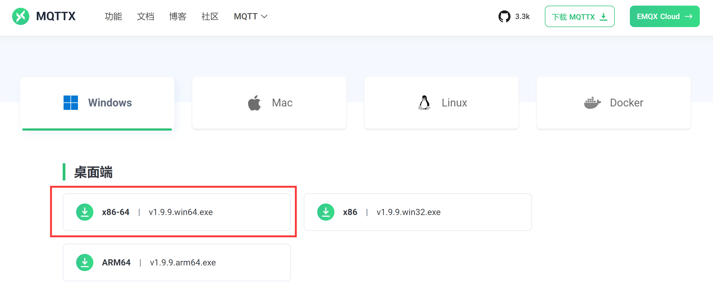
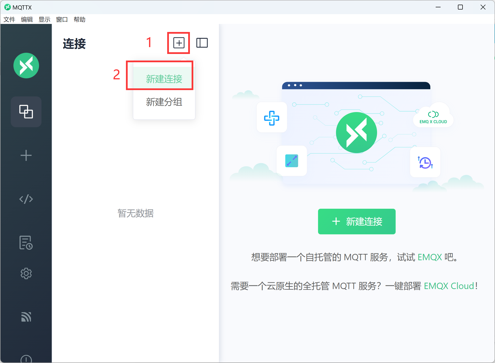
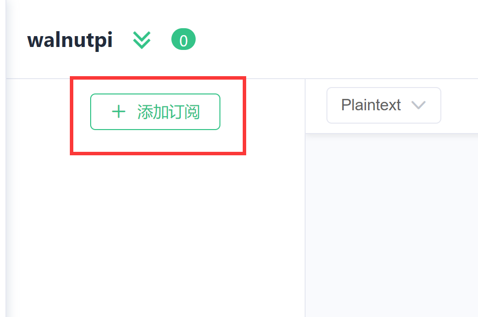

# MQTT Server Installation

MQTT (Message Queuing Telemetry Transport) is a TCP/IP-based machine-to-machine or "Internet of Things" connection protocol. It enables extremely lightweight publish/subscribe messaging transport. MQTT is a very versatile protocol that makes it easy to integrate your own devices. For detailed WalnutPi MQTT tutorials, see: [MQTT Communication](../../python/network/mqtt.md)

Using the MQTT integration requires an MQTT server.

:::tip Note
If you are using the WalnutPi Home Assistant image, the MQTT server is pre-installed and configured to start automatically on boot.
:::

If you installed Home Assistant on the standard WalnutPi image, you need to manually install and configure the MQTT server. Installation instructions are as follows:

## Installation

Open the WalnutPi terminal and install using apt:

```bash
sudo apt install mosquitto
```

Set to start automatically on boot:

```bash
sudo service mosquitto start
```

## General Configuration

Here you can configure the MQTT server port and related file bindings. Create a configuration file in the WalnutPi **/etc/mosquitto/conf.d** directory using the terminal. The filename can be anything — the system will auto-detect it — for example, default.conf:

```bash
sudo nano /etc/mosquitto/conf.d/default.conf
```

Enter the following content:
```
# Modify port
port 1883

# Disallow anonymous access — username & password required to connect
allow_anonymous false

# Specify the username & password file to use; this file must be created manually
password_file /etc/mosquitto/pwfile

# Specify the ACL file path; this file must be created manually
acl_file /etc/mosquitto/aclfile
```

Then press Ctrl+X to save and exit.

## Create Account

This username and password are used to log in to the MQTT server. In the WalnutPi **/etc/mosquitto/** directory, create a file with the following command. The filename must match the one configured above — **pwfile**.

```bash
sudo touch /etc/mosquitto/pwfile
```

After creating the file, use the mosquitto_passwd command to create the account and password. Here we create a test account with username: pi, password: pi.

```bash
sudo mosquitto_passwd /etc/mosquitto/pwfile pi
```

You will then be prompted to enter the password.

:::tip Note
The password will not be displayed on screen. Pay attention to case sensitivity and enter it twice.
:::


## Set Account Permissions

This feature mainly filters out unnecessary information on the MQTT server for different users. This is optional — if not set, all topic messages will be received.

In the WalnutPi **/etc/mosquitto/** directory, create an ACL file with the following command. The filename must match the one configured above — **aclfile**.

```bash
sudo nano /etc/mosquitto/aclfile
```

Enter the following content:

```
user pi
topic #
```

Save and exit by pressing Ctrl+X.

The above content means the pi user receives all MQTT topic information. For example: **topic walnutpi/#** would only accept topic information starting with **walnutpi/**, blocking other topics.

After all configuration is complete, restart the MQTT service for changes to take effect:

```bash
sudo service mosquitto restart
```

## Testing the MQTT Server

After installing the MQTT server on the WalnutPi, you can test it using an MQTT helper tool. We recommend a feature-rich test tool called MQTTX, which supports Windows, Mac, Linux, and other platforms. We'll frequently use MQTT helper tools for debugging in future MQTT experiments. Here we use the Windows installation:

### Download and Install MQTTX

Download link: https://mqttx.app/zh/downloads

Choose the appropriate version for your computer. Below shows the Windows 64-bit version:



Download and install directly.

### Connect to WalnutPi MQTT Server and Test

Open the installed MQTTX. The interface is very clean:


Click the + button next to Connections and select **New Connection**:



Enter the WalnutPi MQTT server information:
- `Name`: Anything you like;
- `Server Address`: Enter the WalnutPi IP address;
- `Username and Password`: The username and password configured earlier. If using the Home Assistant image, the defaults are: username: pi, password: pi.

Leave other settings at their defaults.


Then click **Connect**. A success message will appear:


After connecting, subscribe to a test topic by clicking **Add Topic**:



In the popup, enter: walnutpi/1 in the Topic field. `walnutpi/1` is the topic name — you can define it yourself. Click Confirm.


Back on the main window, select the data type as shown on the right, enter the topic and message. The topic must match the subscription. Click the send button at the bottom right:


You should see two messages in the dialog — the right side is the sent content, the left side is the received content. This confirms that the WalnutPi MQTT server is sending and receiving normally.


