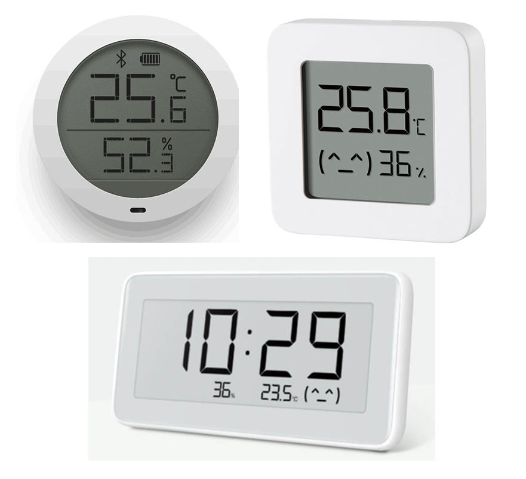
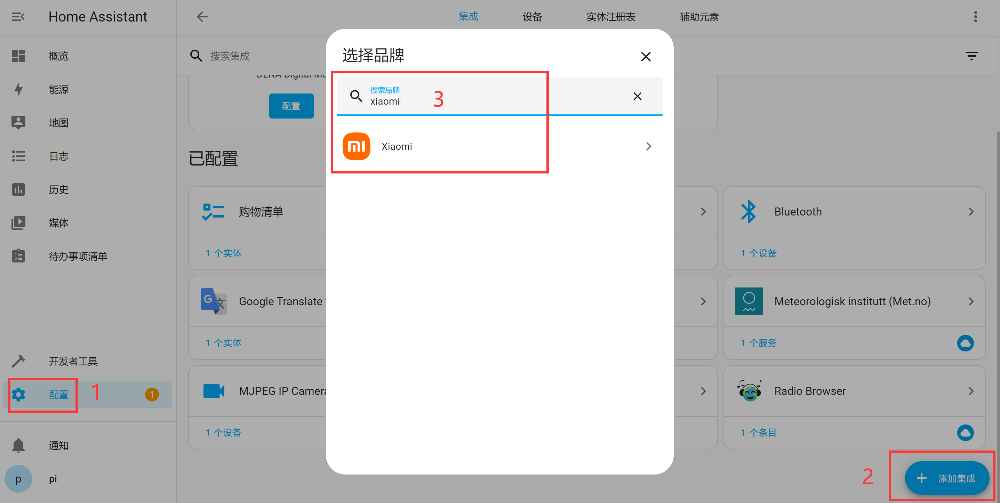
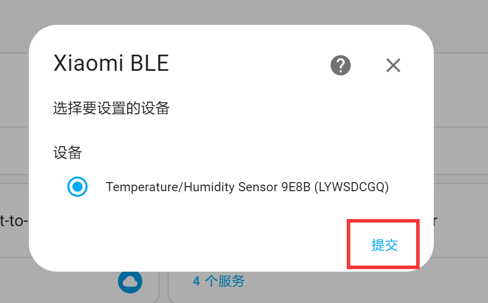
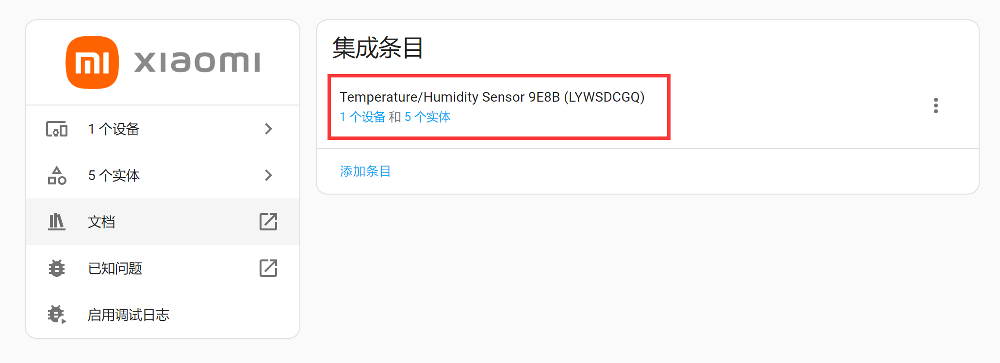
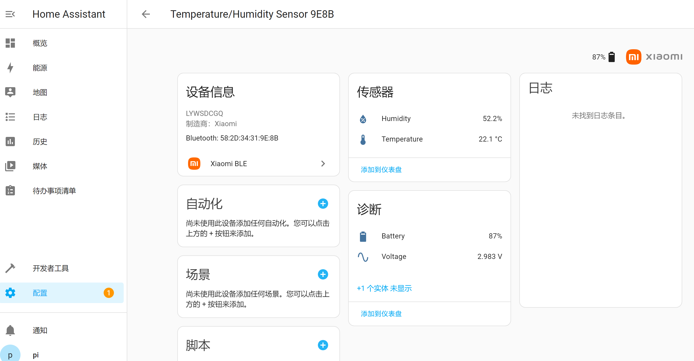
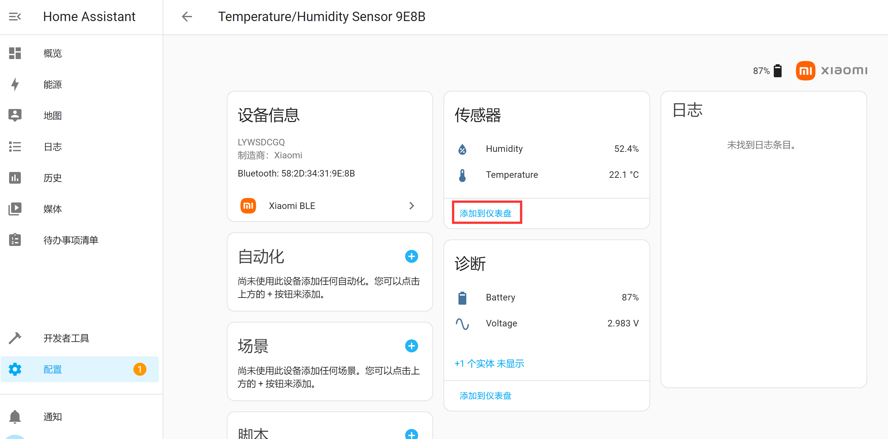
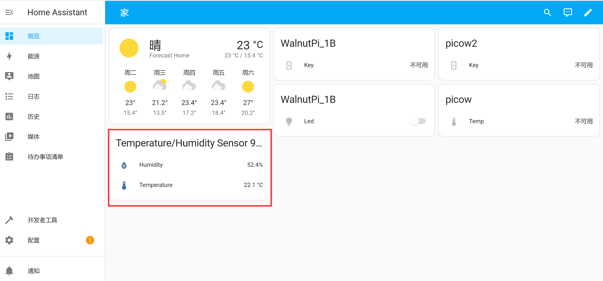

# Adding Commercial Products

## Xiaomi Temperature/Humidity Sensor

Here are a few commercially available Xiaomi temperature/humidity sensors.

  

These sensors broadcast temperature, humidity, battery level, and other information via Bluetooth advertising without requiring a connection. They can be directly discovered by the WalnutPi Home Assistant host.

Place the Xiaomi temperature/humidity sensor close to the WalnutPi Home Assistant host:

  

Click **Settings** → **Add Integration**, and search for **xiaomi** in the popup:

  

Select Xiaomi BLE:

  

A device will appear — click Submit.

  

You can now see the Xiaomi BLE integration under Integrations.

  

Click in to see the relevant device and entities, then click **Device** to view the data:

  

It can be added to the Overview dashboard:

