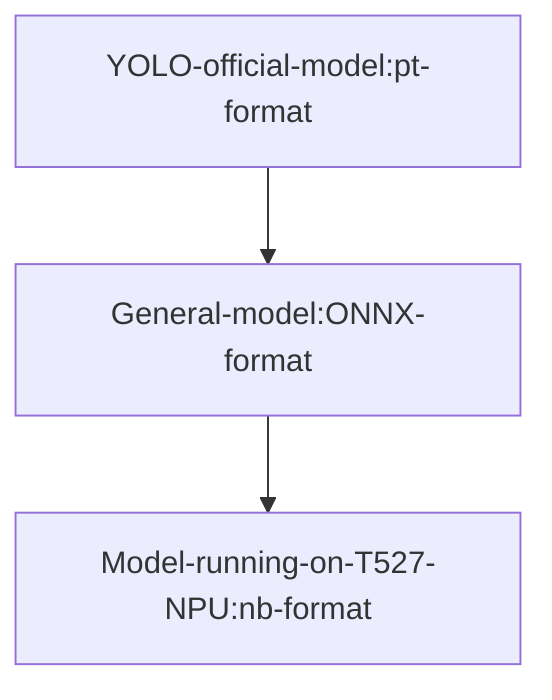

# Model Conversion

This section explains how the .nb format model files used in the previous YOLO11 examples running on WalnutPi are converted. This tutorial requires some basic Linux system knowledge.

First, download the WalnutPi YOLO model resource package, which contains the relevant software tools used in this tutorial:

- Baidu Cloud link: https://pan.baidu.com/s/1Mce6yRNqlZen-uj_qjtF6A?pwd=WPKJ
- Extraction code: **WPKJ**

YOLO11 officially provides pre-trained original model files (.pt format) using PyTorch. We need to first convert them to (.onnx format) general model files, and then convert them to (.nb) model files to run on the WalnutPi 2B (T527) NPU.



## Getting the pt Model

The .pt files used in this tutorial are obtained from [ultralytics release (v8.3.0)](https://github.com/ultralytics/assets/releases/tag/v8.3.0):

    YOLO11n: Drones, mobile devices, real-time monitoring (low-compute environments).
    YOLO11s/m: General object detection (e.g., security monitoring, autonomous driving assistance).
    YOLO11l/x: High-precision scenarios (e.g., industrial inspection, medical image analysis).

The WalnutPi YOLO11 tutorial uses the fastest and smallest YOLO11n series models. The corresponding names are as follows:

- `Classification`: yolo11n-cls.pt
- `Detection`: yolo11n.pt
- `Oriented Detection`: yolo11n-obb.pt
- `Image Segmentation`: yolo11n-seg.pt
- `Pose Recognition`: yolo11n-pose.pt

::::tip Note:
This section uses the detection model `yolo11n.pt` as an example. The operation method is the same for other models.
::::

## pt to onnx Conversion

You need a computer with a Linux system installed, or use a virtual machine to install Linux on Windows. The WalnutPi development board does not currently support running the model format conversion tool.

### Download Conversion Tools

The `.pt` file contains the parameter values required for YOLO operation, but it does not contain network structure information. To run on the NPU, you need to export it to onnx format, which includes network structure information. This step requires using the built-in tools from the YOLO11 source code.

- First, install the ultralytics library

```bash
sudo pip install ultralytics
```

First, you need to download a copy of the YOLO11 source code to convert the YOLO11-specific model files to general onnx model files. Here, you need to download the WalnutPi YOLO11 project, because the official built-in post-processing operations can affect detection accuracy. So, the YOLO11 source code we provide has made some modifications to the post-processing part, adding additional model raw data output.

```shell
git clone https://github.com/walnutpi/ultralytics_yolo11.git
```

After cloning the project, first run the following command to temporarily modify the environment variable PYTHONPATH, specifying Python's module search path to the location of the YOLO11 source code. My YOLO11 source code storage path is /opt/ultralytics_yolo11, so the command is as follows:

```shell
export PYTHONPATH=/opt/ultralytics_yolo11
```

::::tip Note
The above command only takes effect in the current terminal. If you close the current terminal, you need to re-run this command when reopening it.
::::

### Execute Conversion Code

Create a new py file and enter the following code. Then run the following Python code in the same directory as the pt model file. It will look for the YOLO library from the `PYTHONPATH` path you just set and export the model file specified in this code to onnx format.

```python
from ultralytics import YOLO

model = YOLO("./yolo11n.pt")
model.export(format="onnx")
```
- Run the Python code


- Successfully generated onnx model


## onnx to nb Conversion

Please prepare a computer with a Linux system installed, or install a virtual machine on Windows.

onnx is an open and general model format, but the NPU design of different chip manufacturers varies, so you need to convert it to a model that the manufacturer's NPU can run. For example, for WalnutPi 2B T527, Allwinner officially provides conversion tools and documentation. **For user convenience, we directly package the conversion environment into Docker, which users can install directly.**

Download the Docker image and script tool resource package provided by WalnutPi:

### Install Docker Image and Conversion Scripts

- 1. Install Docker

If Docker is not installed on your Linux computer, you can use the `docker-ce_17.09.0-ce-0-ubuntu_amd64.deb` installation package in the resource package folder for installation:

Run the following command in Linux to install:

```bash
sudo apt install docker.io
```

- 2. Import Docker Image

After decompressing the `ubuntu-npu_v1.8.11.rar` file in the resource package, you will get an `ubuntu-npu_v1.8.11.tar` file (with a different suffix). This is an Ubuntu 18 Docker image with the WalnutPi NPU conversion tools installed and configured.

Run the following command to import it into Docker:

```bash
docker load -i ubuntu-npu_v1.8.11.tar
```

- 3. Install Conversion Scripts

The npu-model-transform folder contains some shortcut scripts we wrote. We have written all the steps for calling the Docker image for conversion into scripts for user convenience.

Run install.sh inside it to complete the installation:

```bash
sudo ./install.sh
```

### Install Dependencies

```bash
sudo pip install onnx
```

```bash
sudo apt install jq
```

We have combined steps such as exporting model information, writing configuration files, model quantization, and generating nb files from quantization data into a single command `npu-transfer-yolo`.

When training, the model uses float32 type to store parameters. When running on the NPU, the parameters need to be converted to types with smaller storage ranges, such as int8, to reduce model size and improve model execution speed. This step is called **quantization**. **Quantization** is not simply rounding parameters; it requires feeding some images to the model and optimizing each parameter based on the model's response state.

We need to prepare several images for quantization, usually just taking a few from the training dataset, and store them in a folder.

Then run the following command, passing two parameters: one is the path to the onnx model file, and the other is the path to the folder containing the images.

```bash
sudo npu-transfer-yolo yolo11n.onnx ./image/
```

Finally, a `yolo11n.nb` file will be generated in the current directory. This file can then run inference on the WalnutPi 2B NPU.

## Model Viewer Tool

[netron.app](https://netron.app/) is a web-based tool that can be used to view the structure of pt and onnx models. It does not support viewing manufacturer-custom format models like nb.

- pt format


- onnx format


