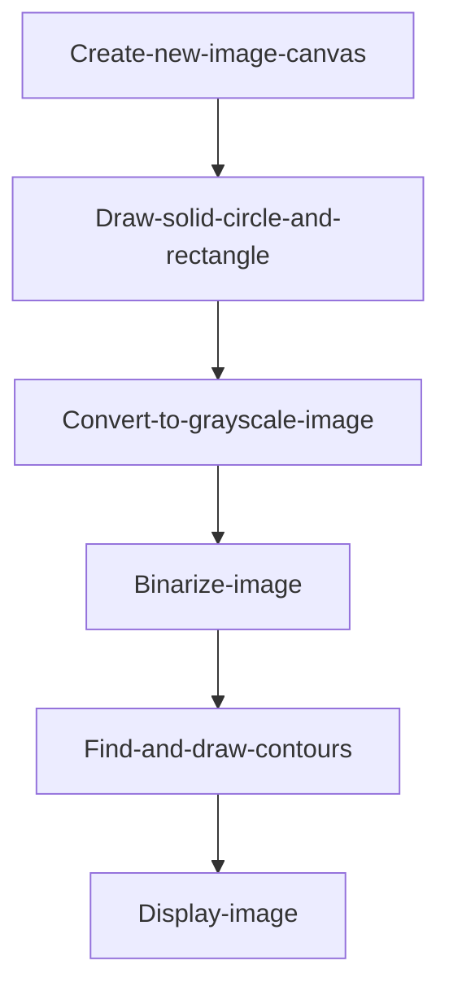

# Contour Detection

## Introduction

This section learns to use OpenCV for image contour detection. Contours refer to the edge lines of shapes or objects in an image.

## Experiment Objective

Detect image contours and draw them for display.

## Experiment Explanation

The OpenCV Python library provides the findContours() function for finding contours and the drawContours() function for drawing contours.

### findContours() Usage

```python
contours, hierarchy = cv2.findContours(image, mode, methode)
```

Find edge coordinates in the image. Returns contours as a list of contour point coordinates; hierarchy indicates hierarchical relationships.
- `iamge`: 8-bit single-channel binary image.
- `mode`: Detection mode.
    - `cv2.RETR_EXTERNAL`: Only detect outer contours.
    - `cv2.RETR_LIST`: Detect all contours, do not establish hierarchical relationships.
    - `cv2.RETR_CCOMP`: Detect all contours, establish 2-level hierarchical relationships.
    - `cv2.RETR_TREE`: Detect all contours, establish tree-like hierarchical relationships.
- `methode`: Detection method.
    - `cv2.CHAIN_APPROX_NONE`: Save all contour points.
    - `cv2.CHAIN_APPROX_SIMPLE`: Save only the endpoints of horizontal, vertical, or diagonal contours.

### drawContours() Usage

```python
img = cv2.drawContours(image, contours, contourIdx, color, thickness, lineType, hierarchy, maxLevel, offset)
```

Draw contours. Returns contours as a list of contour point coordinates; hierarchy indicates hierarchical relationships.
- `iamge`: Original image.
- `contours`: The list obtained from findContours().
- `contourIdx`: Index method, -1 means draw all contours.
- `color`: Color.
- `thickness`: Thickness, -1 means solid fill.
- `lineType`: Contour line type (optional).
- `hierarchy`: Hierarchical relationships obtained from findContours() (optional).
- `maxLevel`: Hierarchical depth (optional).
- `offset`: Offset, changes the position of the drawn result (optional).

Here we can draw a solid circle and a solid rectangle, then binarize the image, then find and draw contours. The code writing flow is as follows:



<br></br>

Reference code is as follows:

```python
'''
Experiment Name: Contour Detection
Experiment Platform: WalnutPi
'''

import cv2
import numpy as np

# Create a new 300x300 pixel RGB888 pure white image
img = np.ones((300,300,3),np.uint8)*255

# Draw a blue solid circle img0
img0 = cv2.circle(img, (100, 100), 50, (255,0,0), -1)

# Draw a red solid rectangle
img = cv2.rectangle(img0, (150, 150), (250, 250), (0,0,255), -1)

cv2.imshow('color', img) # Display the image

# Convert the color image to grayscale (single channel)
img = cv2.cvtColor(img, cv2.COLOR_BGR2GRAY)
cv2.imshow('gray', img) # Display the image

# Convert the grayscale image to binary image
t,img = cv2.threshold(img, 127, 255, cv2.THRESH_BINARY)
cv2.imshow('binary', img) # Display the image

# Detect contours
contours, hierarchy = cv2.findContours(img, cv2.RETR_LIST, cv2.CHAIN_APPROX_NONE)

# Draw contours on the original image img0, green
img = cv2.drawContours(img0, contours, -1, (0,255,0), 5)
cv2.imshow('contours', img) # Display the image

cv2.waitKey() # Wait for any key press
cv2.destroyAllWindows() # Close the window

```

## Experiment Results

Run the above code on the WalnutPi, and you can see the change process of the experimental images. The final contour drawing result is shown below:


## Extension

We use lenna.jpg to draw contours and observe the results. The code is as follows:

```python
'''
Experiment Name: Contour Detection 2
Experiment Platform: WalnutPi
'''
import cv2
import numpy as np

img0 = cv2.imread('lenna.jpg') # Read the image for original observation
cv2.imshow('lenna', img0) # Display the image

img = cv2.imread('lenna.jpg',0) # Get the grayscale image
cv2.imshow('gray', img) # Display the grayscale image

# Convert the grayscale image to binary image
t,img = cv2.threshold(img, 127, 255, cv2.THRESH_BINARY)
cv2.imshow('binary', img) # Display the binary image

# Detect contours
contours, hierarchy = cv2.findContours(img, cv2.RETR_LIST, cv2.CHAIN_APPROX_NONE)

# Draw contours on the original image img0
img = cv2.drawContours(img0, contours, -1, (0,255,0), 5)
cv2.imshow('contours', img) # Display the contour image

cv2.waitKey() # Wait for any key press
cv2.destroyAllWindows() # Close the window

```

Experiment results are as follows:


