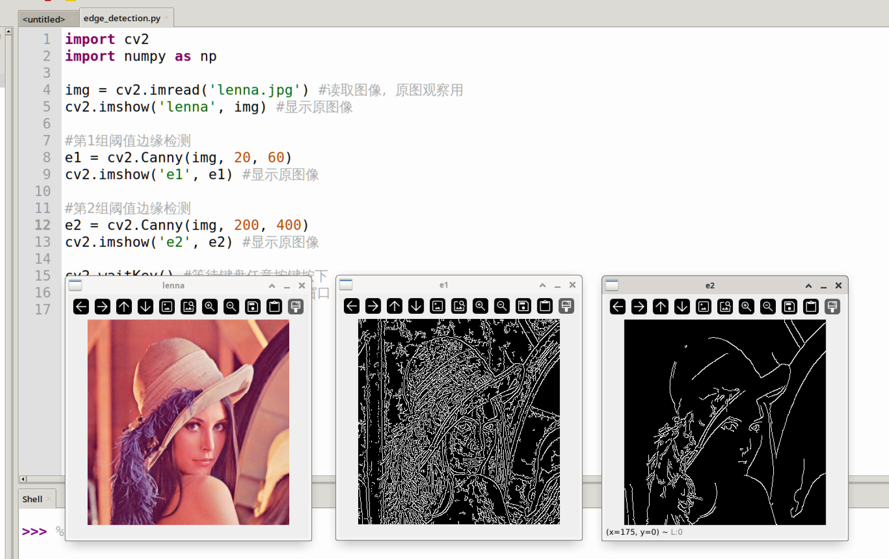

# 边缘检测

## 前言

本节学习使用OpenCV对图像进行边缘检测功能，使用Canny边缘检测算法，相对于前面轮廓检测，这里只需要简单几行代码便可实现。

## 实验目的

图像边缘检测并显示。

## 实验讲解

OpenCV Python库提供了Canny()函数实现边缘检测功能。

### Canny() 使用方法

```python
edges = cv2.Canny(image, threshold1, threshold2, apertureSize, L2gradient)
```

Canny边缘检测。返回edges为二值图像。
- `iamge` ：原始图像。
- `threshold1` ：计算使用的第1个阈值，通常是最小阈值。
- `threshold2` ：计算使用的第2个阈值，通常是最大阈值。

从上面可知道Canny方法使用非常简单，我们只需要根据需求设定好合适的阈值即可，我们可以使用2组阈值来对比实验。代码编写流程如下：

```mermaid
graph TD
    读取图像-->使用2组阈值进行边缘检测-->显示图像;
```

<br></br>

参考代码如下:

```python
'''
实验名称：边缘检测
实验平台：核桃派
'''

import cv2

img = cv2.imread('lenna.jpg') #读取图像，原图观察用
cv2.imshow('lenna', img) #显示原图像

#第1组阈值边缘检测
e1 = cv2.Canny(img, 20, 60)
cv2.imshow('e1', e1) #显示原图像

#第2组阈值边缘检测
e2 = cv2.Canny(img, 200, 400)
cv2.imshow('e2', e2) #显示原图像

cv2.waitKey() #等待键盘任意按键按下
cv2.destroyAllWindows() #关闭窗口

```

## 实验结果

在核桃派运行上面代码，可以2组阈值的边缘检测结果如下图，不同阈值会导致检测的细节程度不一样：

