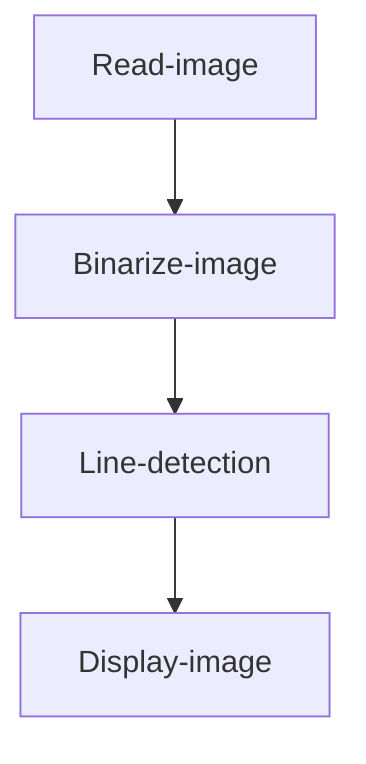

# Line Detection

## Introduction

This section learns to use OpenCV to detect line segments in an image.

## Experiment Objective

Detect line segments in an image and draw them for display.

## Experiment Explanation

The OpenCV Python library provides two line detection methods: HoughLines() for detecting straight lines (infinite length) and HoughLinesP() for detecting line segments. This section mainly uses HoughLinesP(), which only supports binary grayscale images.

### HoughLinesP() Usage

```python
lines = cv2.HoughLinesP(image, rho, theta, threshold, minLineLength, maxLineGap)
```
Line segment detection. Returns lines as an array of all line segment coordinates. Example: [[x0,y0,x1,y1],[x0,y0,x1,y1]]
- `iamge`: Original image. Requires a binary grayscale image.
- `rho`: Detection radius step. Default value is 1, meaning detect all radius steps.
- `theta`: Angle of detected lines. Default value is π/180, meaning detect all angles.
- `threshold`: Threshold. The smaller the value, the more lines detected.
- `minLineLength`: Minimum length. Line segments shorter than this length are not detected.
- `maxLineGap`: Minimum distance between line segments.

Read the image, convert it to a binary grayscale image, then perform line segment detection. The code writing flow is as follows:



<br></br>

Reference code is as follows:

```python
'''
Experiment Name: Line Detection
Experiment Platform: WalnutPi
'''

import cv2
import numpy as np

img0 = cv2.imread('lines.png') # Read the image
cv2.imshow('lines', img0) # Display the original image

# Convert the color image to grayscale (single channel)
img1 = cv2.cvtColor(img0, cv2.COLOR_BGR2GRAY)
#cv2.imshow('gray', img1) # Display the image

# Convert the grayscale image to binary image
t,img2 = cv2.threshold(img1, 127, 255, cv2.THRESH_BINARY_INV)
cv2.imshow('binary', img2) # Display the binary image

# Detect line segments
lines = cv2.HoughLinesP(img2, 1, np.pi/180, 15, 100, 20)

print(lines) # Print line segment information

# Draw line segments on the original grayscale image
for l in lines:    
    x0, y0, x1, y1 = l[0]
    cv2.line(img0, (x0, y0), (x1, y1), (0,255,0), 3)

cv2.imshow('result', img0)

cv2.waitKey() # Wait for any key press
cv2.destroyAllWindows() # Close the window

```

## Experiment Results

Run the above code on the WalnutPi, and the experimental results are as follows:


