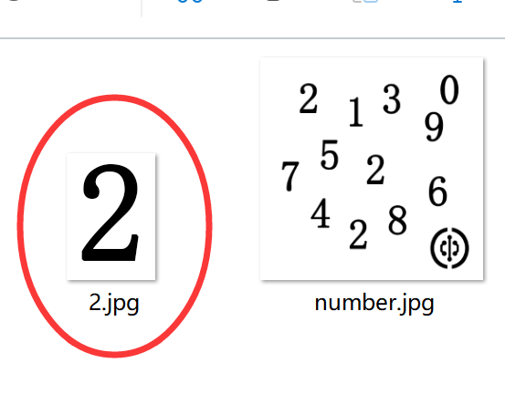
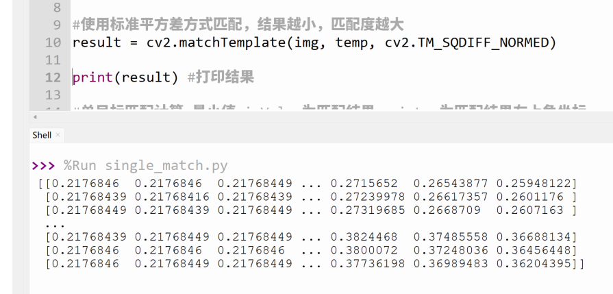
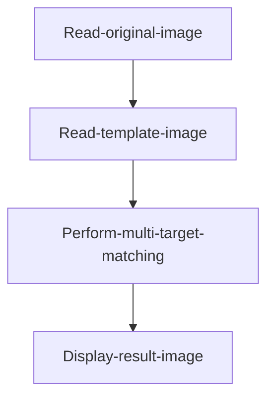
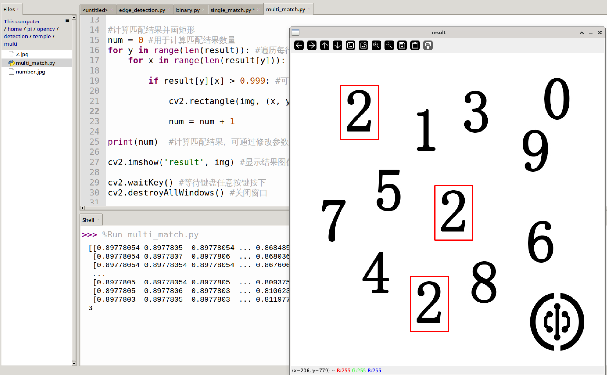

# Template Matching

## Introduction

Template matching refers to finding a specified target object (or image) within an image. The principle is to compare and match the target image against the original image position by position, thereby finding the location of the target object (or image) in the image.


## Experiment Objective

Find a specified image (object) in an image through template matching. This experiment aims to find the digit 2 in the following image.


The digit 2 was cropped from the above image as the template image.




## Experiment Explanation

The OpenCV Python library provides the matchTemplate() function for template matching. Practical applications include single-target matching and multi-target matching. Single-target matching means finding only the closest one, while multi-target matching means finding multiple similar objects (or images) in an image.

### matchTemplate() Usage

```python
result = cv2.matchTemplate(image, templ, method, mask)
```
Template matching. Returns result as a two-dimensional array, which can be viewed by printing via code.
- `iamge`: Original image.
- `templ`: Template image, whose dimensions must be less than or equal to the original image.
- `method`: Matching method.
    - `cv2.TM_SQDIFF`: 0, Sum of squared differences matching (squared difference matching). The higher the match, the smaller the result. A perfect match gives 0.
    - `cv2.TM_SQDIFF_NORMED`: 1, Normalized sum of squared differences matching (normalized squared difference matching). The higher the match, the smaller the result. A perfect match gives 0.
    - `cv2.TM_CCORR`: 2, Correlation matching. The higher the match, the larger the result.
    - `cv2.TM_CCORR_NORMED`: 3, Normalized correlation matching. The higher the match, the larger the result.
    - `cv2.TM_CCOEFF`: 4, Correlation coefficient matching. Results are floating-point numbers from -1 to 1. 1 indicates a perfect match, 0 indicates no match, and -1 indicates that the template and the original image have opposite brightness.
    - `cv2.TM_CCOEFF_NORMED`: 5, Normalized correlation coefficient matching. Results are floating-point numbers from -1 to 1. 1 indicates a perfect match, 0 indicates no match, and -1 indicates that the template and the original image have opposite brightness.
- `mask`: Mask (optional parameter), default value is recommended.
 
## Single-Target Matching

Single-target matching finds only one optimal result.

The matchTemplate() calculation result is a two-dimensional array. Single-target matching parses the coordinate values of this array using the minMaxLoc() function.

```python
minValue, maxValue, minLoc, maxLoc = cv2.minMaxLoc(src, mask)
```
Parameter description:
- `src`: matchTemplate() calculation result.
- `mask`: Mask (optional parameter), default value is recommended.

Return results:
- `minValue`: Minimum value in the array.
- `maxValue`: Maximum value in the array.
- `minLoc`: Coordinates of the minimum value, format (x,y).
- `maxLoc`: Coordinates of the maximum value, format (x,y).

Taking `cv2.TM_SQDIFF_NORMED` normalized squared difference matching as an example, the smaller the calculation result, the higher the match. Therefore, minValue is the optimal matching result, and minLoc is the coordinate of the top-left corner of the matching area, with dimensions consistent with the template dimensions.


The single-target matching code writing flow is as follows:


<br></br>

### Reference Code

Reference code is as follows:

```python
'''
Experiment Name: Template Matching (Single Target)
Experiment Platform: WalnutPi
'''

import cv2
import numpy as np

img = cv2.imread('number.jpg') # Read the original image
temp = cv2.imread('2.jpg') # Read the template image

h, w, c = temp.shape # Get template image info: height, width, channels

# Use normalized squared difference matching; the smaller the result, the higher the match
result = cv2.matchTemplate(img, temp, cv2.TM_SQDIFF_NORMED)

print(result) # Print the result

# Single-target matching calculation; minValue is the matching result, minLoc is the top-left coordinate of the match
minValue, maxValue, minLoc, maxLoc = cv2.minMaxLoc(result)

# Draw a rectangle for display
p1 = minLoc # Top-left corner coordinates of the rectangle
p2 = (p1[0] + w, p1[1] + h) # Bottom-right corner coordinates of the rectangle
cv2.rectangle(img, p1, p2, (0, 0, 255),2)

cv2.imshow('result', img) # Display the image

cv2.waitKey() # Wait for any key press
cv2.destroyAllWindows() # Close the window

```

### Experiment Results

Run the above code on the WalnutPi, and the experimental results are as follows. You can see that the digit 2 template image is detected, with only 1 result (single target):


By printing the matching results, you can see that the matchTemplate() function return result is essentially a bunch of numbers, and the minMaxLoc() function then finds the minimum value within this result.




## Multi-Target Matching

Multi-target matching can find multiple results based on a specified parameter (recognition value).

The matchTemplate() calculation result is a two-dimensional array. Multi-target matching can determine whether the target matches by judging the correlation coefficient of each data group in this result against a set value.

Here we use `cv2.TM_CCORR_NORMED` normalized correlation matching. The larger the calculation result, the higher the match. The code writing flow is as follows:



<br></br>

### Reference Code

Reference code is as follows:

```python
'''
Experiment Name: Template Matching (Multi Target)
Experiment Platform: WalnutPi
'''

import cv2
import numpy as np

img = cv2.imread('number.jpg') # Read the original image
temp = cv2.imread('2.jpg') # Read the template image

h, w, c = temp.shape # Get template image info: height, width, channels

# Use normalized correlation matching; the larger the result, the higher the match
result = cv2.matchTemplate(img, temp, cv2.TM_CCORR_NORMED)

print(result) # Print the result

# Calculate matching results and draw rectangles
num = 0 # Used to count matching results
for y in range(len(result)): # Iterate through each row
    for x in range(len(result[y])): # Iterate through each column
        
        if result[y][x] > 0.999: # Can be modified (needs to be less than 1); the larger the value, the higher the matching precision, resulting in fewer matches
            
            cv2.rectangle(img, (x, y), (x+w, y+h), (0, 0, 255),2) # Draw a rectangle
            
            num = num + 1 

print(num)  # Count the matching results; you can observe the count by modifying the parameter to 0.9 or 0.999

cv2.imshow('result', img) # Display the result image

cv2.waitKey() # Wait for any key press
cv2.destroyAllWindows() # Close the window

```

### Experiment Results

Run the above code on the WalnutPi, and the experimental results are as follows. You can see that the digit 2 template image is detected:


