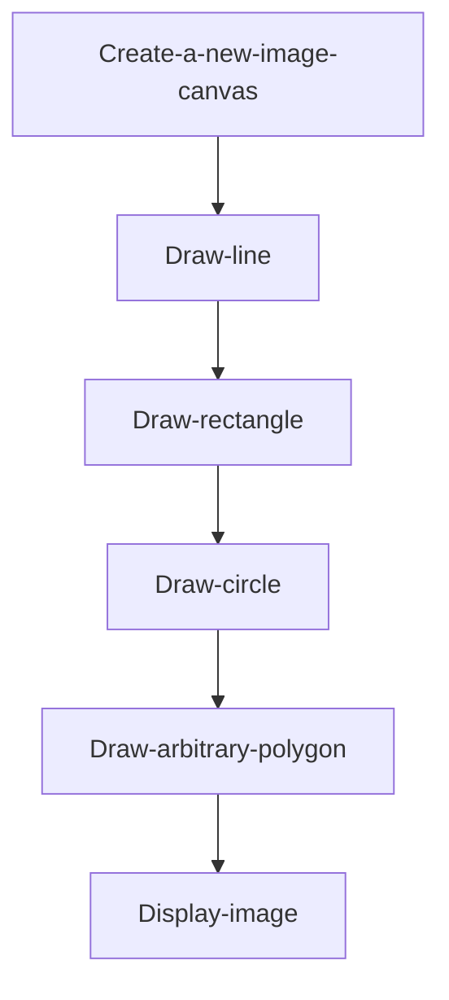
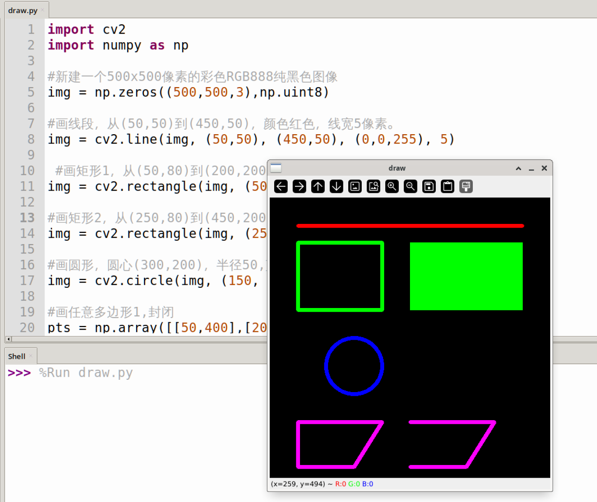

# Drawing Shapes

## Introduction

This chapter learns to use OpenCV for drawing operations on images, a feature that will be frequently used later, such as annotating a specific area on an image or drawing a rectangular box around a face.

## Experiment Objective

Use the OpenCV library to draw various shapes.

## Experiment Explanation

The OpenCV Python library provides various drawing functions that we can use directly.

### Drawing Lines

Use the line() function to draw lines. Usage is as follows:

```python
img = cv2.line(img, pt1, pt2, color, thinkness)
```
Draw a line:
- `img`: Image.
- `pt1`: Starting point coordinates.
- `pt2`: Ending point coordinates.
- `color`: Color (BGR order).
- `thinkness`: Line width (thickness).

### Drawing Rectangles

Use the rectangle() function to draw rectangles. Usage is as follows:

```python
img = cv2.rectangle(img, pt1, pt2, color, thinkness)
```
Draw a rectangle:
- `img`: Image.
- `pt1`: Top-left corner coordinates.
- `pt2`: Bottom-right corner coordinates.
- `color`: Color (BGR order).
- `thinkness`: Line width (thickness). When the value is `-1`, it means fill.

### Drawing Circles

Use the circle() function to draw circles. Usage is as follows:

```python
img = cv2.circle(img, center, radius, color, thinkness)
```
Draw a circle:
- `img`: Image.
- `center`: Center coordinates.
- `radius`: Radius.
- `color`: Color (BGR order).
- `thinkness`: Line width (thickness). When the value is `-1`, it means fill.

### Arbitrary Polygons

Use the polylines() function to draw arbitrary irregular polygons. You only need to know the coordinates of each point. Usage is as follows:

```python
img = cv2.polylines(img, pts, isClosed, color, thinkness)
```
Draw an arbitrary polygon:
- `img`: Image.
- `pts`: Coordinates of each vertex. Numpy array.
- `isClosed`: Whether to close.
    - `True`: Indicates a closed polygon.
    - `False`: Indicates an open polygon.
- `color`: Color (BGR order).
- `thinkness`: Line width (thickness).

After becoming familiar with the common drawing methods, we will implement the code to create a new canvas (image), draw the various shapes on it, and display them. The code writing flow is as follows:



<br></br>

Reference code is as follows. The code uses numpy's array creation functionality. Numpy is used sparingly in this chapter, so it will not be expanded upon here; you can search and learn about it online.

```python
'''
Experiment Name: Drawing Shapes
Experiment Platform: WalnutPi
'''

import cv2
import numpy as np

# Create a new 500x500 pixel color RGB888 pure black image
img = np.zeros((500,500,3),np.uint8)

# Draw a line from (50,50) to (450,50), color red, line width 5 pixels
img = cv2.line(img, (50,50), (450,50), (0,0,255), 5)

# Draw rectangle 1 from (50,80) to (200,200), green, line width 5 pixels
img = cv2.rectangle(img, (50,80), (200,200), (0,255,0), 5)

# Draw rectangle 2 from (250,80) to (450,200), green, filled
img = cv2.rectangle(img, (250,80), (450,200), (0,255,0), -1)

# Draw a circle, center (150,300), radius 50, blue, line width 3
img = cv2.circle(img, (150, 300), 50, (255,0,0), 5)

# Draw arbitrary polygon 1, closed
pts = np.array([[50,400],[200,400],[150,480],[50,480]],np.int32)
img = cv2.polylines(img, [pts], True, (255,0,255), 5)

# Draw arbitrary polygon 2, open
pts = np.array([[250,400],[400,400],[350,480],[250,480]],np.int32)
img = cv2.polylines(img, [pts], False, (255,0,255), 5)

cv2.imshow('draw', img) # Display the image

cv2.waitKey() # Wait for any key press
cv2.destroyAllWindows() # Close the window

```

## Experiment Results

Run the code on the WalnutPi, and you can see the experimental results as shown below:


