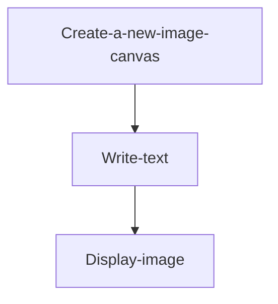
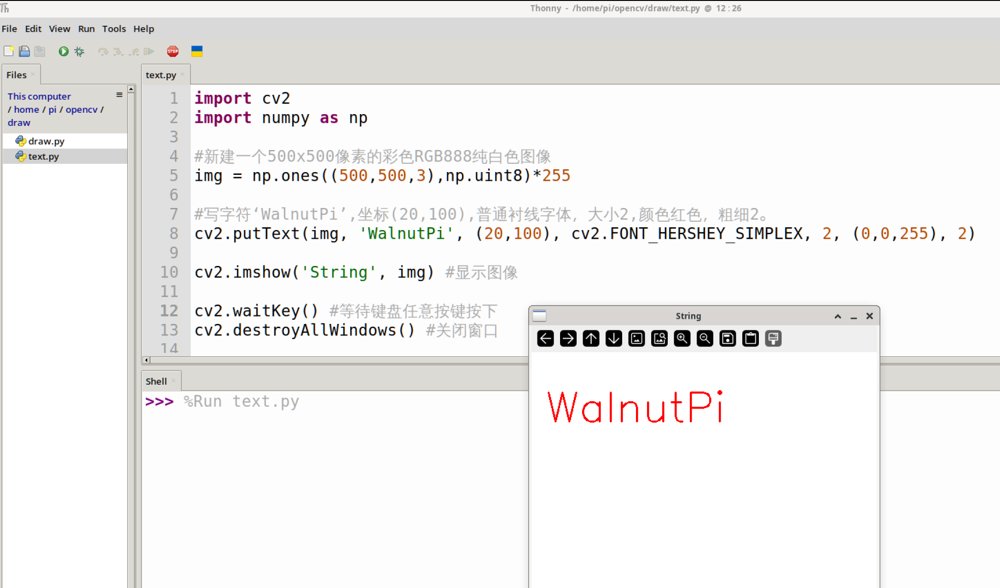

# Writing Text

## Introduction

Text is a commonly used description feature, such as describing photo information and camera capture frame rates. These characters can be written at any position on the image for more intuitive observation.

## Experiment Objective

Use the OpenCV library to write text.

## Experiment Explanation

The OpenCV Python library provides the putText() function for writing text, which we can use directly.

### putText() Usage

```python
img = cv2.putText(img, text, org, fontFace, fontScale, color, thinkness, lineType, bottomLeftOrigin)
```
Write text:
- `img`: Image.
- `text`: The text to write.
- `org`: Coordinates of the bottom-left corner of the text.
- `fontFace`: Font style, with the following font types. Example: cv2.FONT_HERSHEY_SIMPLEX
    - `FONT_HERSHEY_SIMPLEX`: Normal size sans-serif font.
    - `FONT_HERSHEY_PLAIN`: Small sans-serif font.
    - `FONT_HERSHEY_DUPLEX`: Normal size sans-serif font (more complex than FONT_HERSHEY_SIMPLEX).
    - `FONT_HERSHEY_COMPLEX`: Normal size serif font.
    - `FONT_HERSHEY_TRIPLEX`: Normal size serif font (more complex than FONT_HERSHEY_COMPLEX).
    - `FONT_HERSHEY_COMPLEX_SMALL`: Simplified version of FONT_HERSHEY_COMPLEX.
    - `FONT_HERSHEY_SCRIPT_SIMPLEX`: Handwriting style font.
    - `FONT_HERSHEY_SCRIPT_COMPLEX`: Handwriting style font (more complex than FONT_HERSHEY_SCRIPT_SIMPLEX).
    - `FONT_ITALIC`: Italic.
- `fontScale`: Font size.
- `color`: Color.
- `thickness`: Thickness.

After becoming familiar with the text writing usage, we will write a string on the image canvas and display it. The code writing flow is as follows:



<br></br>

Reference code is as follows. The code uses numpy's array creation functionality. Numpy is used sparingly in this chapter, so it will not be expanded upon here; you can search and learn about it online.

```python
'''
Experiment Name: Writing Text
Experiment Platform: WalnutPi
'''

import cv2
import numpy as np

# Create a new 500x500 pixel color RGB888 pure white image
img = np.ones((500,500,3),np.uint8)*255

# Write text 'WalnutPi', coordinates (20,100), normal sans-serif font, size 2, color red, thickness 2
cv2.putText(img, 'WalnutPi', (20,100), cv2.FONT_HERSHEY_SIMPLEX, 2, (0,0,255), 2)

cv2.imshow('String', img) # Display the image

cv2.waitKey() # Wait for any key press
cv2.destroyAllWindows() # Close the window

```

## Experiment Results

Run the code on the WalnutPi, and you can see the experimental results as shown below:


