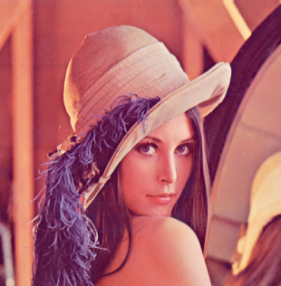
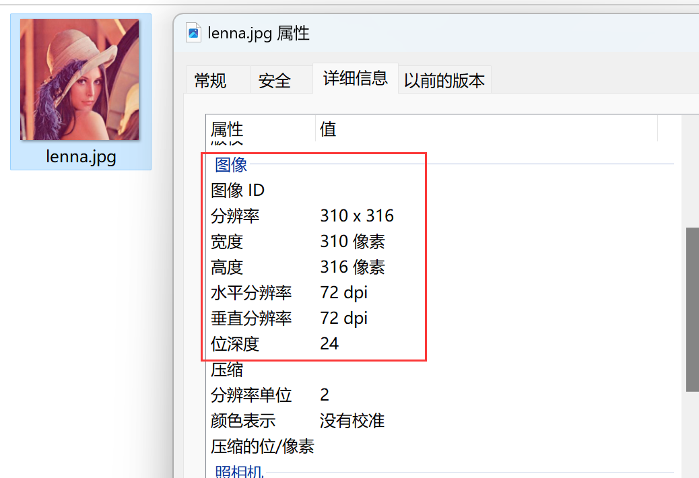
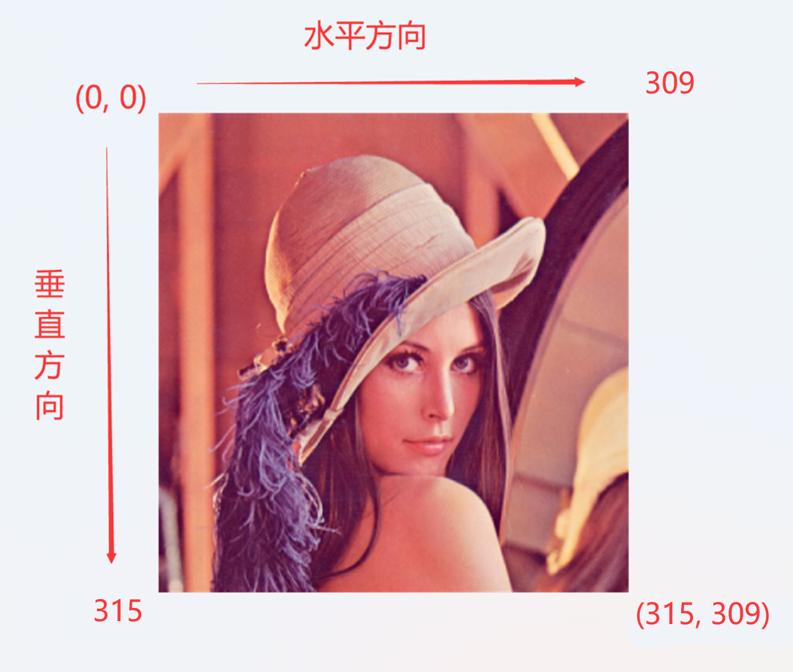
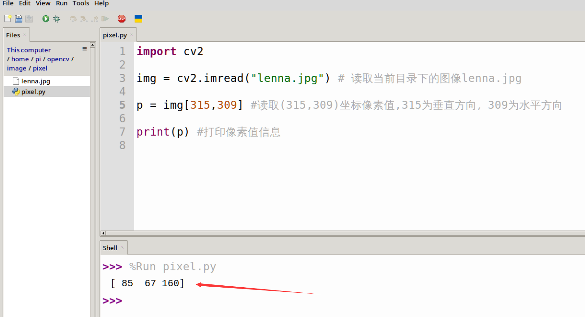
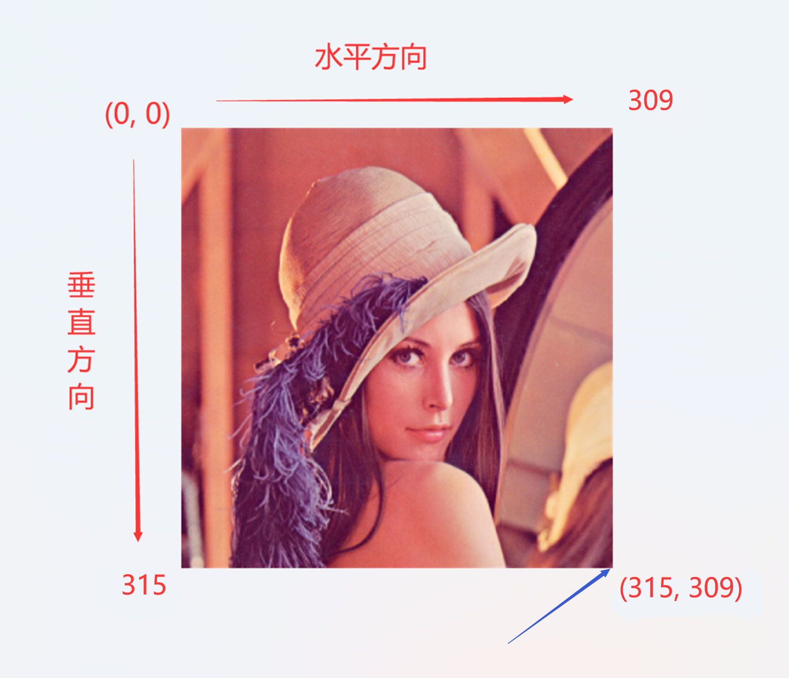
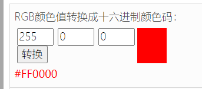
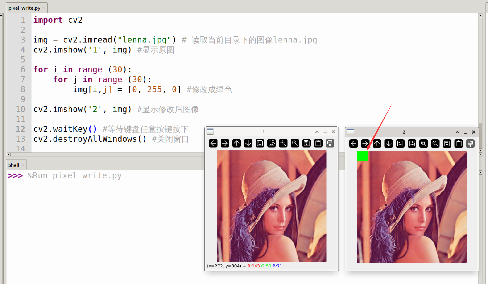
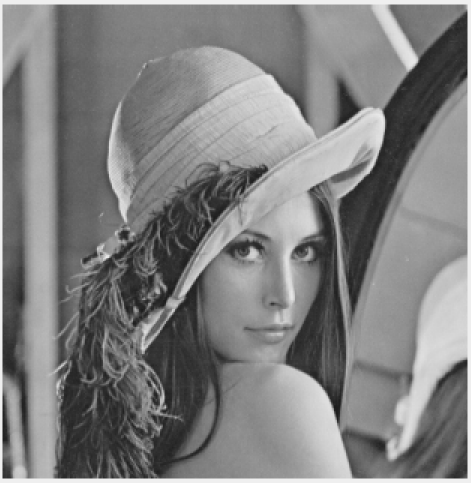
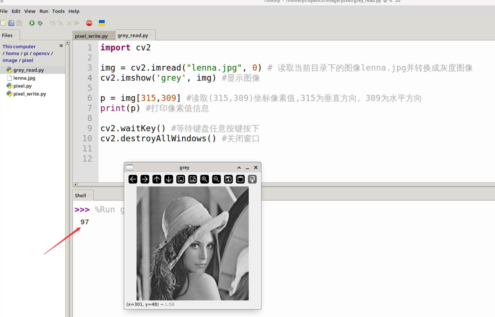

# Image Fundamentals

## Introduction to Pixels

 

The image above is a game from over a decade ago. Due to the limited technology at that time, the display pixels were very small and visible. A complete image is composed of individual pixels as shown above. With technological advancements, the resolution of the phones and laptop displays we use now is very high, so they are invisible to the naked eye. But the principle is the same.

## Reading a Specific Pixel

Pixels are the smallest unit that make up an image. Various visual algorithm applications ultimately involve processing and calculating these pixels. We can use the OpenCV library to take an image and its pixels to gain a deeper understanding of how OpenCV processes images.

Take the following image as an example:

 

You can see its properties on a computer:

 


We read the image using OpenCV's imread() function with the following coordinate orientation: the top-left corner is the (0, 0) origin, there are 316 pixels in the vertical direction [0-315], and 310 pixels in the horizontal direction [0-309].

 

You can read the value of a specific pixel using the following code.

```python
'''
Experiment Name: Reading Pixels
Experiment Platform: WalnutPi
'''

import cv2

img = cv2.imread("lenna.jpg") # Read the image lenna.jpg in the current directory

p = image[315,309] # Read the pixel value at coordinates (315,309), 315 is vertical, 309 is horizontal

print(p) # Print pixel value information

```

Run the code on the WalnutPi development board, and the output is [85 67 160].

 

[85 67 160] is actually the BGR value of the pixel at the bottom-right corner of the image **(OpenCV reads pixels in BGR order, not RGB)**. This involves knowledge of the three primary colors, which will be explained next.

 

## The Three Primary Colors

The RGB color model (also known as the RGB color system, RGB color model, or red-green-blue color model) is an additive color model that mixes the red (R), green (G), and blue (B) primary color lights in different proportions to synthesize various colors of light.

 

Therefore, the pixel data result obtained earlier [85 67 160] is actually B=85, G=67, R=160 **(OpenCV reads pixels in BGR order, not RGB)**, a color mixed from these 3 channel colors. Each channel value has 2^8 = 256 levels [0-255]. So what is commonly referred to as RGB888 means 24-bit true color, where the three RGB channels each have 8-bit color.

We can use an online color conversion tool to test the relationship between colors and values:

Online RGB tool link: https://www.sioe.cn/yingyong/yanse-rgb-16/

Input RGB values (255, 0, 0) to get red:

 

The original pixel value read earlier was [85 67 160], converted to RGB values as (160, 67, 85). Input them to get the corresponding color:

 

## Modifying Pixel Values

Using OpenCV, you can read a pixel value and, of course, write a pixel value as well. To make the result easier to see, here we use code to fill a 30x30 area in the top-left corner of the image with green.

Directly assigning values to specified pixel coordinates of the image can modify image pixel values. Reference code is as follows:

```python
'''
Experiment Name: Modifying Pixels
Experiment Platform: WalnutPi
'''

import cv2

img = cv2.imread("lenna.jpg") # Read the image lenna.jpg in the current directory
cv2.imshow('1', img) # Display the original image

for i in range (30):
    for j in range (30):
        img[i,j] = [0, 255, 0] # Modify to green
        
cv2.imshow('2', img) # Display the modified image

cv2.waitKey() # Wait for any key press
cv2.destroyAllWindows() # Close the window
```

Run the code, and you can see that the 30x30 pixel area in the top-left corner of the image has been modified to green. (The two images may overlap after running; just drag them apart with the mouse.)

 

## GRAY Grayscale Images

Earlier we saw that in a color RGB888 image, each pixel's B/G/R channel values are in the range [0,255]. A grayscale image has only 1 channel, also [0,255], where `0` represents pure black, `255` represents pure white, and values between 0~255 represent different shades, such as dark gray or light gray.

 

::::tip Note
Since grayscale images have less image information compared to RGB888 images, they are often used in visual algorithm scenarios that do not require color, such as shape recognition and face recognition. Converting to grayscale images before processing can greatly reduce computation and achieve faster recognition speeds.
::::

The following code reads the pixel value of a grayscale image:
```python
import cv2

img = cv2.imread("lenna.jpg", 0) # Read the image lenna.jpg in the current directory and convert to grayscale
cv2.imshow('grey', img) # Display the image

p = img[315,309] # Read the pixel value at coordinates (315,309), 315 is vertical, 309 is horizontal
print(p) # Print pixel value information

cv2.waitKey() # Wait for any key press
cv2.destroyAllWindows() # Close the window

```
 
