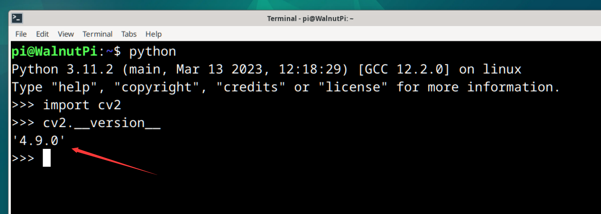

# OpenCV Installation

Installing OpenCV on the WalnutPi 2B is very simple, just use pip to install it. **It is recommended to install the opencv-contrib-python library, which includes the OpenCV main module and contrib module, providing complete functionality.**

Enter the following command in the WalnutPi terminal to install:

```bash
pip install opencv-contrib-python
```

::::tip Note:
If your network cannot download, or if you are a user in mainland China, you can use the Tsinghua mirror for faster downloads. Replace the above installation command with the following:
```bash
pip install opencv-contrib-python -i https://pypi.tuna.tsinghua.edu.cn/simple 
```
::::


<br></br>

After installation, let's test whether it was installed successfully.

Enter the python command to enter the Python terminal:

```bash
python
```

Then enter the following command. If no error occurs, the installation is successful.

```python
import cv2
```


Continue entering the following command to view the version number:

```python
cv2.__version__
```



Since this tutorial is based on Python development, the WalnutPi development board provides multiple ways to run Python code. For details, see: [Running Python Code](../python/python_run.md) chapter, which will not be repeated here.

OpenCV is mainly for vision development, so it is recommended that users develop locally on the WalnutPi development board using a monitor and keyboard/mouse, or through VNC remote desktop. [WalnutPi VNC Remote](../os_software/vnc.md)
