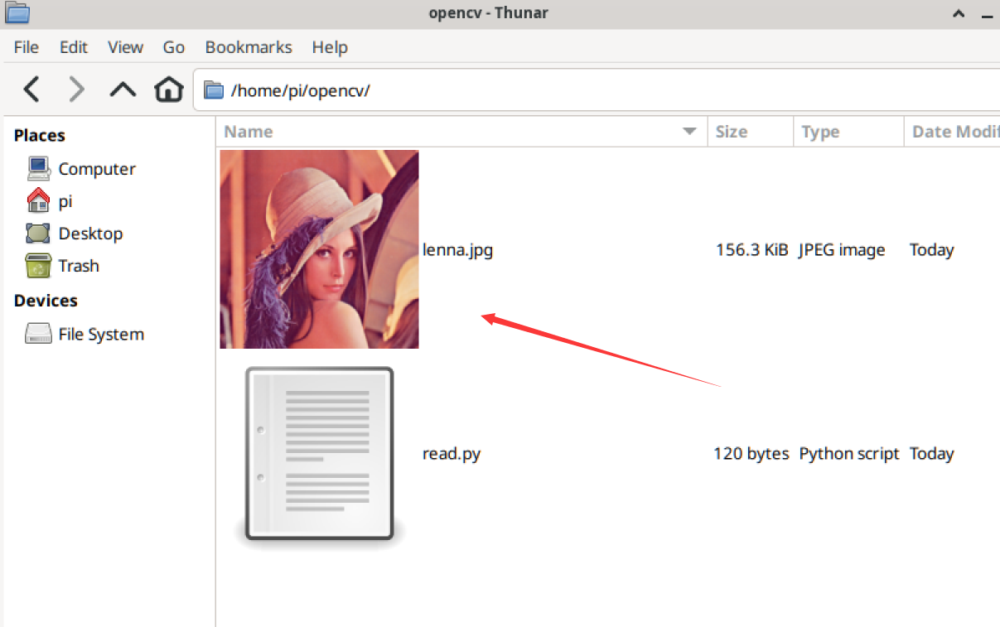

# Basic Image Operations

In the previous section, after successfully installing OpenCV on the WalnutPi, this section will learn to implement some basic image operations using Python programming with the OpenCV library, such as: opening (reading) images, displaying images, saving images, and getting image property information.

## Reading Images

 

Using the OpenCV library to read an image is very simple, using the imread() function. The function description is as follows:

### imread() Usage

```python
img = cv2.imread(filename, flags)
```
Reading an image:
- `filename`: Image name (including path). Chinese paths are not supported.
- `flags`: Color type. Default is 1.
    - `1`: Color.
    - `0`: Grayscale image.

<br></br>

Reference code is as follows:

```python
'''
Experiment Name: Reading Images
Experiment Platform: WalnutPi
'''

import cv2

img = cv2.imread("lenna.jpg") # Read the image lenna.jpg in the current directory
print(img) # Print image information

```

Run the above code through the WalnutPi terminal or WalnutPi Thonny IDE, and you can see the image information printed. **You can see that what is printed is the RGB value information of each pixel of the image, which will be explained in later tutorials.**

 

## Displaying Images

Displaying images here means using the OpenCV library to show the image, allowing more intuitive observation of experimental results, which is frequently used in future experiments.

### imshow() Usage

```python
cv2.imshow(winname, mat)
```
Displaying an image:
- `winname`: Window name. Chinese is not supported.
- `mat`: The image to display.

<br></br>

Here we demonstrate reading the image lenna.jpg and displaying it via imshow. Reference code is as follows:

```python
'''
Experiment Name: Displaying Images
Experiment Platform: WalnutPi
'''
import cv2

img = cv2.imread("lenna.jpg") # Read the image lenna.jpg in the current directory
cv2.imshow('lenna', img) # Display the image

cv2.waitKey() # Wait for any key press
cv2.destroyAllWindows() # Close the window

```

The code execution result is as follows, a window named **lenna** pops up displaying the relevant image, with x, y coordinates and RGB color values at the bottom of the window, which will be discussed in later chapters.

 

## Saving Images

To save a specified image, use the imwrite() method.

### imwrite() Usage

```python
cv2.imwrite(filename, img)
```
Saving an image:
- `filename`: Path to save the image.
- `img`: The image to save.

<br></br>

Here we demonstrate reading the image lenna.jpg and saving it as lenna2.jpg. Reference code is as follows:

```python
'''
Experiment Name: Saving Images
Experiment Platform: WalnutPi
'''

import cv2

img = cv2.imread("lenna.jpg") # Read the image lenna.jpg in the current directory
cv2.imwrite('lenna2.jpg', img) # Save the new image as lenna2.jpg

```

The code execution result is as follows, a new image named lenna2 appears in the current directory:

 

## Getting Image Property Information

We can view image information through image properties, commonly including dimensions, resolution, color type, etc., as shown below.

 

All this information can be obtained using OpenCV library functions. This can be done directly by operating on the image object returned by reading the image.

```python
img = cv2.imread("lenna.jpg") # Read the image lenna.jpg in the current directory

img.shape # Returns an array of image shape: pixel columns, pixel rows, number of channels (grayscale images have 1 channel)

img.size  # Returns the number of image pixels, i.e.: pixel columns x pixel rows x number of channels

img.dtype # Image data type
```

<br></br>

We use the following code to get information about color and grayscale images:

```python
'''
Experiment Name: Getting Image Property Information
Experiment Platform: WalnutPi
'''

import cv2

img = cv2.imread("lenna.jpg") # Read the image lenna.jpg in the current directory
print('Color Image: ')
print('shape: ', img.shape)
print('size: ', img.size)
print('dtype: ', img.dtype)

img = cv2.imread("lenna.jpg", 0) # Read and convert to grayscale image
print('Grayscale Image: ')
print('shape: ', img.shape)
print('size: ', img.size)
print('dtype: ', img.dtype)

```

Run the above code on the WalnutPi, and you can see the output results as follows:

 

The color image has 3 channels, i.e., RGB888. The grayscale image has only 1 channel.
