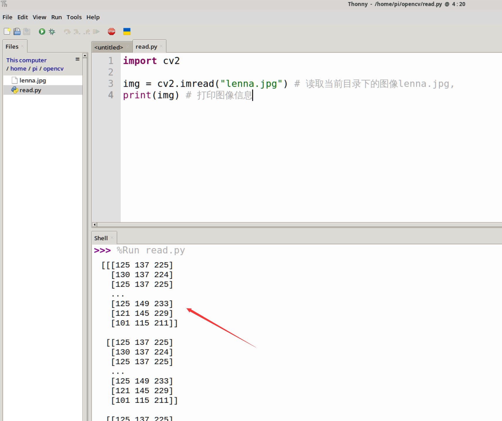
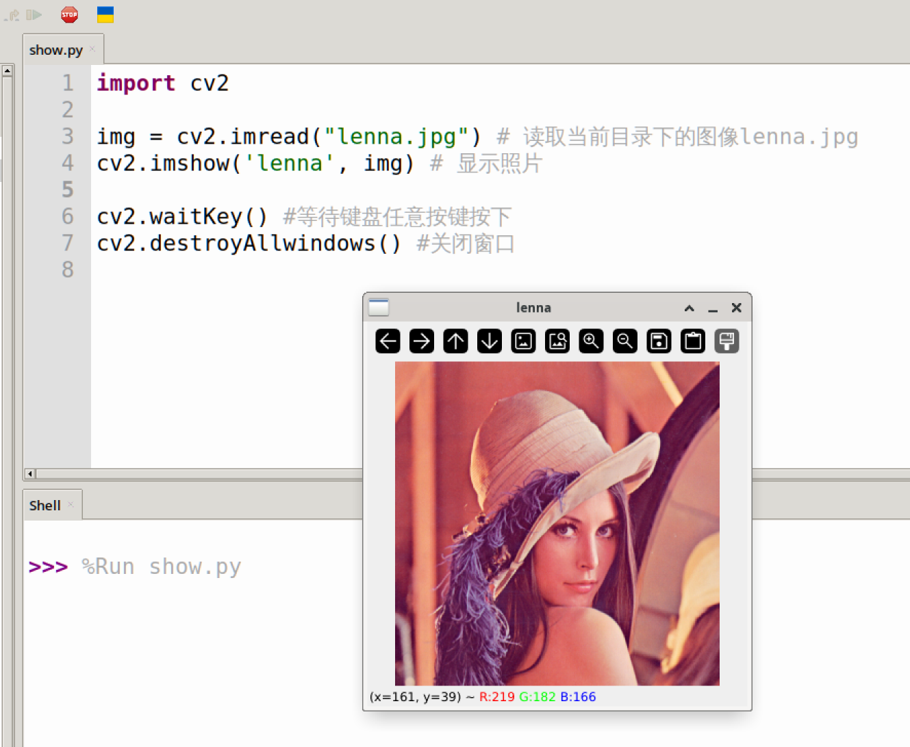
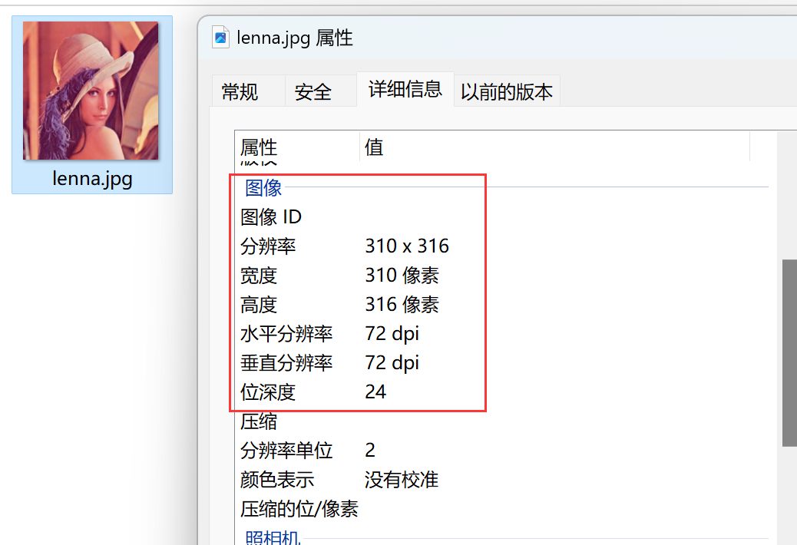
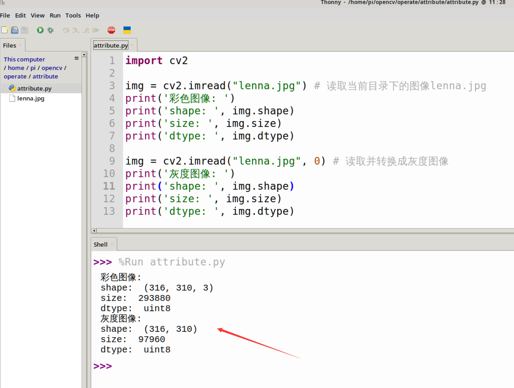

# 图像基本操作

上一节我们在核桃派上成功安装OpenCV后，这节来学习通过Python编程OpenCV库来实现一些图像的基本操作，如：打开（读取）图像、显示图像、保存图像和获取图像属性信息等。

## 读取图像

 

使用OpenCV库读取一张图片非常简单，使用imread()函数。函数说明如下：

### imread() 使用方法

```python
img = cv2.imread(filename, flags)
```
读取一张图片：
- `filename` ：图片名称（含路径），不支持中文路径。
- `flags` ：颜色类型。默认1。
    - `1` ：彩色。
    - `0` ：灰度图像。

<br></br>

参考代码如下：

```python
'''
实验名称：读取图像
实验平台：核桃派
'''

import cv2

img = cv2.imread("lenna.jpg") # 读取当前目录下的图像lenna.jpg
print(img) # 打印图像信息

```

通过核桃派终端运行或者核桃派Thonny IDE运行上面代码，可以看到图像信息被打印出来。**可以看到打印出来的是图像每个像素的RGB值信息，后续教程会讲解。**

 

## 显示图像

这里显示图像是指使用opencv库将图像显示出来，更直观的观察实验结果，在今后的实验中经常使用。

### imshow() 使用方法

```python
cv2.imshow(winname, mat)
```
读取一张图片：
- `winname` ：窗口名称，不支持中文。
- `mat` ：要显示的图像。

<br></br>

我们这里演示读取图片lenna.jpg，再通过imshow显示出来。参考代码如下：

```python
'''
实验名称：显示图像
实验平台：核桃派
'''
import cv2

img = cv2.imread("lenna.jpg") # 读取当前目录下的图像lenna.jpg
cv2.imshow('lenna', img) # 显示照片

cv2.waitKey() #等待键盘任意按键按下
cv2.destroyAllWindows() #关闭窗口

```

代码运行结果如下，弹出了一个**linna**名称窗口，显示了相关图片，窗口下方有x,y坐标和RGB色彩值，这些在后面章节内容会讲述。

 

## 保存图像

将指定图像保存使用imwrite()方法。

### imwrite() 使用方法

```python
cv2.imwrite(filename, img)
```
读取一张图片：
- `filename` ：保存图像的路径。
- `img` ：要保存的图像。

<br></br>

我们这里演示读取图片lenna.jpg，再保存成名称为lenna2.jpg。参考代码如下：

```python
'''
实验名称：保存图像
实验平台：核桃派
'''

import cv2

img = cv2.imread("lenna.jpg") # 读取当前目录下的图像lenna.jpg
cv2.imwrite('lenna2.jpg', img) # 保存新图片名称为leanna2.jpg

```

代码运行结果如下，当前目录下多了一张名称为 linna2 的图片：

 

## 获取图像属性信息

我们可以通过图片属性查看到图片的信息，常用的比如尺寸分辨率，色彩类型等，如下图。

 

而这些信息都可以使用OpenCV库函数来获取。这个可以直接对读取图像返回的对象image进行操作。

```python
img = cv2.imread("lenna.jpg") # 读取当前目录下的图像lenna.jpg

img.shape # 返回图片形状，像素列数，像素行数 ，通道数量（灰度图像通道数量为1）的数组。

img.size  # 返回图片像素数量，即：像素列数 x 像素行数 x 通道数量

img.dtype # 图像数据类型
```

<br></br>

我们通过下面代码来获取彩色图像和灰度的信息：

```python
'''
实验名称：获取图像属性信息
实验平台：核桃派
'''

import cv2

img = cv2.imread("lenna.jpg") # 读取当前目录下的图像lenna.jpg
print('彩色图像: ')
print('shape: ', img.shape)
print('size: ', img.size)
print('dtype: ', img.dtype)

img = cv2.imread("lenna.jpg", 0) # 读取并转换成灰度图像
print('灰度图像: ')
print('shape: ', img.shape)
print('size: ', img.size)
print('dtype: ', img.dtype)

```

在核桃派运行上面代码，可以看到输出结果如下：

 

彩色图像是3通道，即RGB888。而灰度图像只有1个通道。