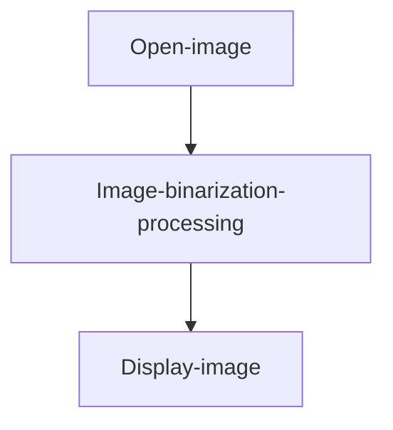
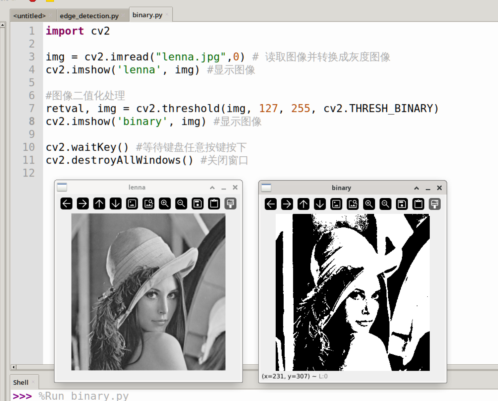

# Binarization

## Introduction

We previously learned about grayscale image conversion. Compared to color images, grayscale images have the advantage of less information, and the single-channel 0~255 value range enables faster processing speeds. The binarized images in this section are further processed from grayscale images: values below a certain threshold are converted to 0 (pure black), and values above a certain threshold are converted to 255 (pure white). This more clearly preserves the main contours of the image.

## Experiment Objective

Perform binarization processing on an image.

## Experiment Explanation

The OpenCV Python library provides the threshold() function for threshold processing, thereby achieving image binarization.

### threshold() Usage

```python
retval, img = cv2.threshold(src, thresh, maxval, type)
```

Threshold processing. Returns retval indicating the threshold used during processing; returns img indicating the threshold-processed image.
- `src`: Original image.
- `thresh`: Threshold, usually set to 125~150.
- `maxval`: Maximum value used in threshold processing, usually set to 255.
- `type`: Processing type.
    - `cv2.THRESH_BINARY`: Binary threshold processing.
    - `cv2.THRESH_BINARY_INV`: Inverse binary threshold processing.
    - `cv2.THRESH_TOZERO`: Below threshold to zero processing.
    - `cv2.THRESH_TOZERO_INV`: Above threshold to zero processing.
    - `cv2.THRESH_TRUNC`: Truncation threshold processing.

This experiment uses `cv2.THRESH_BINARY` binary threshold processing to achieve image binarization. With threshold = 127 and maxval = 255, pixels in the image < 127 will be changed to 0, and those greater than 127 will be changed to 255, resulting in a purely black-and-white image.

The code writing flow is as follows:



<br></br>

Reference code is as follows:


```python
'''
Experiment Name: Image Binarization
Experiment Platform: WalnutPi
'''

import cv2

img = cv2.imread("lenna.jpg",0) # Read the image and convert to grayscale
cv2.imshow('lenna', img) # Display the image

# Image binarization processing
retval, img = cv2.threshold(img, 127, 255, cv2.THRESH_BINARY) 
cv2.imshow('binary', img) # Display the image

cv2.waitKey() # Wait for any key press
cv2.destroyAllWindows() # Close the window

```

## Experiment Results

Run the above code on the WalnutPi, and you can see the experimental results as shown below (multiple windows may overlap, just drag them apart with the mouse):


