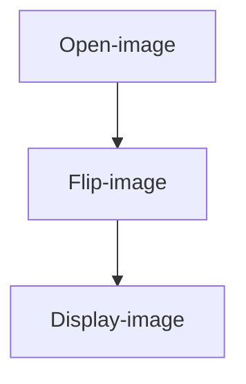
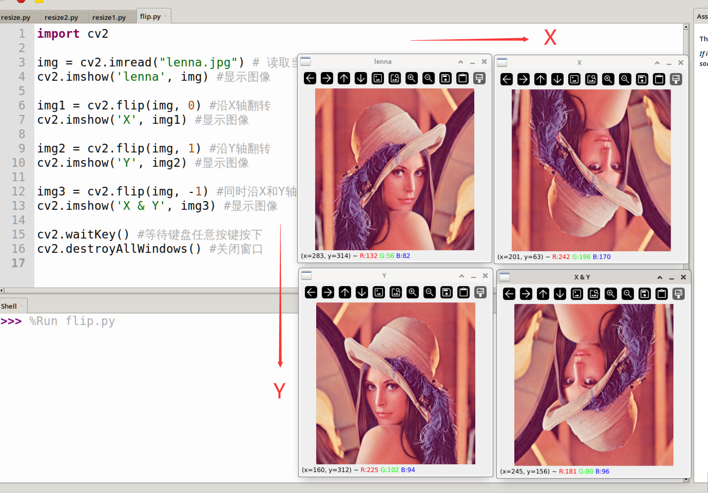

# Flip

## Introduction

This section learns to use OpenCV for image flipping, supporting flipping along the X-axis or Y-axis to achieve mirror effects.

## Experiment Objective

Flip an image and display it.

## Experiment Explanation

The OpenCV Python library provides the flip() function to implement image flipping.

### flip() Usage

```python
img = cv2.flip(src, flipCode)
```

Image flipping.
- `src`: Original image.
- `flipCode`: Flipping type.
    - `0`: Flip along the X-axis.
    - `1`: Flip along the Y-axis.
    - `-1`: Flip along both the X and Y axes.

In this section, we will apply the 3 flipping methods to the image separately and display them. The code writing flow is as follows:



<br></br>

Reference code is as follows:


```python
'''
Experiment Name: Image Flipping
Experiment Platform: WalnutPi
'''

import cv2

img = cv2.imread("lenna.jpg") # Read the image lenna.jpg in the current directory
cv2.imshow('lenna', img) # Display the image

img1 = cv2.flip(img, 0) # Flip along the X-axis
cv2.imshow('X', img1) # Display the image

img2 = cv2.flip(img, 1) # Flip along the Y-axis
cv2.imshow('Y', img2) # Display the image

img3 = cv2.flip(img, -1) # Flip along both X and Y axes
cv2.imshow('X & Y', img3) # Display the image

cv2.waitKey() # Wait for any key press
cv2.destroyAllWindows() # Close the window

```

## Experiment Results

Run the above code on the WalnutPi, and you can see the experimental results as shown below (multiple windows may overlap, just drag them apart with the mouse):


