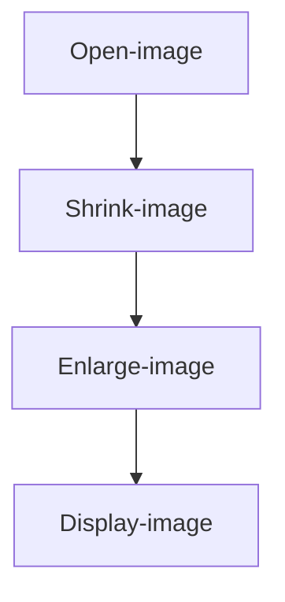

# Resize

## Introduction

This section learns to use OpenCV for image resizing, i.e., shrinking and enlarging, which means changing the size of the image.

## Experiment Objective

Resize an image and display it.

## Experiment Explanation

The OpenCV Python library provides the resize() function to implement image resizing.

### resize() Usage

```python
img = cv2.resize(src, dsize, fx, fy, interpolation)
```

Image resizing.
- `src`: Original image.
- `dsize`: Generated image size, format (width, height), in pixels.
- `fx`: Horizontal scaling factor (optional).
- `fy`: Vertical scaling factor (optional).
- `interpolation`: Supplement or remove pixels (optional), default value is recommended.

In this section, we will shrink and enlarge the image separately and display them. The code writing flow is as follows:



<br></br>

Reference code is as follows:

**Scaling using the dsize parameter:**
```python
'''
Experiment Name: Image Resizing (dsize Parameter)
Experiment Platform: WalnutPi 2B
'''

import cv2

img = cv2.imread("lenna.jpg") # Read the image lenna.jpg in the current directory
cv2.imshow('lenna', img) # Display the image

img1 = cv2.resize(img, (200,200)) # Scale using dsize parameter to 200x200
cv2.imshow('200x200', img1) # Display the image

img2 = cv2.resize(img, (500,500)) # Scale using dsize parameter to 500x500
cv2.imshow('500x500', img2) # Display the image

cv2.waitKey() # Wait for any key press
cv2.destroyAllWindows() # Close the window

```

**Scaling using the fx, fy parameters:**
```python
'''
Experiment Name: Image Resizing (fx, fy Parameters)
Experiment Platform: WalnutPi 2B
'''

import cv2

img = cv2.imread("lenna.jpg") # Read the image lenna.jpg in the current directory
cv2.imshow('lenna', img) # Display the image

img1 = cv2.resize(img, None, fx=1/2 , fy=1/2) # Shrink the image to 1/2 using fx, fy parameters
cv2.imshow('0.5x', img1) # Display the image

img2 = cv2.resize(img, None, fx=2 , fy=2) # Enlarge the image 2x using fx, fy parameters
cv2.imshow('2x', img2) # Display the image

cv2.waitKey() # Wait for any key press
cv2.destroyAllWindows() # Close the window

```

## Experiment Results

Run the above two codes on the WalnutPi respectively, and you can see the experimental results as shown below (multiple windows may overlap, just drag them apart with the mouse):

**Scaling result using the dsize parameter:**


**Scaling result using the fx, fy parameters:**

