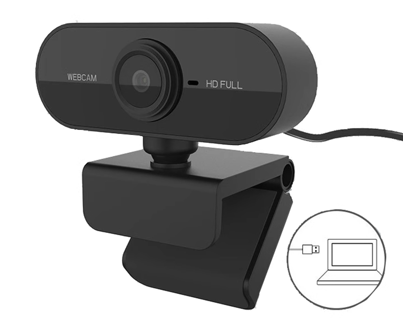

# Using USB Camera

The camera is like OpenCV's eyes. With a camera, you can process video streams and images captured by the camera in real-time, implementing image processing and machine vision algorithms on them.

The WalnutPi system has built-in USB camera drivers. Most USB cameras on the market can be used. The following model is used for this tutorial: [**Click to buy->**](https://item.taobao.com/item.htm?spm=a213gs.success.result.1.6c854831c6UKif&id=740242931183) 



Simply plug it into one of the WalnutPi USB ports.


## Getting USB Camera Device Information

First, use v4l2-ctl to view the current USB camera device information. This requires installing v4l. Most WalnutPi software can be installed via sudo apt install:

```bash
sudo apt install v4l-utils
```

After installation, run the following command to view the inserted USB camera information:

```bash
v4l2-ctl --list-devices
```

You can see that this camera has multiple video devices, usually the first one. Here it is: video1

 

## Using Camera via OpenCV

OpenCV can obtain camera video streams through the VideoCapture() function. A camera video stream is essentially a series of images frame by frame. Therefore, by combining the previously learned reading, displaying, and saving images, you can capture and display camera images (since it is fast, it looks like a video). Reference code is as follows:

```python
'''
Experiment Name: Using USB Camera
Experiment Platform: WalnutPi
'''

import cv2

cam = cv2.VideoCapture(1) # Open the camera, confirm the number

while (cam.isOpened()): # Confirm it is opened
    
    retval, img = cam.read() # Read images from the camera in real-time
    
    cv2.imshow("Video", img) # Display the read image in a window
    
    key = cv2.waitKey(1) # Window image refresh time is 1 millisecond to prevent blocking
    
    if key == 32: # If the spacebar is pressed, break
        break
    
cam.release() # Close the camera
cv2.destroyAllWindows() # Destroy the window displaying the camera video

```

Run the code on the WalnutPi, and you can see the video images captured by the camera displayed in real-time:

 

The **img** obtained in the code is each frame image, which can be used for all the OpenCV image processing operations we have learned previously.
