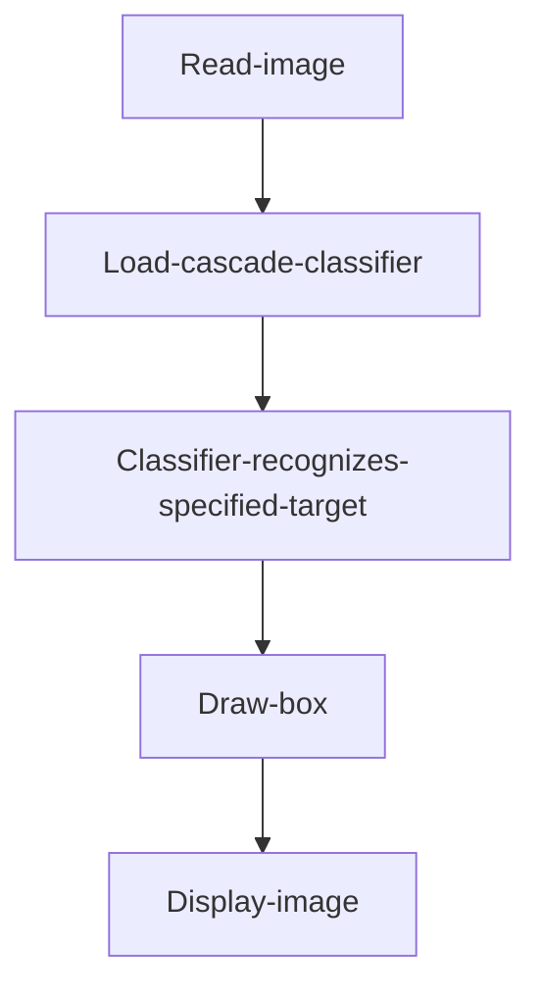
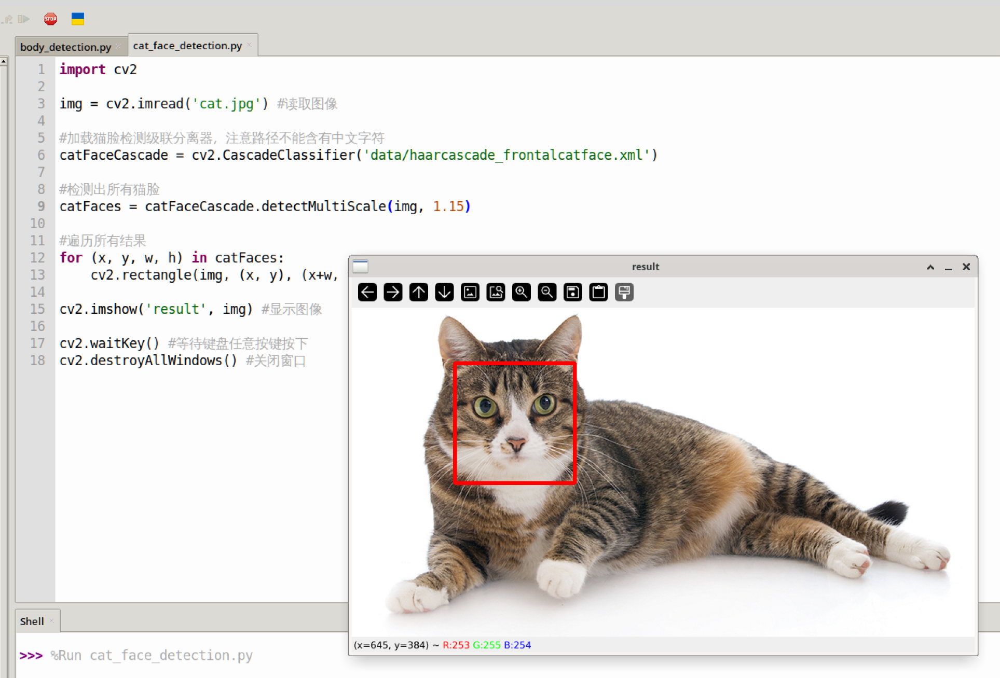
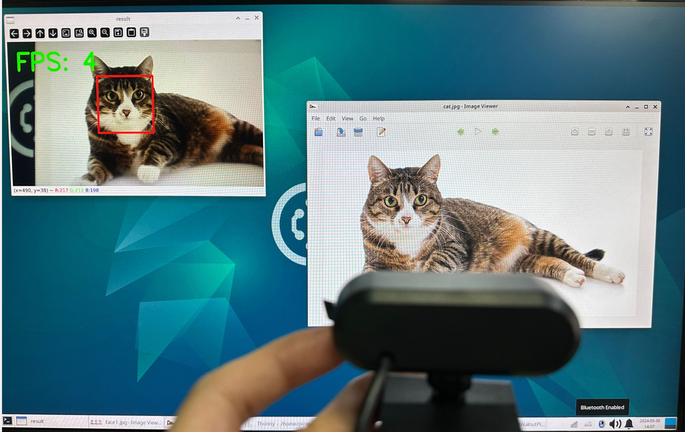

# Cat Face Detection

## Introduction

This section learns to use OpenCV to detect cat faces in an image.

## Experiment Objective

Detect cat faces in an image and draw rectangular boxes for display.

## Experiment Explanation

Using the cascade classifier method introduced earlier, this section uses the frontal cat face detection cascade classifier `haarcascade_frontalcatface.xml`. The code writing flow is as follows:



<br></br>

## Reference Code

Reference code is as follows:

```python
'''
Experiment Name: Cat Face Detection
Experiment Platform: WalnutPi 2B
'''

import cv2

img = cv2.imread('cat.jpg') # Read the image

# Load the cat face detection cascade classifier; note that the path must not contain Chinese characters
catFaceCascade = cv2.CascadeClassifier('data/haarcascade_frontalcatface.xml')

# Detect all cat faces
catFaces = catFaceCascade.detectMultiScale(img, 1.15)

# Iterate through all results
for (x, y, w, h) in catFaces:
    cv2.rectangle(img, (x, y), (x+w, y+h), (0, 0, 255), 3) # Draw a box
    
cv2.imshow('result', img) # Display the image

cv2.waitKey() # Wait for any key press
cv2.destroyAllWindows() # Close the window    

```

## Experiment Results

Run the above code on the WalnutPi, and the experimental results are as follows:

 

## Using USB Camera for Recognition

By combining the USB camera usage method introduced earlier, you can perform real-time recognition via a USB camera. Reference code is as follows:

### Reference Code

```python
'''
Experiment Name: Cat Face Detection (Using USB Camera)
Experiment Platform: WalnutPi 2B
'''

import cv2, time

# Load the cat face detection cascade classifier; note that the path must not contain Chinese characters
catFaceCascade = cv2.CascadeClassifier('data/haarcascade_frontalcatface.xml')

cam = cv2.VideoCapture(1) # Open the USB camera

# Lowering the resolution can improve recognition speed; can be set to 480x320 or 320x240
cam.set(3,480) # Set capture image width to 480
cam.set(4,320) # Set capture image height to 320
 
# Calculate FPS (frames per second parameter)
start = 0
end = 0

while True:
    
    start = time.time() # Record start time
    
    retval, img = cam.read() # Read images from the camera in real-time

    # Detect all cat faces
    catFaces = catFaceCascade.detectMultiScale(img, 1.15)

    # Iterate through all results
    for (x, y, w, h) in catFaces:
        cv2.rectangle(img, (x, y), (x+w, y+h), (0, 0, 255), 3) # Draw a box
            
    end = time.time() # Record end time
    
    # Calculate FPS (frames per second), result rounded to integer
    fps = round(1/(end-start))
    print('FPS: ', fps)
    
    # Write text on the image
    cv2.putText(img, "FPS: "+ str(fps), (20, 70), cv2.FONT_HERSHEY_SIMPLEX, 2, (0, 255, 0), 5)
    
    cv2.imshow('result', img) # Display the image
    
    key = cv2.waitKey(1) # Window image refresh time is 1 millisecond to prevent blocking    
    if key == 32: # If the spacebar is pressed, break and exit
        break
    
cam.release() # Close the camera
cv2.destroyAllWindows() # Destroy the window displaying the camera video

```

### Experiment Results

 
