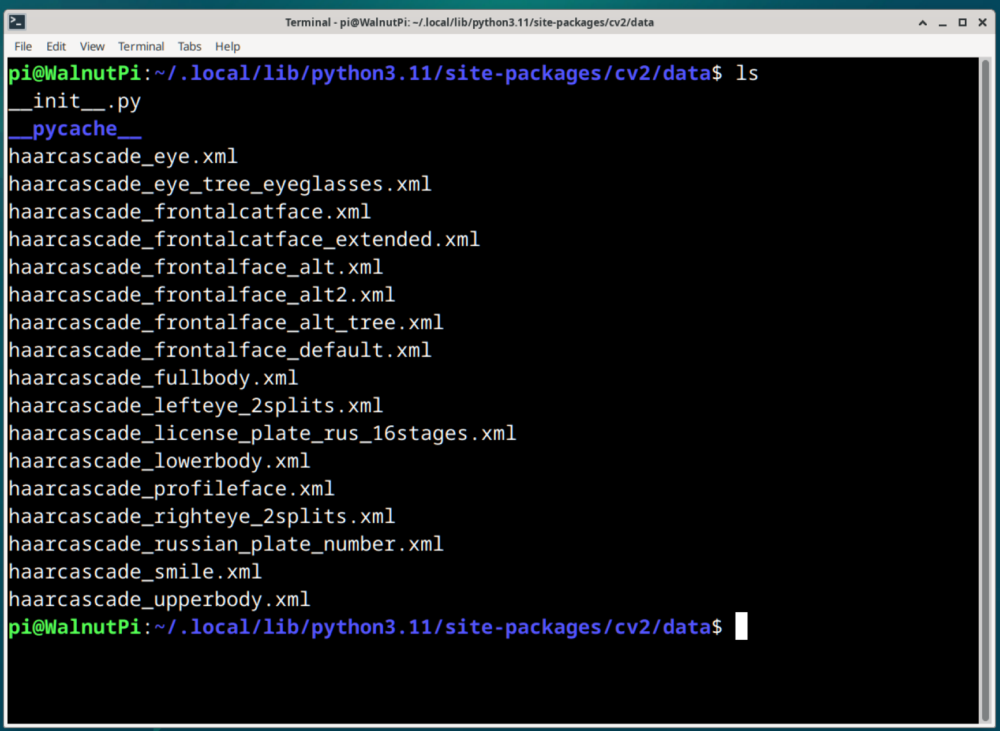

# Cascade Classifier Introduction

A cascade classifier can be understood as a pre-trained model file prepared by OpenCV for visual recognition.

For example, to detect human eyes in an image containing both people and cats, you need to recognize both cats and humans. Cats have 4 legs, and humans have 2 legs. Different classifiers based on the number of legs are used to distinguish between humans and cats. Then, within the human body, a second classifier can distinguish between eyes and ears, thereby achieving the goal of detecting eyes. Here, 2 classifiers are used. Connecting these classifiers in a specific sequence forms a **cascade classifier**.

## Cascade Classifier File Path

OpenCV officially provides some cascade classifier files. After installing via pip on WalnutPi, they are located in the following directory, with files ending in xml:

```bash
/home/pi/.local/lib/python3.11/site-packages/cv2/data
```

 

They can also be obtained on GitHub: https://github.com/opencv/opencv/tree/4.x/data/haarcascades

Below are descriptions of these commonly used cascade classifiers:

- `haarcascade_fullbody.xml`: Human body detection;
- `haarcascade_upperbody.xml`: Upper body detection;
- `haarcascade_lowerbody.xml`: Lower body detection;
- `haarcascade_frontalface_default.xml`: Frontal face detection;
- `haarcascade_profileface.xml`: Profile face detection;
- `haarcascade_eye.xml`: Eye detection;
- `haarcascade_lefteye_2splits.xml`: Left eye detection;
- `haarcascade_righteye_2splits.xml`: Right eye detection;
- `haarcascade_eye_tree_eyeglasses.xml`: Eyeglasses detection;
- `haarcascade_smile.xml`: Smile detection;
- `haarcascade_frontalcatface.xml`: Frontal cat face detection;
- `haarcascade_russian_plate_number.xml`: License plate detection;

## Usage

Using cascade classifiers is relatively simple. You only need to load the cascade classifier and use it to recognize the image.

### Loading a Cascade Classifier

```python
<CascadeClassifier object> = cv2.CascadeClassifier(filename)
```
Returns the classifier object.
- `filename`: Cascade classifier XML file;

### Using the Classifier to Recognize Objects

```python
objects = cascade.detectMultiScale(image, scaleFactor, minNeighbors, flags, minSize, maxSize)
```
Returns objects as an array of target regions. Each target contains 4 values: top-left x-coordinate, top-left y-coordinate, width, height.
- `image`: The image to be recognized;
- `scaleFactor`: Scale factor when scanning the image (optional parameter);
- `minNeighbors`: The larger this value, the smaller the analysis error (optional parameter);
- `flags`: Use default value (optional parameter);
- `minSize`: Minimum target size (optional parameter);
- `maxSize`: Maximum target size (optional parameter);

In the following content, we will use the above cascade classifiers to implement visual recognition in various scenarios.
