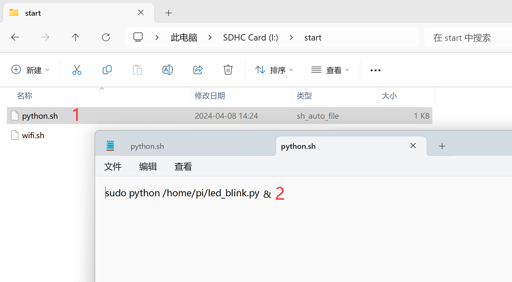

# Auto-run Scripts on Boot

The Walnut Pi official Debian system supports automatically running all `sh` files located under the `/boot/start` directory at boot.

Users can customize multiple sh files by reading the SD card on Windows or directly on the Walnut Pi, enabling the execution of various custom commands at boot. Below are some application examples:

## Auto-connect to WiFi on Boot

If you don't have an Ethernet cable or a USB-to-TTL serial adapter after burning the image, you can use this feature to make the Walnut Pi automatically connect to WiFi. Then, obtain the Walnut Pi's IP address through the router or a WiFi scanning tool to enable SSH remote terminal access. (The Walnut Pi system comes with a wifi.sh file by default.)

Create a file under `/boot/start` with a name ending in .sh, such as wifi.sh.


Fill in the following content—make sure to replace `walnutpi` and `12345678` with your own home or office WiFi SSID and password (both 2.4G and 5G are supported):
```
# Scan WiFi
nmcli dev wifi > /dev/null

# Connect to WiFi
nmcli dev wifi connect walnutpi password 12345678
```


Insert the SD card into the Walnut Pi. After booting, the wifi.sh script will automatically execute and connect to the specified WiFi.

Download an IP scanner tool from: https://www.advanced-ip-scanner.com/


After installation, you can scan for the Walnut Pi's IP address within the same LAN (typically under the same router).


Then you can wirelessly log into the Walnut Pi via SSH remote terminal: [SSH Remote Terminal Tutorial](./ssh.md)

## Auto-run Python Code on Boot

This feature can also be used to automatically run pre-written Python scripts at power-on.

Let's write a test Python script using the onboard LED blink effect as a demonstration:


```python
'''
Experiment: LED Blinking
Platform: Walnut Pi
'''

# Import relevant modules
import board,time
from digitalio import DigitalInOut, Direction

# Build LED object and initialize
led = DigitalInOut(board.LED) # Define pin number
led.direction = Direction.OUTPUT  # IO as output

while True:

    led.value = 1 # Output high, turn on onboard blue LED
    
    time.sleep(0.5)
    
    led.value = 0 # Output low, turn off onboard blue LED
    
    time.sleep(0.5)

```

Save the above code as **led_blink.py** in the Walnut Pi's /home/pi directory for testing. You can transfer it using Thonny or copy it directly to that directory via a USB drive.

Then, create a python.sh file under the /boot/start/ directory with the following content (to run led_blink.py):

::::tip Note
Add **&** at the end of the command below to run it in a new process, preventing infinite loops in Python programs from blocking other services from starting during the system boot process.
::::

```
sudo python /home/pi/led_blink.py &
```



Insert the SD card into the Walnut Pi board and boot the system, or reboot the board. You will see the blue LED blinking after startup, indicating that the Python code was successfully auto-run.


